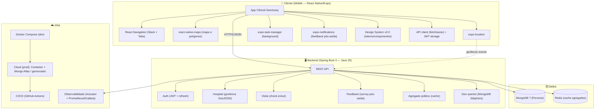

# 🌳 Árvore Tecnológica — saude-monitor v2.0

> **Decisões de stack para manter ou refatorar o sistema de monitoramento hospitalar por geolocalização**
>
> | Campo | Valor |
> |---|---|
> | **Versão** | 2.0 |
> | **Status** | Proposta técnica — validada contra o código atual (07/08/2026) |
> | **Escopo** | Backend (Spring Boot + MongoDB), Frontend (React Native/Expo), Infra (Docker) |
> | **Base** | Varredura completa do repositório `D:\saude-monitor` + relatório de arquitetura v1.1 |

---

## 1. Estado Atual (levantado em código)

### 1.1 Backend — `D:\saude-monitor\backend`

| Item | Tecnologia | Versão | Observação |
|---|---|---|---|
| Runtime | Java (toolchain Gradle) | 25 | Toolchain configurada no `build.gradle` |
| Framework | Spring Boot (WebMVC) | 4.0.4 | `spring-boot-starter-webmvc` (síncrono, não WebFlux) |
| Persistência | Spring Data MongoDB | via Boot 4 | Documentos `UserDocument`, `AuthDocument` |
| Banco | MongoDB (Percona Server) | 7.0 | Rodando via Docker Compose |
| Build | Gradle | 9.4 | Wrapper incluído |
| Boilerplate | Lombok | — | `@Builder`, `@Getter/@Setter` |
| Endpoints existentes | `POST /api/auth/login` · `POST /api/user/cadastro` | — | Sem JWT real, sem roles |
| Testes | JUnit 5 + Spring Boot Test | — | 1 teste de controller de auth |

**⚠️ Achados críticos na varredura:**
1. **Senha em texto puro**: `AuthServiceImpl.saveLogin()` grava `request.password()` sem hash. Violação grave de segurança.
2. **Sem autenticação real**: o endpoint de login apenas salva um documento `auth_logins`; não há emissão de token, sessão ou controle de acesso.
3. **Sem módulos de domínio**: não existem entidades de Hospital, Visita, Feedback, Agregado — o core do produto não foi implementado.
4. **Sem suporte geoespacial**: nenhum índice `2dsphere`, nenhuma query de raio/polígono.

### 1.2 Frontend — `D:\saude-monitor\frontend`

| Item | Tecnologia | Versão | Observação |
|---|---|---|---|
| Framework | React Native + Expo | Expo ~55 / RN 0.83 | SDK atual (fev/2026) |
| Linguagem | JavaScript (JSX) | — | Sem TypeScript ativo no app (devDep instalada) |
| Navegação | React Navigation | Stack + Drawer | `@react-navigation/stack` v7 + drawer v7 |
| Mapas | react-native-maps | 1.20.1 | `MapView` + `Marker` |
| Localização | expo-location | 19.0.7 | `watchPositionAsync` com `BestForNavigation`, 2s/3m |
| Ícones | lucide-react-native | ^1.7.0 | Consistente com novo design |
| Telas | Home, Login, Cadastro, GeoLocalizacao | — | 4 telas em `src/screens/{home,auth,user,geolocalizacao}` |

**⚠️ Achados críticos na varredura:**
1. **Consumo de bateria**: `watchPositionAsync` contínuo (`Accuracy.BestForNavigation`, `timeInterval: 2000`, `distanceInterval: 3`) mantém o GPS ligado o tempo todo — inviável para monitoramento contínuo em background. **Deve migrar para geofencing nativo** (`startGeofencingAsync`), que usa hardware dedicado e consome muito menos bateria.
2. **Sem geofencing**: não existe definição de área hospitalar nem detecção de entrada/saída.
3. **Sem telas de negócio**: não há tela de detalhe do hospital, feedback pós-saída, ranking, nem histórico.
4. **Inconsistência visual**: LoginScreen usa assets antigos (GIF, ícones PNG) enquanto UserScreen já segue o novo padrão (lucide + tokens). Unificar com o Design System v2.0.

### 1.3 Infraestrutura

| Item | Estado |
|---|---|
| Containerização | Docker Compose (`backend/docker-compose.yml`): serviço `percona-mongodb` + `backend` |
| Healthcheck | MongoDB com `mongosh ping` |
| Variáveis | `.env.example` com credenciais MongoDB |
| Deploy | Sem pipeline CI/CD, sem ambiente cloud provisionado |

---

## 2. Árvore Tecnológica Alvo (v2.0)

> Legenda: ✅ **MANTER** · 🔄 **REFATORAR** · ➕ **ADICIONAR** · ❌ **REMOVER**

---

## 3. Decisões por Camada — Manter / Refatorar / Adicionar / Remover

### 3.1 Frontend Mobile

| Componente | Decisão | Justificativa |
|---|---|---|
| **React Native + Expo 55** | ✅ **MANTER** | Stack atual saudável, atual, com build Android já gerado (`app-debug.apk`). Migrar para Flutter/KMP seria reescrever sem ganho para MVP. |
| **react-native-maps** | ✅ **MANTER** | Necessário para mapa de hospitais, polígonos de geofence e exibição da posição. |
| **JavaScript → TypeScript** | 🔄 **REFATORAR (incremental)** | `tsc` já está no `package.json`; tipos para contratos de API (Hospital, Visita, Feedback) reduzem bugs em um app que cresce rápido. Adotar por arquivo novo, não reescrever tudo. |
| **watchPositionAsync contínuo** | 🔄 **REFATORAR → geofencing nativo** | Substituir monitoramento contínuo por `expo-location.startGeofencingAsync()` + `expo-task-manager`. Reduz consumo de bateria de ~alto para <5%/dia. Fallback: `watchPositionAsync` apenas durante telas abertas. |
| **Navegação Drawer** | 🔄 **REFATORAR → Bottom Tabs + Stack** | Drawer é adequado a painel administrativo; o app do paciente exige navegação de 1 polegar (Bottom Tabs com 4 abas: Home, Mapa, Avaliações, Perfil), conforme Padrão UI/UX v2.0. |
| **expo-notifications** | ➕ **ADICIONAR** | Necessário para notificação local de feedback pós-saída (RN-08). |
| **expo-task-manager** | ➕ **ADICIONAR** | Executar tarefa de geofence em background (Android/iOS). |
| **expo-secure-store** | ➕ **ADICIONAR** | Armazenar refresh token/JWT com segurança no dispositivo. |
| **Assets antigos (GIF, PNGs de ícones)** | ❌ **REMOVER** | Unificar com lucide-react-native + Design System v2.0 (correção de identidade visual e LGPD — remover selos "HIPAA"). |

### 3.2 Backend

| Componente | Decisão | Justificativa |
|---|---|---|
| **Spring Boot 4 + Java 25** | ✅ **MANTER** | Ecossistema corporativo, fluência da equipe, documentação ampla. WebMVC (síncrono) é suficiente para o volume do MVP. |
| **Spring Data MongoDB + Percona 7** | ✅ **MANTER** | Banco já operacional. Documentos JSON casam bem com GeoJSON e com a natureza variável dos feedbacks. |
| **Senha em texto puro** | 🔄 **REFATORAR (crítico, imediato)** | Implementar hash **BCrypt/Argon2** (Spring Security `PasswordEncoder`). Corrigir antes de qualquer exposição pública. |
| **Auth sem token** | 🔄 **REFATORAR (crítico)** | Implementar **JWT (access 15min + refresh 30d)** com Spring Security; roles `USER`, `HOSPITAL_ADMIN` (futuro). Rate limiting em login. |
| **Módulos de domínio** | ➕ **ADICIONAR** | Novos bounded contexts: `hospital` (geofence GeoJSON Polygon), `visita` (check-in/out + duração), `feedback` (survey), `agregado` (indicadores públicos). |
| **Geo queries** | ➕ **ADICIONAR** | Índice **2dsphere** em `hospital.geofence` e `visita.localizacao`; queries `$geoIntersects` / `$near` para detecção de entrada e listagem por raio. |
| **Validação e tratamento de erros** | 🔄 **REFATORAR** | `GlobalExceptionHandler` existe; padronizar envelope de erro, mensagens pt-BR e códigos HTTP corretos. |
| **Testes** | ➕ **ADICIONAR** | Cobertura mínima: serviços de visita (regras RN-01..RN-07) e agregação (RN-14..RN-18); testes de integração com Testcontainers. |
| **Flyway/Liquibase para schema** | ➕ **ADICIONAR (opcional)** | MongoDB não exige migrations clássicas, mas documentar índices e coleções em `application.properties`/scripts versionados. |

### 3.3 Dados e Infraestrutura

| Componente | Decisão | Justificativa |
|---|---|---|
| **MongoDB como fonte primária** | ✅ **MANTER (MVP)** | PostGIS seria mais robusto para analytics geoespacial, mas adiciona um segundo banco. Para MVP, `2dsphere` atende; avaliar PostGIS na Fase 2 se houver necessidade de análises complexas (relatório v1.1). |
| **Redis para cache de agregados** | ➕ **ADICIONAR (Fase 1 tardia)** | `AGREGADO_HOSPITAL` materializado no MongoDB já resolve leitura pública; Redis evita recalcular em picos de leitura. Adicionar quando a leitura pública exceder ~50 req/s. |
| **Kafka** | ➕ **ADICIONAR (apenas se necessário)** | O relatório v1.1 previa Kafka, mas o MVP não tem volume nem múltiplos consumidores. **Decisão: não usar Kafka no MVP** — eventos assíncronos podem ser feitos com `@TransactionalEventListener`/filas simples. Reduzir complexidade operacional. |
| **Docker Compose (dev)** | ✅ **MANTER** | Ambiente local já funcional. |
| **Cloud / deploy** | ➕ **ADICIONAR** | Produção: container da API + MongoDB gerenciado (Atlas ou similar) + HTTPS. Escolher provedor único (AWS/GCP/Azure) conforme custo (referência: Relatorio_Estimativa_Custos_MVP v1.1, ~US$120k/ano com equipe; revisar para stack enxuta). |
| **CI/CD** | ➕ **ADICIONAR** | GitHub Actions: lint → testes → build APK/AAB → deploy. Gate de qualidade mínimo. |
| **Observabilidade** | ➕ **ADICIONAR** | Spring Actuator já presente; expor `/actuator/health`, `/actuator/metrics`; Prometheus + Grafana em produção. |

---

## 4. Matriz Comparativa de Tecnologias (decisões relevantes)

### 4.1 Monitoramento de localização no mobile

| Critério | Geofencing nativo (expo-location) | watchPositionAsync contínuo (atual) | Background location (foreground service) |
|---|---|---|---|
| Consumo de bateria (0–5, maior = melhor) | 5 | 1 | 2 |
| Precisão de entrada/saída | 4 | 5 | 5 |
| Suporte iOS background | 5 (permitido) | 1 (não roda em background) | 2 (restrito) |
| Complexidade de implementação | 3 | 5 | 2 |
| **Total** | **17** | **12** | **11** |

**Recomendação:** **Geofencing nativo** (`startGeofencingAsync` + `expo-task-manager`), com `watchPositionAsync` como fallback apenas em tela aberta. Justificativa: único que roda em background no iOS com consumo aceitável.

### 4.2 Backend: WebMVC vs WebFlux (para o MVP)

| Critério | Spring WebMVC (atual) | Spring WebFlux (relatório v1.1) |
|---|---|---|
| Simplicidade (0–5) | 5 | 3 |
| Performance sob alta carga (0–5) | 3 | 5 |
| Fluência da equipe (0–5) | 4 | 2 |
| Complexidade operacional (0–5, maior = melhor) | 5 | 3 |
| **Total** | **17** | **13** |

**Recomendação:** **MANTER WebMVC no MVP.** Migrar para WebFlux apenas se houver requisito comprovado de throughput com recursos limitados (o relatório v1.1 recomendava WebFlux; a decisão atual é revisada para priorizar velocidade de entrega e menor risco).

### 4.3 Banco: MongoDB vs PostGIS

| Critério | MongoDB + 2dsphere (atual) | PostgreSQL + PostGIS |
|---|---|---|
| Já operacional no projeto (0–5) | 5 | 1 |
| Geo queries básicas (raio, polígono) (0–5) | 4 | 5 |
| Analytics geoespacial avançado (0–5) | 2 | 5 |
| Custo operacional MVP (0–5, maior = melhor) | 5 | 3 |
| **Total** | **16** | **14** |

**Recomendação:** **MANTER MongoDB no MVP** (índice 2dsphere + `$geoIntersects`). Reavaliar PostGIS na Fase 2, se analytics avançado (mapas de calor, isócronas, séries temporais geo) virar requisito.

### 4.4 TypeScript no frontend

| Critério | Manter JS (atual) | Adotar TS incremental |
|---|---|---|
| Velocidade de escrita (0–5) | 4 | 3 |
| Segurança de contratos API (0–5) | 2 | 5 |
| Manutenibilidade a médio prazo (0–5) | 2 | 5 |
| Curva da equipe (0–5, maior = melhor) | 5 | 4 |
| **Total** | **13** | **17** |

**Recomendação:** **ADOTAR TypeScript incrementalmente** (novos arquivos em `.tsx`, tipos de domínio no `src/types`), sem reescrever o que já funciona.

---

## 5. ADRs (Architecture Decision Records)

### ADR-001: Autenticação com JWT + hash BCrypt
- **Status:** Proposta (prioridade crítica)
- **Contexto:** Login atual grava senha em texto puro e não emite token. Qualquer exposição pública inviabiliza o produto (LGPD, confiança).
- **Decisão:** Spring Security + JWT (access 15min, refresh 30d em SecureStore), senhas com BCrypt, roles `USER`/`HOSPITAL_ADMIN`.
- **Opções consideradas:** (A) JWT self-contained — adotado; (B) Sessão server-side (Redis) — mais simples para revogação, porém maior acoplamento de estado; (C) OAuth2 externo — overkill no MVP.
- **Consequências:** (+) segurança real, padrão de mercado; (–) gerenciamento de refresh/rotação; revogação depende de blacklist curta.
- **Revisar quando:** volume de usuários exigir SSO/empresas ou surgir requisito de revogação imediata massiva.

### ADR-002: Geofencing nativo em vez de GPS contínuo
- **Status:** Proposta (prioridade alta)
- **Contexto:** Monitoramento contínuo com `watchPositionAsync` drena bateria e não funciona em background no iOS — impossível cumprir a proposta "detecção automática".
- **Decisão:** `expo-location.startGeofencingAsync()` + `expo-task-manager` para detectar entrada/saída; `watchPositionAsync` apenas com tela aberta.
- **Opções consideradas:** (A) Geofencing nativo — adotado; (B) Background location service — maior consumo e restrição iOS; (C) BLE beacons — precisa de infraestrutura física nos hospitais, inviável no MVP.
- **Consequências:** (+) bateria <5%/dia, background OK; (–) precisão de ~100–300m em áreas urbanas densas (tolerâncias RN-01/RN-03 mitigam falsos positivos).
- **Revisar quando:** parceiros hospitalares oferecerem beacons/indoors; ou precisão de setor interno for requisito.

### ADR-003: MongoDB (2dsphere) no lugar de PostGIS no MVP
- **Status:** Proposta
- **Contexto:** Produto precisa detectar entrada em polígono e listar hospitais por raio. Banco atual é MongoDB.
- **Decisão:** Índice `2dsphere` + `$geoIntersects`/`$near`; sem segundo banco no MVP.
- **Opções consideradas:** (A) MongoDB 2dsphere — adotado; (B) PostGIS — mais poderoso para analytics geo, porém adiciona banco e operação; (C) DynamoDB/Geo library — sem ganho relevante.
- **Consequências:** (+) zero banco extra; (–) analytics geo avançado limitado (mitigado na Fase 2).
- **Revisar quando:** surgir requisito de mapas de calor, isócronas ou séries temporais geoespaciais.

### ADR-004: Sem Kafka no MVP
- **Status:** Proposta
- **Contexto:** Relatório v1.1 previa Kafka para eventos entre microsserviços; o código atual é um monólito Spring Boot e o MVP tem baixo volume.
- **Decisão:** Monólito modular com eventos assíncronos simples (`@TransactionalEventListener` / job de agregação); Kafka fica para quando houver múltiplos consumidores ou volume alto.
- **Opções consideradas:** (A) Monólito + eventos in-process — adotado; (B) Kafka — complexidade operacional desnecessária no MVP; (C) SQS — dependência de cloud específica.
- **Consequências:** (+) menor custo e ops; (–) refatorar para fila externa será necessário na Fase 2/3 (contratos de evento já desenhados).
- **Revisar quando:** volume > ~100 eventos/s ou segundo serviço consumidor entrar no roadmap.

---

## 6. Roadmap Técnico de Implementação

### Fase 0 — Estabilização (1–2 semanas) 🔥
- [ ] **Segurança:** hash BCrypt + JWT + refresh token (ADR-001)
- [ ] Padronizar erro de API e mensagens pt-BR
- [ ] Adicionar testes de integração básicos

### Fase 1 — Core do produto (6–8 semanas)
- [ ] Backend: módulo `hospital` com geofence GeoJSON + CRUD admin
- [ ] Backend: módulo `visita` — check-in/out com `$geoIntersects`, regras RN-01..RN-07
- [ ] Backend: módulo `feedback` — survey pós-saída, dedupe (RN-12)
- [ ] Backend: módulo `agregado` — job de agregação (RN-14..RN-19)
- [ ] Mobile: geofencing nativo (ADR-002) + notificação local
- [ ] Mobile: telas Mapa (hospitais + geofences), Detalhe do Hospital, Feedback, Histórico
- [ ] Mobile: migração de navegação Drawer → Bottom Tabs (Design System v2.0)
- [ ] TypeScript incremental nos novos módulos

### Fase 2 — Escala e institucional (após MVP)
- [ ] Painel institucional para gestores (agregados + alertas)
- [ ] Redis para cache de leitura pública
- [ ] CI/CD completo + observabilidade (Prometheus/Grafana)
- [ ] Avaliar PostGIS se analytics geo avançado virar requisito

---

## 7. Riscos Técnicos

| # | Risco | Prob. | Impacto | Mitigação |
|---|---|---|---|---|
| T1 | Precisão do geofence em área urbana densa (falsos positivos/negativos) | Alta | Médio | Tolerâncias 2min/5min (RN-01/03); fallback manual em 1 toque; teste de campo em 3 hospitais reais |
| T2 | Restrições iOS de localização em background | Alta | Alto | Geofencing nativo (permitido), justificativa de uso no Info.plist, testes em device real |
| T3 | Acúmulo de dívida de segurança (senha pura) até correção | Alta | Crítico | Fase 0 primeiro; nunca expor endpoint sem auth |
| T4 | Volume de escrita de posição no MongoDB | Média | Médio | Persistir apenas eventos de entrada/saída + pontos amostrais reduzidos; TTL index para pontos temporários |
| T5 | Dependência de bibliotecas RN de terceiros (geofencing) | Baixa | Médio | APIs oficiais do Expo (expo-location/task-manager), acompanhamento de releases |

---

## 8. Glossário Técnico

| Termo | Definição |
|---|---|
| **Geofence** | Círculo ou polígono geográfico monitorado pelo SO do dispositivo; entrada/saída disparam eventos. |
| **2dsphere** | Índice geoespacial do MongoDB para consultas de ponto/polígono/raio em coordenadas lon/lat. |
| **GeoJSON** | Formato padrão (RFC 7946) para representar geometrias (`Polygon`, `Point`) — usado nos geofences dos hospitais. |
| **JWT** | JSON Web Token — token de acesso assinado, stateless. |
| **Bounded context** | Fronteira de domínio (DDD) — aqui: `auth`, `hospital`, `visita`, `feedback`, `agregado`. |
| **Agregado público** | Documento materializado com nota média, N e tempo mediano por hospital (leitura rápida). |

---

*Fim da Árvore Tecnológica v2.0 — revisar ADRs com o time antes da Fase 0.*
