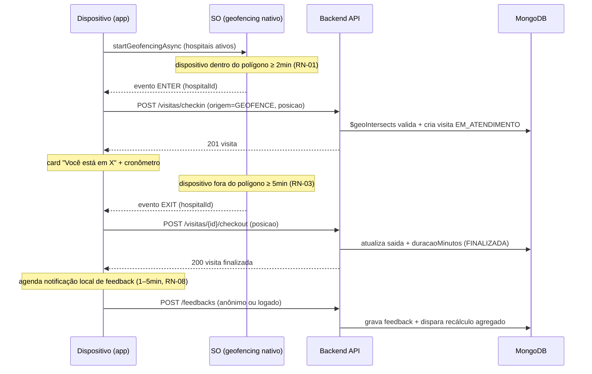

# 🔌 Especificação da API REST — saude-monitor v2.0

> **Contratos de integração e modelo de dados MongoDB para o Clinical Sanctuary**
>
> | Campo | Valor |
> |---|---|
> | **Versão** | 2.0 |
> | **Status** | Proposta de contrato — congelar com o time antes da implementação |
> | **Data** | 07/08/2026 |
> | **Base** | Árvore Tecnológica v2.0 (ADRs) · Documento Negocial v2.0 (RN) · Backlog v2.0 (E1–E6) |
> | **Padrão** | REST + JSON · OpenAPI 3.1 (gerar spec a partir deste documento) |

---

## 1. Convenções Gerais

- **Base URL:** `https://api.saude-monitor.com.br/api/v1` (produção) · `http://localhost:8080/api/v1` (dev)
- **Protocolo:** HTTPS obrigatório em produção.
- **Autenticação:** `Authorization: Bearer <access_token>` (JWT). Endpoints públicos são explicitamente marcados como 🔓.
- **Formato de data/hora:** ISO 8601 UTC (`2026-08-07T16:00:00Z`).
- **GeoJSON:** conforme RFC 7946; coordenadas `[longitude, latitude]` (lon/lat, ordem do GeoJSON).
- **Ids:** strings (MongoDB ObjectId) — `652c9f3e1a2b3c4d5e6f7080`.
- **Paginação:** `?page=0&size=20` (0-based) → resposta com `page`, `size`, `totalElements`, `totalPages`, `content`.
- **Idioma das mensagens:** pt-BR.
- **Versionamento:** prefixo `/api/v1` no path; quebras de contrato exigem v2.

### 1.1 Envelope de resposta padrão

**Sucesso:** o recurso retorna diretamente o JSON do objeto ou paginação.

**Erro (todos os endpoints):**
```json
{
  "timestamp": "2026-08-07T16:00:00Z",
  "status": 404,
  "code": "HOSPITAL_NAO_ENCONTRADO",
  "message": "Hospital não encontrado para o id informado.",
  "details": [],
  "traceId": "e3b0c44298fc1c149afbf4c8996fb924"
}
```

| Campo | Tipo | Descrição |
|---|---|---|
| `timestamp` | string (ISO) | Momento do erro |
| `status` | int | HTTP status |
| `code` | string | Código estável do erro (usar em testes/automação) |
| `message` | string | Mensagem amigável pt-BR |
| `details` | array | Detalhes de validação de campo (ex.: `[{campo, mensagem}]`) |
| `traceId` | string | Correlação para suporte (log) |

### 1.2 Códigos de erro comuns

| Código | HTTP | Uso |
|---|---|---|
| `CAMPOS_INVALIDOS` | 400 | Falha de validação de request |
| `NAO_AUTORIZADO` | 401 | Token ausente/ inválido/ expirado |
| `ACESSO_NEGADO` | 403 | Sem papel para o recurso |
| `RECURSO_NAO_ENCONTRADO` | 404 | Id inexistente |
| `CONFLITO` | 409 | Violação de unicidade/estado (ex.: feedback duplicado) |
| `LIMITE_EXCEDIDO` | 429 | Rate limit |
| `ERRO_INTERNO` | 500 | Erro não tratado |

---

## 2. Modelo de Dados MongoDB (coleções)

> Banco: `saude_monitor` · Fonte primária: MongoDB 7 (Percona) · Índices geoespaciais **2dsphere**.

### 2.1 `hospitais`

```json
{
  "_id": "652c9f3e1a2b3c4d5e6f7080",
  "nome": "Hospital Santa Casa",
  "cnpj": "12.345.678/0001-90",
  "tipo": "PRIVADO",
  "endereco": { "logradouro": "Rua X, 100", "cidade": "São Paulo", "uf": "SP", "cep": "01000-000" },
  "geofence": {
    "type": "Polygon",
    "coordinates": [[[-46.633, -23.550], [-46.633, -23.560], [-46.620, -23.560], [-46.620, -23.550], [-46.633, -23.550]]]
  },
  "contato": { "telefone": "(11) 3333-0000", "email": "contato@santacasa.com.br" },
  "ativo": true,
  "criadoEm": "2026-08-01T10:00:00Z",
  "atualizadoEm": "2026-08-01T10:00:00Z"
}
```

- **Índices:** `{ "geofence": "2dsphere" }` · `{ "nome": 1 }` unique · `{ "cnpj": 1 }` unique · `{ "ativo": 1, "tipo": 1 }`
- **Regras:** geofence é `Polygon` fechado (primeiro e último vértice iguais); tipo ∈ `PUBLICO|PRIVADO|FILANTROPICO`.

### 2.2 `usuarios`

```json
{
  "_id": "652c9f3e1a2b3c4d5e6f7081",
  "nome": "Marina Souza",
  "email": "marina@email.com",
  "senhaHash": "$2a$10$N9qo8uLOickgx2ZMRZoMyeIjZAgcfl7p92ldGxad68LJZdL17lhWy",
  "telefone": "(11) 99999-0000",
  "papel": "USER",
  "consentimentos": {
    "localizacao": { "aceito": true, "data": "2026-08-01T10:00:00Z", "versaoTermos": "1.0" },
    "notificacoes": { "aceito": true, "data": "2026-08-01T10:00:00Z" },
    "termosUso": { "aceito": true, "data": "2026-08-01T10:00:00Z", "versao": "1.0" }
  },
  "ativo": true,
  "criadoEm": "2026-08-01T10:00:00Z",
  "atualizadoEm": "2026-08-01T10:00:00Z"
}
```

- **Índices:** `{ "email": 1 }` unique.
- **Segurança:** `senhaHash` via BCrypt (F0-01); token JWT armazenado **nunca** no banco (apenas no cliente, SecureStore).

### 2.3 `visitas`

```json
{
  "_id": "652c9f3e1a2b3c4d5e6f7082",
  "usuarioId": "652c9f3e1a2b3c4d5e6f7081",
  "hospitalId": "652c9f3e1a2b3c4d5e6f7080",
  "entrada": "2026-08-07T14:03:00Z",
  "saida": "2026-08-07T16:45:00Z",
  "duracaoMinutos": 162,
  "status": "FINALIZADA",
  "tipoPermanencia": "ATENDIMENTO",
  "ultimoHeartbeat": "2026-08-07T16:30:00Z",
  "origem": "GEOFENCE",
  "pontosAmostrais": [
    { "posicao": { "type": "Point", "coordinates": [-46.627, -23.555] }, "em": "2026-08-07T14:10:00Z" }
  ],
  "notas": "entrada detectada em 3min; saída em 6min",
  "criadoEm": "2026-08-07T14:03:00Z"
}
```

- **Índices:** `{ "hospitalId": 1, "entrada": -1 }` · `{ "usuarioId": 1, "entrada": -1 }` · `{ "status": 1 }` · `{ "ultimoHeartbeat": 1 }`
- **Status:** `EM_ATENDIMENTO` → `SUSPEITA` → `FINALIZADA` | `EXPIRADA` | `GPS_INTERROMPIDO` | `SEM_FEEDBACK` (derivado)
- **`tipoPermanencia`:** `ATENDIMENTO` (padrão) | `OBSERVACAO` | `INTERNACAO` — sinalizado pelo usuário após 12h de visita ativa (RN-24).
- **Regras (RN-01..RN-07, RN-23, RN-24):** entrada após 2min contínuos no geofence; saída após 5min fora; **expiração apenas após 24h sem heartbeat** (não por tempo de permanência — filas de 12h+ no SUS são comuns e a visita deve continuar ativa enquanto houver heartbeat); `origem` ∈ `GEOFENCE|MANUAL`; visitas < 2min não entram no agregado; heartbeat a cada 30min (RN-23).

### 2.4 `feedbacks`

```json
{
  "_id": "652c9f3e1a2b3c4d5e6f7083",
  "visitaId": "652c9f3e1a2b3c4d5e6f7082",
  "usuarioId": null,
  "hospitalId": "652c9f3e1a2b3c4d5e6f7080",
  "foiAtendido": "SIM",
  "motivoNaoAtendido": null,
  "teveMedico": "SIM",
  "fezTriagem": "SIM",
  "medicacaoReceita": "RECEBI",
  "nota": 4,
  "comentario": "Atendimento rápido, equipe atenciosa.",
  "anonimizado": false,
  "criadoEm": "2026-08-07T16:55:00Z"
}
```

- **Índices:** `{ "visitaId": 1 }` **unique** (RN-12 dedupe) · `{ "hospitalId": 1, "criadoEm": -1 }`
- **Enums:** `foiAtendido` ∈ `SIM|NAO|DESISTI` · `teveMedico` ∈ `SIM|NAO|NAO_PRECISEI` · `fezTriagem` ∈ `SIM|NAO|NAO_SEI` · `medicacaoReceita` ∈ `RECEBI|NAO_RECEBEU|NAO_PRECISEI` · `nota` 1–5.
- **Regras:** `usuarioId` pode ser nulo (anônimo); feedbacks nunca expostos publicamente; agregação usa apenas feedbacks com `criadoEm` dentro do período.

### 2.5 `agregados_hospitais` (materializado — leitura pública)

```json
{
  "_id": "652c9f3e1a2b3c4d5e6f7084",
  "hospitalId": "652c9f3e1a2b3c4d5e6f7080",
  "notaMedia": 4.2,
  "nAvaliacoes": 12,
  "tempoMedianoMinutos": 95,
  "nVisitas": 34,
  "periodoInicio": "2026-05-10T00:00:00Z",
  "periodoFim": "2026-08-07T23:59:59Z",
  "atualizadoEm": "2026-08-07T16:55:05Z"
}
```

- **Índices:** `{ "hospitalId": 1 }` unique.
- **Regras (RN-14..RN-19):** `notaMedia` = média aritmética das notas; `tempoMedianoMinutos` = mediana das durações de visitas FINALIZADA com `tipoPermanencia = ATENDIMENTO` e **≤ 24h** no período (filas de 12h+ do SUS entram na métrica; internação/observação saem — RN-16/RN-17/RN-24); exibir indicadores apenas se `nAvaliacoes >= 5` (o app/API omite quando abaixo); atualização em ≤ 15min via job.

---

## 3. Endpoints

> Legenda: 🔓 público · 🔒 autenticado · 🛡️ admin/gestor

### 3.1 Auth e Usuário

#### `POST /api/v1/auth/registro` 🔓
Cria conta (opcional no MVP — jornada principal funciona sem login).

**Request:**
```json
{
  "nome": "Marina Souza",
  "email": "marina@email.com",
  "senha": "S3nh@Forte!",
  "telefone": "(11) 99999-0000",
  "consentimento": { "termosUso": true, "versaoTermos": "1.0" }
}
```
**201 Created**
```json
{
  "id": "652c9f3e1a2b3c4d5e6f7081",
  "nome": "Marina Souza",
  "email": "marina@email.com",
  "criadoEm": "2026-08-01T10:00:00Z"
}
```
**Validações:** e-mail válido e único; senha ≥ 8 chars com número e letra; `consentimento.termosUso` obrigatório = true (LGPD).

#### `POST /api/v1/auth/login` 🔓
**Request:**
```json
{ "email": "marina@email.com", "senha": "S3nh@Forte!" }
```
**200 OK**
```json
{
  "accessToken": "eyJhbGciOi...",
  "refreshToken": "eyJhbGciOi...",
  "expiraEm": 900,
  "usuario": { "id": "652c9f3e1a2b3c4d5e6f7081", "nome": "Marina Souza", "email": "marina@email.com", "papel": "USER" }
}
```
**Regras:** `expiraEm` = 900s (15min); rate limit 10 req/min/IP.

#### `POST /api/v1/auth/refresh` 🔓
**Request:** `{ "refreshToken": "..." }` → **200** `{ "accessToken": "...", "refreshToken": "...", "expiraEm": 900 }`
Rotação de refresh token (revoga o anterior).

#### `POST /api/v1/auth/logout` 🔒
**200** — invalida refresh token (blacklist).

#### `DELETE /api/v1/usuarios/me` 🔒
Exclui conta e dados pessoais (LGPD). **200** com resumo do que foi removido/anonimizado.

#### `GET /api/v1/usuarios/me` 🔒
Perfil do usuário logado (dados + consentimentos).

#### `PUT /api/v1/usuarios/me/consentimentos` 🔒
Atualiza consentimentos (ex.: revogar localização). **Request:** `{ "localizacao": { "aceito": false } }`

---

### 3.2 Hospitais

#### `GET /api/v1/hospitais` 🔓
Lista hospitais ativos próximos ou com filtro. Query params: `latitude`, `longitude`, `raioKm` (default 10), `tipo`, `busca`, `page`, `size`.
**200 OK**
```json
{
  "content": [
    {
      "id": "652c9f3e1a2b3c4d5e6f7080",
      "nome": "Hospital Santa Casa",
      "tipo": "PRIVADO",
      "endereco": { "cidade": "São Paulo", "uf": "SP" },
      "geofence": { "type": "Polygon", "coordinates": [["..."] ] },
      "indicadores": {
        "notaMedia": 4.2,
        "nAvaliacoes": 12,
        "tempoMedianoMinutos": 95,
        "atualizadoEm": "2026-08-07T16:55:05Z"
      }
    }
  ],
  "page": 0, "size": 20, "totalElements": 1, "totalPages": 1
}
```
**Query geo:** usa `$near` com `$maxDistance` sobre `geofence` (centroide) ou `$geoIntersects` — **decisão de implementação**: listar por raio usa o **centroide** do polígono; detectar entrada usa `$geoIntersects` com o ponto do usuário.

#### `GET /api/v1/hospitais/{id}` 🔓
Detalhe público: campos do hospital + indicadores (omitir `notaMedia`/`tempoMedianoMinutos` se `nAvaliacoes < 5` — retornar `"indicadoresDisponiveis": false`).

#### `GET /api/v1/hospitais/{id}/geofence` 🔓
Retorna apenas o geofence (para renderização no mapa). **200** `{ "geofence": { ... } }`

#### `POST /api/v1/hospitais` 🛡️
Cadastro de hospital + geofence (admin). **201** com recurso completo. Valida polígono GeoJSON (fechado, ≥ 3 vértices, sem auto-interseção).

#### `PUT /api/v1/hospitais/{id}` 🛡️
Atualiza hospital/geofence. **200**.

#### `PATCH /api/v1/hospitais/{id}/status` 🛡️
Ativa/desativa. **200**.

---

### 3.3 Visitas

> O fluxo de detecção é **iniciado no dispositivo** (geofencing nativo, ADR-002). A API recebe eventos de entrada/saída.

#### `POST /api/v1/visitas/checkin` 🔒
Registra entrada (automática via geofence ou manual).

**Request:**
```json
{
  "hospitalId": "652c9f3e1a2b3c4d5e6f7080",
  "origem": "GEOFENCE",
  "posicao": { "type": "Point", "coordinates": [-46.627, -23.555] },
  "dispositivoId": "android-uuid-123" 
}
```
**201 Created**
```json
{
  "id": "652c9f3e1a2b3c4d5e6f7082",
  "hospitalId": "652c9f3e1a2b3c4d5e6f7080",
  "entrada": "2026-08-07T14:03:00Z",
  "status": "EM_ATENDIMENTO"
}
```
**Regras:** valida se ponto está dentro do geofence (`$geoIntersects`) quando `origem=GEOFENCE`; se já existe visita `EM_ATENDIMENTO` no mesmo hospital, retorna a existente (idempotente); `dispositivoId` permite visita anônima (sem login).

#### `POST /api/v1/visitas/{id}/checkout` 🔒
Registra saída. **Request:** `{ "posicao": {...} }` → **200**
```json
{
  "id": "652c9f3e1a2b3c4d5e6f7082",
  "saida": "2026-08-07T16:45:00Z",
  "duracaoMinutos": 162,
  "status": "FINALIZADA"
}
```

#### `POST /api/v1/visitas/{id}/heartbeat` 🔒
Sinal de vida da visita (RN-23). O app envia a cada **30 minutos** enquanto a visita está ativa (também serve de fallback quando o app está em primeiro plano). Atualiza `ultimoHeartbeat`; se a visita estava `SUSPEITA` (2h sem heartbeat), retorna ao status `EM_ATENDIMENTO`. **200** `{ "status": "EM_ATENDIMENTO", "ultimoHeartbeat": "2026-08-07T16:30:00Z" }`

#### `PATCH /api/v1/visitas/{id}/tipo-permanencia` 🔒
Sinaliza internação/observação (RN-24) — disponível quando a visita tem ≥ 12h de duração. **Request:** `{ "tipoPermanencia": "INTERNACAO" }` → **200** `{ "tipoPermanencia": "INTERNACAO" }`. A visita continua ativa, mas **sai do cálculo do tempo médio de pronto-atendimento**.

#### `GET /api/v1/visitas/ativas` 🔒
Retorna visita `EM_ATENDIMENTO` do usuário (para card/cronômetro). **200** `{ "visita": {...} | null }`

#### `GET /api/v1/usuarios/me/visitas` 🔒
Histórico do usuário (paginado). **200** paginação com visita + hospital + status + feedback (se houver).

#### `POST /api/v1/visitas/{id}/expirar` 🛡️ (job interno)
Expira visita **apenas após 24h sem heartbeat** (RN-04) — proteção contra GPS "preso", sem cortar esperas reais de 12h+. Chamado por job agendado (ex.: a cada 15min). Visitas em `SUSPEITA` há 2h são candidatas; sem heartbeat por 24h → `EXPIRADA`.

---

### 3.4 Feedbacks

#### `POST /api/v1/feedbacks` 🔓 (público — permite anônimo)
Registra feedback pós-saída. **Autenticação opcional** (se logado, vincula `usuarioId`).

**Request:**
```json
{
  "visitaId": "652c9f3e1a2b3c4d5e6f7082",
  "foiAtendido": "SIM",
  "motivoNaoAtendido": null,
  "teveMedico": "SIM",
  "fezTriagem": "SIM",
  "medicacaoReceita": "RECEBI",
  "nota": 4,
  "comentario": "Atendimento rápido."
}
```
**201 Created** `{ "id": "...", "criadoEm": "...", "recebido": true }`
**Erros:** `CONFLITO` se `visitaId` já tem feedback (RN-12); `RECURSO_NAO_ENCONTRADO` se visita não existe ou não está FINALIZADA.

#### `GET /api/v1/visitas/{id}/feedback` 🔒
Retorna feedback da visita (se houver) — usado para edição de comentário (opcional).

#### `PUT /api/v1/feedbacks/{id}` 🔒 (dono)
Permite editar comentário/nota dentro da janela de 24h (RN-09). **200**.

---

### 3.5 Agregados (leitura pública)

#### `GET /api/v1/hospitais/{id}/indicadores` 🔓
**200**
```json
{
  "hospitalId": "652c9f3e1a2b3c4d5e6f7080",
  "indicadoresDisponiveis": true,
  "notaMedia": 4.2,
  "nAvaliacoes": 12,
  "tempoMedianoMinutos": 95,
  "nVisitas": 34,
  "periodo": { "inicio": "2026-05-10T00:00:00Z", "fim": "2026-08-07T23:59:59Z" },
  "atualizadoEm": "2026-08-07T16:55:05Z"
}
```
Se `nAvaliacoes < 5`: `"indicadoresDisponiveis": false` e campos de média `null` (RN-15).

#### `GET /api/v1/hospitais/ranking` 🔓
Ranking por `ordem=nota|tempo`. Query: `ordem`, `tipo`, `page`, `size`. Ordena pelos campos do agregado.

---

## 4. Fluxo de Detecção (Geofence → API)



---

## 5. Segurança da API

| Item | Política |
|---|---|
| **TLS** | HTTPS obrigatório; HSTS; certificados gerenciados |
| **JWT** | Access 15min (curto) + Refresh 30d (rotação, SecureStore no app) |
| **CORS** | Restrito a domínios do app web (dev) |
| **Rate limit** | Login 10/min/IP · Feedback 30/min/IP · Público 60/min/IP |
| **Validação** | Bean Validation em todos os DTOs; mensagens pt-BR |
| **Logs** | Sem dados pessoais (nunca logar e-mail/senha/posição bruta); `traceId` em todas as respostas |
| **Papéis** | `USER` (padrão) · `HOSPITAL_ADMIN` (futuro) · `ADMIN` (cadastro de hospitais) |

---

## 6. Contratos de evento (futuro — desenho para Fase 2)

Quando Kafka entrar (ADR-004 revisão), os eventos já serão desenhados:

| Evento | Payload (resumo) | Consumidores futuros |
|---|---|---|
| `visita.finalizada` | `{ visitaId, hospitalId, duracaoMinutos, entrada, saida }` | Agregador, Analytics |
| `feedback.criado` | `{ feedbackId, visitaId, hospitalId, nota, criadoEm }` | Agregador, Notificação |
| `hospital.atualizado` | `{ hospitalId, versaoGeofence }` | Cache geofence mobile |

No MVP, esses eventos são processados **in-process** (job/`@TransactionalEventListener`) — sem fila externa.

---

## 7. Checklist de congelamento do contrato

- [ ] Validar nomes de campos pt-BR vs ingleses (ex.: `duracaoMinutos` vs `durationMinutes`) — **padrão adotado: camelCase pt-BR** no payload JSON, campos de domínio em pt-BR.
- [ ] Confirmar política de `origem=MANUAL` (check-in manual) e seus limites anti-abuso.
- [ ] Confirmar `dispositivoId` anônimo: formato e duração de retenção (LGPD).
- [ ] Confirmar política de heartbeat/expiração (RN-04/RN-23): intervalo de 30min, marcação `SUSPEITA` aos 2h, expiração aos 24h sem sinal — validar consumo de bateria e rede em teste de campo.
- [ ] Decidir edição de feedback: permitida só comentário ou nota também? (Proposta: comentário editável; nota não — integridade do agregado.)
- [ ] Gerar spec OpenAPI 3.1 a partir deste documento e versionar em `backend/src/main/resources/openapi/`.
- [ ] Testes de integração por recurso no Sprint 0 (F0-03).

---

*Fim da Especificação da API v2.0 — congelar com o time antes do Sprint 0.*
