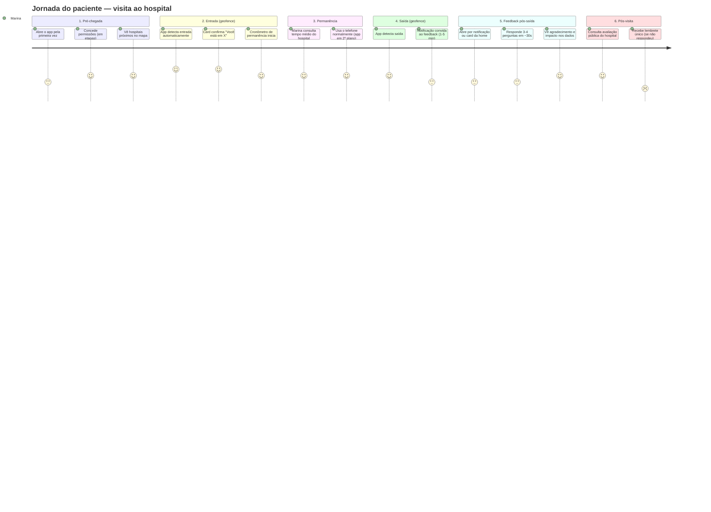
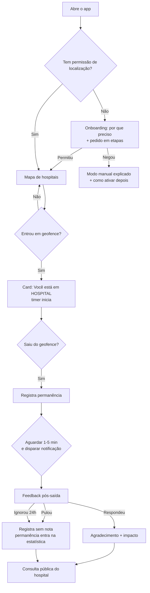
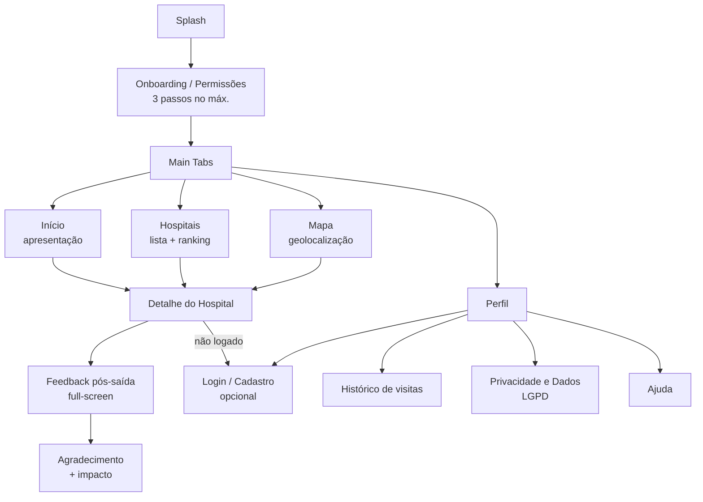
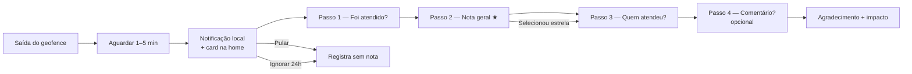

# Padrão UI/UX v2.0 — Clinical Sanctuary
## App de Monitoramento Hospitalar por Geolocalização (Experiência do Paciente)

| Campo | Valor |
|---|---|
| **Versão do documento** | 2.0 |
| **Status** | Proposta de padrão — pronta para validação e desenvolvimento |
| **Área responsável** | Design de Produto (UI/UX) |
| **Base** | `DESIGN.md` v1.2 (Clinical Sanctuary — painel institucional) + protótipo `code.html` + frontend Expo 55 existente |
| **Escopo** | App mobile (React Native + Expo 55) — Android e iOS, responsivo para web |
| **Público do documento** | Designers, desenvolvedores frontend, PO, QA e stakeholders |

> **Como ler este documento:** ele é autocontido. Toda decisão de design está expressa em tokens, números e nomes de componentes. Se um valor não está aqui, ele não existe no padrão — crie a partir das escalas definidas nas seções 5.2 a 5.5.

---

## 1. Visão Geral e Princípios de UX

### 1.1 O que o produto faz

O **Clinical Sanctuary** (v2.0) é um app mobile que monitora a experiência hospitalar do cidadão por geolocalização:

1. **Entrada automática:** ao entrar na área de um hospital (geofence), o app detecta via GPS e inicia a contagem do tempo de permanência — sem nenhuma ação do usuário.
2. **Saída com feedback leve:** ao sair da área, o app dispara um formulário rápido e não-cansativo: foi atendido? teve médico? fez triagem? como foi o atendimento (recepção, enfermagem, médico, técnicos)? recebeu medicação/receita? nota geral.
3. **Transparência pública:** tempo de permanência e notas são agregados por hospital e exibidos publicamente — tempo médio de atendimento e avaliação média para todos os usuários.
4. **Requisito central de UX:** o app deve ser intuitivo e o feedback **nunca** pode ser cansativo.

### 1.2 Evolução da identidade: do painel institucional para o paciente

O padrão v1.2 ("Clinical Sanctuary") foi desenhado para o **gestor hospitalar** — dashboards, cadastro institucional, credenciais. A v2.0 **mantém a linguagem visual** (calma, tonal, editorial) e a **muda de voz**: agora quem segura o telefone é uma pessoa que acabou de passar por um hospital — possivelmente ansiosa, cansada, com pressa ou cuidando de alguém.

| Dimensão | v1.2 (institucional) | v2.0 (paciente/cidadão) |
|---|---|---|
| North Star | "Clinical Sanctuary" — segurança e inteligência institucional | "**Um santuário que cuida de você antes, durante e depois**" — o app que acolhe e informa sem cobrar esforço |
| Voz | Formal, técnica | **Acolhedora, direta, humana** — frases curtas, verbo na 2ª pessoa, zero jargão |
| Fricção aceitável | Formulários longos com credenciais | **Mínima absoluta**: detecção automática, feedback ≤ 45s, pulável |
| Dados | Painéis para gestão | **Transparência pública** para o cidadão escolher e cobrar qualidade |
| Privacidade | LGPD institucional | LGPD centrada no titular: consentimento granular, minimização, anonimização |

### 1.3 Princípios de UX (não-negociáveis)

| # | Princípio | Tradução prática |
|---|---|---|
| P1 | **Zero fricção na entrada** | A detecção automática (geofence) é a via principal e o app confirma com um card gentil: "Você está em X". O **check-in manual em 1 toque** é um caminho de primeira classe, ao lado do automático — não uma exceção — para quem tem GPS desligado, permissão negada ou iOS restritivo. Ambas as vias mantêm a fricção mínima na entrada. |
| P2 | **Feedback não-cansativo** | Máximo de **4 perguntas**, tempo alvo **< 45 segundos**, progresso visível, botão **"Pular" sempre presente**, comentário opcional, envio em 1 toque. Nunca bloquear o uso do app por falta de resposta. |
| P3 | **Momento certo é o meio-termo** | O pedido de feedback chega **1 a 5 minutos após a saída** (notificação local + card na home), com janela de 24h e **no máximo 1 lembrete**. Fora da janela, o feedback perde a validade sem penalizar o usuário. |
| P4 | **Transparência radical** | Todo dado exibido publicamente é **agregado e anônimo**, com N mínimo de amostra e data da medição. O usuário vê o próprio tempo registrado e entende como ele vira estatística. |
| P5 | **Privacidade por design (LGPD)** | Consentimento granular em etapas, minimização de dados (só coleta o que o geofence precisa), direitos do titular acessíveis em 2 toques (Perfil → Dados e Privacidade). |
| P6 | **Uma ação primária por tela** | Qualquer tela é compreendida em **2 segundos**: o olho encontra a ação principal antes de qualquer outra coisa. |
| P7 | **Calma visual (Clinical Sanctuary)** | Tons sobre tons, sem bordas duras, sem preto puro, sem ruído. O app parece um instrumento médico premium — porque transmite confiança. |
| P8 | **Acessível por padrão** | WCAG 2.2 AA, alvos de toque ≥ 48dp, contraste verificado, leitores de tela suportados. Acessibilidade é gate de aceite, não polimento. |
| P9 | **Honestidade sobre limitações** | Quando o hospital não tem amostra suficiente, o app diz "ainda sem avaliações suficientes" — nunca inventa média. Quando o GPS falha, o app explica e oferece saída. |

---

## 2. Personas

### 2.1 Marina — a paciente (usuária principal)

- **Perfil:** 34 anos, mãe de 2 filhos, trabalha como vendedora. Usa smartphone Android intermediário, apps de banco, WhatsApp e mapas no dia a dia.
- **Cenário:** levou o filho de 6 anos ao pronto-socorro às 22h com febre. Esperou 3 horas na recepção, foi atendida pela enfermagem, depois pelo médico.
- **Dores:** não sabe quanto tempo vai esperar; não tem como comparar hospitais na hora de escolher; na saída, está exausta e não quer preencher "mais um formulário gigante".
- **Necessidades:** saber que o app detectou sozinho (não quer apertar nada na entrada); poder responder a avaliação em 30 segundos no sofá de casa; ver se aquele hospital é bom antes de voltar.
- **Sucesso medido por:** completou o feedback em < 1 min; voltou a consultar a avaliação pública do hospital; recomendou o app para outra mãe.

### 2.2 Carlos — o acompanhante

- **Perfil:** 28 anos, designer, levou o pai (idoso) para uma consulta eletiva e depois para exames.
- **Cenário:** passa 2 horas no hospital entre triagem, consulta e coleta de sangue. Sai com o pai, que está bem, mas cansado.
- **Dores:** durante a espera, queria informação útil (quanto tempo em média o hospital demora?); na saída, o pai não vai responder o formulário — ele responde pelo pai.
- **Necessidades:** conseguir responder em nome do acompanhado (mesmo celular, mesma visita); feedback com linguagem simples; poder pular perguntas que não se aplicam (ex.: "não precisei de medicação").
- **Sucesso medido por:** respondeu pelo pai sem fricção; usou os dados públicos para escolher o próximo hospital do pai.

### 2.3 Dra. Renata — a gestora hospitalar

- **Perfil:** 41 anos, diretora de qualidade de um hospital de médio porte. Consome relatórios, responde à ouvidoria, é cobrada por indicadores.
- **Cenário:** descobre o app porque pacientes citam "o aplicativo que avalia hospitais". Quer entender a reputação pública da própria unidade e agir.
- **Dores:** dados públicos imprecisos podem prejudicar a instituição; não sabe quem são os avaliadores; quer detalhes (por setor, por turno) para melhorar.
- **Necessidades:** painel institucional (v1.2) com os mesmos dados agregados; alertas quando a nota cai; transparência metodológica (N mínimo, período).
- **Sucesso medido por:** nota pública subiu após ações de melhoria; tempo médio registrado bate com o sistema interno.

### 2.4 Comparação e implicações de design

| Aspecto | Marina (paciente) | Carlos (acompanhante) | Dra. Renata (gestora) |
|---|---|---|---|
| Superfície | App mobile (principal) | App mobile | Painel web (v1.2, evoluir depois) |
| Momento de uso | Entrada/saída do hospital, consulta pública | Durante espera e pós-saída | Escritório, reuniões |
| Tolerância a fricção | Muito baixa | Baixa | Média |
| Decisão de design | Formulário de feedback ≤ 4 perguntas, pulável, anônimo | Resposta "em nome de" sem cadastro extra; linguagem simples | Painel usa os mesmos agregados, com metodologia visível |

> **Decisão estrutural:** o app **não exige login para a jornada principal** (detectar, avaliar, consultar). Conta é opcional (seção 4.4). Isso atende Marina e Carlos no momento de menor tolerância a fricção.

---

## 3. Jornada do Usuário Ponta a Ponta

### 3.1 Mapa da jornada



### 3.2 Momentos de verdade e redução de fricção

| Fase | Momento de verdade | Fricção típica | Redução de fricção (nossa regra) |
|---|---|---|---|
| **1. Entrada** | "O app percebeu que estou aqui **sem eu fazer nada**" | Check-in manual, formulários | Geofence automático + card de confirmação não-bloqueante. **Zero toques obrigatórios.** |
| **2. Permanência** | "Posso ver quanto tempo estou aqui e como o hospital se sai" | Nada a fazer | Card discreto com timer; consulta pública a 1 toque do card. |
| **3. Saída** | "O app pediu minha opinião **no momento certo, sem me importunar**" | Popup imediato bloqueante, formulário longo | Notificação local 1-5 min após sair; formulário ≤ 45s; "Pular" sempre visível; 1 lembrete máximo; janela 24h. |
| **4. Transparência** | "Meu tempo virou informação útil para todo mundo — e vejo isso" | Sentimento de "coletei meus dados e sumiram" | Tela de agradecimento mostra o tempo registrado e "sua avaliação entrou na média de X"; link para a página pública. |

### 3.3 Fluxo lógico com decisões e estados



### 3.4 Estados da jornada (nunca desenhar só o caminho feliz)

| Estado | Regra de produto | UI |
|---|---|---|
| GPS desligado | Oferece card manual "Estou em um hospital" com lista por proximidade | Empty state + CTA primário |
| Permissão negada | Explica como ativar nas configurações; mantém modo manual | Empty state + CTA "Abrir configurações" |
| Permanência < 3 min | Descarta (provável passagem/trânsito) — não gera feedback | Sem UI; silencioso |
| Múltiplos hospitais no raio | Escolhe o mais próximo (< 100m de diferença = confirmação manual) | Card com 2 opções "Você está em X ou Y?" |
| Hospital não mapeado | Convida a "Sugerir hospital" (envia geolocalização + nome) | Link no empty state do mapa |
| Bateria baixa | Reduz frequência de amostragem de GPS | Sem UI; degrade transparente |
| Notificação não aberta em 2h | 1 lembrete; expira em 24h | Notificação local + card na home |
| Sem amostra suficiente no hospital | Não exibe média inventada | Badge "Ainda sem avaliações suficientes" |

---

## 4. Arquitetura de Informação e Mapa de Navegação

### 4.1 Mapa de navegação



### 4.2 Estrutura da informação

```
Clinical Sanctuary
├── Onboarding (1ª vez)
│   ├── Passo 1 — Boas-vindas e valor
│   ├── Passo 2 — Permissão de localização (granular, explicada)
│   └── Passo 3 — Permissão de notificações (opcional, explicada)
├── Main Tabs (navegação inferior)
│   ├── Início (aba 1 — apresentação)
│   │   ├── Apresentação do produto/valor
│   │   ├── Atalho para busca de hospitais
│   │   └── Card de permanência ativa (geofence/check-in manual) — sobreposto
│   ├── Hospitais (aba 2)
│   │   ├── Busca por nome
│   │   ├── Lista/ranking com nota média + tempo médio
│   │   └── Detalhe do Hospital (push)
│   │       ├── Nota geral, N de avaliações, período
│   │       ├── Barras por categoria (recepção, enfermagem, médico, medicação)
│   │       ├── Tempo médio de permanência
│   │       └── Botão "Avaliar agora" (se esteve lá)
│   │       └── Botão de check-in manual (1 toque)
│   ├── Mapa (aba 3)
│   │   ├── Mapa com hospitais próximos (pins)
│   │   ├── Card de permanência ativa (geofence) — sobreposto
│   │   └── Sugestão de hospital (empty/edge)
│   └── Perfil (aba 4)
│       ├── Identidade (anônimo ou logado)
│       ├── Histórico de visitas (data, hospital, tempo, nota)
│       ├── Minhas avaliações (editar/excluir)
│       ├── Dados e Privacidade (LGPD: baixar/excluir dados)
│       ├── Preferências (notificações, modo economia)
│       └── Ajuda
└── Feedback pós-saída (full-screen, não é aba)
    ├── Passo 1 — Foi atendido?
    ├── Passo 2 — Nota geral (estrelas)
    ├── Passo 3 — Quem atendeu? (chips multi)
    └── Passo 4 — Comentário opcional + enviar
```

### 4.3 Navegação inferior (Bottom Navigation)

4 abas — no máximo 4 no v1. Início (apresentação) é a aba inicial; Mapa é a 3ª aba (geolocalização); a jornada de detecção/check-in é distribuída entre Início, Hospitais e Mapa.

| Aba | Ícone (lucide) | Label | Papel |
|---|---|---|---|
| Início | `Home` | Início | Apresentação, atalhos, card de permanência ativa |
| Hospitais | `Building2` | Hospitais | Busca, ranking público, detalhe, check-in manual |
| Mapa | `MapPin` | Mapa | Geolocalização, hospitais próximos, permanência ativa |
| Perfil | `UserRound` | Perfil | Histórico, conta (opcional), LGPD |

### 4.4 Decisão estrutural: conta opcional

- **Jornada principal é anônima:** detectar, avaliar, consultar — tudo sem login. O feedback é anônimo por padrão (agregado ao hospital).
- **Conta opcional** (e-mail/senha ou Apple/Google) habilita: histórico pessoal em nuvem, editar/excluir avaliações, preferências sincronizadas.
- **Por quê:** o momento de maior fricção (saída do hospital) não pode exigir "crie uma conta para avaliar". Login fica no Perfil, onde o usuário já está em contexto de gestão.
- **Fluxo de logout** não destrói dados locais; avaliações anônimas permanecem agregadas.

### 4.5 Fluxo de autenticação (evoluído da v1.2)

- Tela de Login/Cadastro **mantém o card hero do Clinical Sanctuary**, com os ajustes de conformidade da seção 8: badges passam a **"LGPD"**, **"Criptografia ponta a ponta"** e **"Dados anônimos e agregados"** (remover "HIPAA Compliant" — lei americana, não se aplica).
- Campos: e-mail/usuário, senha, "lembrar dispositivo", "esqueci minha senha", link para cadastro.
- Cadastro: nome, e-mail, telefone (opcional), senha, termos LGPD (checkbox em secondary).

---

## 5. Design System — Clinical Sanctuary v2.0

### 5.1 Tokens de cor

Paleta Material 3 tonal herdada da v1.2 (protótipo `code.html`). **Nenhum valor novo fora desta tabela.**

#### 5.1.1 Cores primárias, secundárias e terciárias

| Token | Hex | Uso principal |
|---|---|---|
| `primary` | `#006193` | Ação principal, links, ícones ativos, gradiente base |
| `on-primary` | `#ffffff` | Texto/ícones sobre primary |
| `primary-container` | `#007bb8` | Fundo de destaques informativos, gradiente secundário |
| `on-primary-container` | `#fcfcff` | Texto sobre primary-container |
| `primary-fixed` | `#cce5ff` | Fundos suaves de destaque (timeline, selo) |
| `on-primary-fixed` | `#001e31` | Texto sobre primary-fixed |
| `primary-fixed-dim` | `#91ccff` | Marcas de progresso, sublinhados |
| `on-primary-fixed-variant` | `#004b73` | Texto alternativo sobre primary-fixed |
| `secondary` | `#006a6a` | Sucesso, confirmação, checkbox, timer "ativo" |
| `on-secondary` | `#ffffff` | Texto sobre secondary |
| `secondary-container` | `#90efef` | Badges positivos, chips "atendido" |
| `on-secondary-container` | `#006e6e` | Texto sobre secondary-container |
| `tertiary` | `#884e00` | **Estrelas/avaliação preenchidas**, avisos de atenção |
| `on-tertiary` | `#ffffff` | Texto sobre tertiary |
| `tertiary-container` | `#ab6300` | Badges de aviso |
| `on-tertiary-container` | `#fffbff` | Texto sobre tertiary-container |
| `error` | `#ba1a1a` | Erros, mensagens críticas |
| `on-error` | `#ffffff` | Texto sobre error |
| `error-container` | `#ffdad6` | Badges de urgência, fundo de erro |
| `on-error-container` | `#93000a` | Texto sobre error-container |

#### 5.1.2 Superfícies (hierarquia de tons — regra "no-line")

| Token | Hex | Uso |
|---|---|---|
| `surface` | `#f7f9fb` | Fundo base do app |
| `surface-container-lowest` | `#ffffff` | Cards principais, inputs, superfícies elevadas |
| `surface-container-low` | `#f2f4f6` | Seções secundárias sobre a surface |
| `surface-container` | `#eceef0` | Faixas, rodapés de card, compliance |
| `surface-container-high` | `#e6e8ea` | Trilhas de progresso, skeletons, hover |
| `surface-container-highest` | `#e0e3e5` | Elementos arrastáveis, chips de contexto |
| `surface-variant` | `#e0e3e5` | Data pills, chips neutros |
| `on-surface` | `#191c1e` | Título e texto principal (**nunca preto puro**) |
| `on-surface-variant` | `#3f4850` | Texto secundário, labels, metadata |
| `outline` | `#6f7881` | Ícones de input, placeholders, ghost borders |
| `outline-variant` | `#bfc7d2` | Bordas fantasma 20%, estrelas vazias |
| `inverse-surface` | `#2d3133` | Fundo de toasts/escuras |
| `inverse-on-surface` | `#eff1f3` | Texto sobre inverse-surface |
| `inverse-primary` | `#91ccff` | Destaque sobre superfícies escuras |
| `background` | `#f7f9fb` | Igual a surface (compatibilidade) |

#### 5.1.3 Tokens semânticos novos da v2.0 (contexto paciente)

| Token | Valor | Uso |
|---|---|---|
| `rating-filled` | `#884e00` (tertiary) | Estrelas preenchidas na avaliação |
| `rating-empty` | `#bfc7d2` (outline-variant) | Estrelas vazias |
| `geo-active` | `#006a6a` (secondary) | Card de permanência ativa, timer |
| `geo-inactive` | `#3f4850` (on-surface-variant) | Estado "não estou em hospital" |
| `success-bg` | `#90efef` (secondary-container) | Confirmação positiva |
| `warning-bg` | `#ffdcbf` (tertiary-fixed) | Avisos não-críticos |
| `on-warning` | `#2d1600` (on-tertiary-fixed) | Texto sobre warning-bg |
| `skeleton` | `#e6e8ea` (surface-container-high) | Esqueletos de carregamento |
| `overlay-scrim` | `rgba(25,28,30,0.4)` | Scrim de modais |

#### 5.1.4 Contraste verificado (WCAG 2.2 AA)

| Par | Contraste ≈ | Status |
|---|---|---|
| `on-primary` / `primary` | 6.7 : 1 | ✅ AA (texto normal) |
| `on-primary` / `primary-container` | 4.6 : 1 | ✅ AA (texto normal) — usar peso ≥ 600 em botões |
| `on-secondary` / `secondary` | 6.4 : 1 | ✅ AA |
| `on-secondary-container` / `secondary-container` | 4.6 : 1 | ✅ AA |
| `on-tertiary` / `tertiary` | 6.3 : 1 | ✅ AA |
| `on-error-container` / `error-container` | 7.2 : 1 | ✅ AA |
| `error` / `surface` | 6.1 : 1 | ✅ AA |
| `on-surface` / `surface` | 16.2 : 1 | ✅ AAA |
| `on-surface-variant` / `surface` | 8.0 : 1 | ✅ AA |
| `on-surface-variant` / `surface-container` | 8.0 : 1 | ✅ AA |
| `outline` / `surface` | 4.2 : 1 | ⚠️ Componentes gráficos (≥3:1) — **não usar para texto pequeno**; placeholders aceitáveis com label presente |
| `outline-variant` / `surface` | ~2.4 : 1 | ❌ Somente decorativo (estrelas vazias, ghost borders) — nunca texto |

> Valores aproximados, validar com ferramenta (ex.: Stark, axe) no pipeline de CI visual.

### 5.2 Tipografia

Dupla tipográfica herdada: **Manrope** (display/headlines, força institucional) + **Inter** (body/labels, legibilidade de texto longo e termos médicos).

| Role | Fonte / Peso | Tamanho | Line-height | Tracking | Uso |
|---|---|---|---|---|---|
| `display-lg` | Manrope ExtraBold 800 | 32 | 40 | -0.5 | Nota geral do hospital, métricas hero |
| `display-md` | Manrope ExtraBold 800 | 28 | 36 | -0.5 | Valores de destaque (tempo médio) |
| `display-sm` | Manrope Bold 700 | 24 | 32 | -0.3 | Números do timer de permanência |
| `headline-md` | Manrope Bold 700 | 22 | 30 | -0.3 | Título de tela principal |
| `headline-sm` | Manrope Bold 700 | 20 | 28 | -0.2 | Título de card |
| `title-lg` | Manrope SemiBold 600 | 18 | 26 | -0.2 | Nome do hospital em cards, header |
| `title-md` | Manrope SemiBold 600 | 16 | 24 | 0 | Subtítulos, seções |
| `body-lg` | Inter Regular 400 | 16 | 24 | 0 | Texto principal, perguntas do feedback |
| `body-md` | Inter Regular 400 | 14 | 21 | 0 | Texto secundário, descrições |
| `body-sm` | Inter Regular 400 | 12 | 18 | 0 | Metadata, ajuda |
| `label-lg` | Inter SemiBold 600 | 14 | 20 | 0.1 | Botões, CTAs |
| `label-md` | Inter SemiBold 600 | 12 | 16 | 0.5 | Chips, badges |
| `label-sm` | Inter SemiBold 600 | 11 | 16 | 1.0 | Microcopy, labels de campo (UPPERCASE) |
| `numeric` | Manrope Bold 700 | — | — | 0 | Valores numéricos — usar `fontVariant: ['tabular-nums']` |

**Regras:**
- Nunca usar `#000000` — sempre `on-surface`.
- Labels de campo sempre `label-sm` uppercase, cor `on-surface-variant`.
- Números sempre Manrope com tabular-nums (timer, notas, tempo médio).
- Escala de fonte do sistema (acessibilidade): layout deve suportar até 200% sem cortar texto (seção 7).

### 5.3 Espaçamento e grade

Escala base **8pt** (herdada da v1.2):

| Token | Valor |
|---|---|
| `spacing-1` | 4 |
| `spacing-2` | 8 |
| `spacing-3` | 12 |
| `spacing-4` | 16 |
| `spacing-5` | 20 |
| `spacing-6` | 24 |
| `spacing-8` | 32 |
| `spacing-10` | 40 |
| `spacing-12` | 48 |
| `spacing-16` | 64 |

- **Padding de página:** `spacing-4` (16) em mobile; `spacing-6` (24) em tablet/web.
- **Grid:** mobile 4 colunas (largura 375pt, gutter 16); tablet/web 8 colunas (largura 768pt, gutter 24); conteúdo centralizado em `max-width: 560pt`.
- **Gap padrão entre cards:** `spacing-4` (16).
- **Respiro em torno de dados críticos:** `spacing-8` a `spacing-10` (regra v1.2 mantida).
- Separação de itens de lista: **espaço** (nunca divisores/hairlines) ou troca de tom entre `surface` e `surface-container-low`.

### 5.4 Raios

| Token | Valor | Uso |
|---|---|---|
| `radius-xs` | 4 | Checkbox |
| `radius-sm` | 8 | Chips pequenos, mini-badges |
| `radius-md` | 12 | Inputs, selects, toasts, progress bar |
| `radius-lg` | 16 | Botões secundários, cards médios |
| `radius-xl` | 24 | **Cards principais e botões primários** (herdado: 1.5rem) |
| `radius-2xl` | 32 | Cards hero (login/cadastro), formulário de feedback |
| `radius-full` | 9999 | Pills, FAB, avatar, chips |

> **Harmonização:** o protótipo HTML usou 12px em inputs e botões; o padrão oficial da v1.2 define botões primários em 1.5rem (24). Regra final: inputs `radius-md` (12), botões primários `radius-xl` (24), botões secundários `radius-lg` (16).

### 5.5 Elevação e sombras

| Token | Spec | Uso |
|---|---|---|
| `shadow-cloud-1` | Y 8 · Blur 24 · cor `on-surface` 6% (`rgba(25,28,30,0.06)`) | Cards, formulário de feedback |
| `shadow-cloud-2` | Y 12 · Blur 32 · cor `on-surface` 8% (`rgba(25,28,30,0.08)`) + highlight 1px `rgba(255,255,255,0.6)` | FAB, card de permanência sobre o mapa |
| `shadow-primary-glow` | Y 6 · Blur 12 · cor `primary` 20% (`rgba(0,97,147,0.20)`) | Botão primário |
| `shadow-glass` | Y -8 · Blur 24 · cor `on-surface` 6% | Bottom navigation, painéis flutuantes |
| `elevation-android-1` | elevation 3 | Equivalente Android de shadow-cloud-1 |
| `elevation-android-2` | elevation 6 | Equivalente Android de shadow-cloud-2 |

**Glassmorphism** (herdado): superfície `surface-container-lowest` com **80% de opacidade** + `backdrop-blur` 20–40px + borda fantasma `outline-variant` 20%. Usar em: bottom navigation, card de permanência sobre o mapa, painéis flutuantes de detalhe.

**Ghost border** (fallback acessível): se uma borda for indispensável, usar `outline-variant` a 20% de opacidade. Nunca borda 100% opaca para separar seções (regra no-line).

### 5.6 Iconografia

- **Família:** `lucide-react-native` (já no projeto) — traço 2, preenchimento desligado (variante `fill` apenas para estado ativo na nav).
- **Tamanhos:** 16 (inline/label), 20 (dentro de inputs), 24 (navegação e ações), 32 (empty states), 48 (ícones de hospital em cards — dentro de círculo `surface-container`).
- **Cores:** ícones de input em `outline`; ícones de ação em `on-surface-variant`; ícones em botão primário em `on-primary`; ícone ativo da nav em `primary`.
- **Regra v1.2:** alinhar ícones à cap-height do texto adjacente.
- Ícones do mapa (pin de hospital): `MapPin` em `primary`; pin "você está aqui": `CircleDot` em `secondary`.
- Sem ícones ilustrados/fotográficos no v1 — ícones vetoriais lineares apenas.

### 5.7 Gradientes e texturas

- **Gradiente primário (assinatura):** `linear-gradient(135deg, #006193 0%, #007bb8 100%)` — exclusivo para **botões primários**, FAB e barra de progresso ativa.
- **Fundo de tela (assinatura):** `radial-gradient(circle at top left, #f7f9fb 0%, #eef2f7 100%)` — telas de autenticação e onboarding.
- **Nunca** aplicar gradiente em texto, badges ou cards de dados (mantém a hierarquia tonal).

### 5.8 Componentes

Convenção de nomenclatura: `CSComponenteVariant`. Todos os valores abaixo são tokens da seção 5.

---

#### 5.8.1 Botões

**Button Primary** (`CSButtonPrimary`)
- Anatomia: container + label (`label-lg` Manrope Bold 16) + ícone trailing opcional (16–20).
- Spec: altura **56** (mín. 52), padding horizontal 24, `radius-xl` 24, fundo gradiente primário 135°, texto `on-primary`, sombra `shadow-primary-glow`.
- Estados:
  - Default: gradiente + sombra.
  - Pressed: `scale 0.98` + sombra reduzida (transição 120ms).
  - Loading: ícone `Loader2` girando (24, `on-primary`) + label "Enviando…"; desabilita toque.
  - Disabled: `opacity 0.5`, sem sombra.
- Alvo de toque ≥ 48dp (altura 56 cobre).

**Button Secondary** (`CSButtonSecondary`)
- Fundo `surface-container-low` (ou transparente), ghost border `outline-variant` 20%, texto `primary`, `radius-lg` 16, altura 52, padding horizontal 20. Estados: pressed `surface-container`; disabled `opacity 0.5`.

**Button Tertiary** (`CSButtonTertiary`)
- Text-only: `label-lg` em `primary`, altura 48, padding horizontal 16. Só texto — para ações de baixa prioridade ("Pular", "Ver detalhes").

**Icon Button** (`CSIconButton`)
- 48×48, `radius-full`, ícone 24. Estados: pressed com fundo `surface-container-high`. Usado em headers (voltar, ajuda, configurações).

**FAB** (`CSFloatingActionButton`)
- 56×56, `radius-full`, gradiente primário, ícone 24 `on-primary`, sombra `shadow-cloud-2`. Posição: 16dp acima da bottom nav, 16dp da borda direita. Ação: "Centralizar no meu GPS" (Mapa).

---

#### 5.8.2 Campos de texto (Inputs)

**Text Field** (`CSTextField`)
- Anatomia: label (`label-sm` uppercase, `on-surface-variant`) + container + ícone leading opcional (20, `outline`) + input + ícone trailing opcional (senha: `Eye`/`EyeOff`) + helper/erro (`body-sm`).
- Spec: fundo `surface-container-lowest` sobre `surface`, altura **56**, `radius-md` 12, padding horizontal 16, texto `body-lg` `on-surface`, placeholder `outline`.
- Estados:
  - Default: sem borda — separação por tom.
  - Focus: stroke 2px `primary` (fundo mantém tom).
  - Error: stroke 2px `error` + mensagem `on-error-container` com **instrução de recuperação** ("Informe um e-mail válido", nunca "Erro").
  - Disabled: `opacity 0.5`.
  - Filled: texto `on-surface`.
- Alvo ≥ 48dp; espaçamento entre campos `spacing-5`.

**Select** (`CSSelect`)
- Igual ao Text Field + trailing `ChevronDown`; abre Bottom Sheet nativo com opções (`radius-2xl` no sheet, item com 56dp de altura, selecionado com check em `secondary`).

**Checkbox / Radio** (`CSCheckbox`, `CSRadio`)
- Visual: 20×20; checkbox `radius-xs` 4; radio `radius-full`.
- Alvo de toque: 24×24 visual **dentro de área de toque ≥ 48dp** (padding).
- Checked: preenchido em `secondary` (regra v1.2 — "sucesso calmo", não azul agressivo) + ícone `Check` 14 `on-secondary`.
- Estados: default (borda `outline-variant`), checked, disabled (`opacity 0.5`).

---

#### 5.8.3 Cards

**Card** (`CSCard`)
- Fundo `surface-container-lowest`, `radius-xl` 24, padding `spacing-5` (20), sombra `shadow-cloud-1`.
- Variante **tonal** (`CSCardTonal`): sem sombra, fundo `surface-container-low` — para blocos secundários sobre `surface`.

**Glass Card** (`CSGlassCard`) — camadas sobre o mapa
- Fundo `surface-container-lowest` 80% + `backdrop-blur` 20–40px, `radius-xl`, ghost border `outline-variant` 20%, sombra `shadow-cloud-2`.

**Hospital Card** (`CSHospitalCard`) — lista/ranking
- Anatomia: avatar 48 (`radius-full`, fundo `surface-container`, ícone `Building2` 24 `primary`) + nome (`title-lg`) + distância (`body-sm` `on-surface-variant`) + linha de avaliação (estrelas 16 + nota `numeric` + "N avaliações") + chips de métricas (`label-md`).
- Ação: card inteiro clicável → Detalhe do Hospital. Alvo ≥ 80dp de altura.
- Estados: pressed `surface-container`; exibição de "novo" opcional via badge.

---

#### 5.8.4 Navegação inferior

**Bottom Navigation** (`CSBottomNav`)
- Glass: `surface-container-lowest` 80% + blur 30px, borda superior ghost `outline-variant` 20%, sombra `shadow-glass`.
- Altura: 64 + safe area inferior.
- Item: ícone 24 + label `label-sm` 11 uppercase; ativo: ícone `fill` e texto em `primary`, com indicador pill 24×4 `primary-fixed-dim` centralizado; inativo: `on-surface-variant`.
- Área de toque por item: ≥ 48dp de altura × largura flexível.
- Transição de aba: crossfade 200ms (sem slides horizontais agressivos).

---

#### 5.8.5 Badges, chips e pills

| Componente | Spec | Uso |
|---|---|---|
| `CSBadgePositive` | fundo `secondary-container`, texto `on-secondary-container` | "Atendido", "Ativo", "Avaliado" |
| `CSBadgeUrgent` | fundo `error-container`, texto `on-error-container` | "Alta demanda", "Urgente" |
| `CSBadgeWarning` | fundo `tertiary-container`, texto `on-tertiary-container` | "Atenção", "Amostra pequena" |
| `CSBadgeInfo` | fundo `primary-container`, texto `on-primary-container` | "Novo", "Dica" |
| `CSBadgeNeutral` | fundo `surface-variant`, texto `on-surface-variant` | Metadata, "Fechado", "Privado" |
| `CSDataPill` | `radius-full`, fundo `surface-variant`, padding 12/8, `label-md` | Tempo médio "2h05", departamentos |
| `CSRatingPill` | `radius-full`, fundo `surface-container-high`, estrela 16 `tertiary` + valor `numeric` | Nota média compacta |

Altura padrão de badge/pill: 32; alvo de toque ≥ 48 quando interativo (com padding).

---

#### 5.8.6 Avaliação (estrelas) — componente central

**Rating Stars** (`CSRatingStars`)
- Input: 5 estrelas, cada estrela 32×32 com área de toque 48×48 (spacing 4 entre elas). Preenchida: `rating-filled` (`#884e00`); vazia: `rating-empty` (`#bfc7d2`). Ícone `Star` (lucide) com `fill` quando ativa.
- Feedback: spring suave no toque (escala 1.0 → 1.15 → 1.0, 200ms) + label dinâmico acima ("Nota 4 de 5 — Bom").
- **Rótulos âncora** para reduzir ambiguidade: 1 "Péssimo" · 2 "Ruim" · 3 "Regular" · 4 "Bom" · 5 "Excelente".
- Exibição agregada: permite meia-estrela (`StarHalf`) — ex.: 4.3 → 4 estrelas + meia.
- Acessibilidade: `accessibilityRole="adjustable"`, swipe para cima/baixo ou setas muda valor, `accessibilityValue` "4 de 5", anúncio em live region.
- Alternativa rápida: **Emoji Rating** (`CSRatingEmoji`) — 5 emojis (😞😕😐🙂😄) 40×40 com alvo 48, escala no toque. Usado na pergunta "Como foi o atendimento?" como variante opcional de teste A/B; padrão = estrelas.

---

#### 5.8.7 Feedback pós-saída (formulário)

**Feedback Form** (`CSFeedbackForm`) — tela full-screen
- Container: `radius-2xl` card sobre fundo `surface`, padding `spacing-6`, largura máx. 560pt centralizada.
- Topo: barra de progresso (altura 4, track `surface-container-high`, fill gradiente primário) + label "Passo X de 4" (`label-sm`) + botão **"Pular"** (`CSTextButton`) **sempre visível no canto**.
- Passos:
  1. **Atendimento** — "Você foi atendido?" — 3 chips (`CSChipSelect`): "Sim" · "Não" · "Não precisei".
  2. **Nota geral** — "Como foi o atendimento?" — `CSRatingStars` 5 estrelas.
  3. **Quem atendeu?** (multi) — "Quem te atendeu? Toque em todos que quiser" — chips: Recepção · Enfermagem · Técnico · Médico · Farmácia.
  4. **Comentário** (opcional) — `CSTextField` multiline, máx. 280 caracteres, contador discreto; botão "Enviar avaliação" (`CSButtonPrimary`).
- Avanço automático: selecionar estrela avança para o próximo passo após 300ms (não exige botão "próximo" na pergunta de nota — menos toques).
- Regras de não-cansativo: nenhum campo obrigatório além do passo 1 e da nota; "Pular" mantém avaliação parcial; envio em 1 toque; sem confirmação extra.
- Estados: enviando (spinner no botão), sucesso (transição para agradecimento), erro de rede (toast + manter respostas locais, reenvio automático).

**Agradecimento** (`CSFeedbackThanks`)
- Ícone `HeartHandshake` 48 em círculo `secondary-container`/`success-bg`, headline "Obrigado por ajudar outras pessoas", texto: "Seu tempo de X foi registrado e sua avaliação entrou na média de <Hospital>." + botão "Ver avaliação pública" (`CSButtonSecondary`) + link "Fechar".

---

#### 5.8.8 Status de geofence (card de permanência)

**Geo Status Card** (`CSGeoStatusCard`) — glass sobre o mapa
- Estado **ativo**: ícone `Activity` pulsante (24, `secondary`) + "Você está em" (`body-sm` `on-surface-variant`) + nome do hospital (`title-lg`) + timer `display-sm` Manrope tabular-nums + botão `CSButtonTertiary` "Não estou aqui / Encerrar".
- Estado **inativo**: ícone `MapPin` (24, `on-surface-variant`) + "Nenhum hospital detectado" (`body-md`) + botão `CSButtonSecondary` "Estou em um hospital" (modo manual).
- Estados do timer: ativo (`secondary`), pausado/aguardando GPS (`on-surface-variant`), erro ("Sem sinal de GPS — tempo estimado" com badge `CSBadgeWarning`).

---

#### 5.8.9 Feedback de sistema (toast, snackbar, modais)

- **Toast** (`CSToast`): fundo `inverse-surface` 90% + blur, `radius-md`, texto `inverse-on-surface` `body-md`, duração 4s, action opcional ("Desfazer", "Ver"). Slides de baixo (180ms) — acima da bottom nav.
- **Snackbar** (`CSSnackbar`): igual ao toast, porém persistente até ação; usado para erros de rede no envio do feedback.
- **Modal** (`CSModal`): scrim `overlay-scrim` + card `radius-2xl` `surface-container-lowest`; fade 150ms + scale 0.98→1.0; fechar por X, scrim ou swipe down. Para confirmações raras (ex.: excluir avaliação).
- **Bottom Sheet** (`CSBottomSheet`): para selects e escolhas rápidas; handle 4×40 `surface-container-highest`, `radius-2xl` no topo, drag para fechar, 300ms.

---

#### 5.8.10 Empty states, loading states e offline

**Empty State** (`CSEmptyState`)
- Anatomia: ícone 64 em círculo 96 (`surface-container`) + título (`headline-sm`) + texto (`body-md` `on-surface-variant`) + CTA primário opcional.
- Variações: "Nenhum hospital perto de você ainda" (ícone `MapPinOff`), "Sem avaliações suficientes" (`ClipboardList`), "Histórico vazio — suas visitas aparecerão aqui" (`History`).

**Loading** (`CSLoading`)
- Primeira carga de lista: **skeleton** (`skeleton` `#e6e8ea`) com pulso de opacidade 0.6→1.0 em 1.2s, 3 blocos no formato dos cards.
- Ações: spinner 24 `primary` dentro do botão.
- Mapa: spinner central 32 `primary` + texto "Localizando você…" (`body-sm`).

**Offline** (`CSOfflineBanner`)
- Faixa superior fixa: fundo `surface-container-high`, texto `on-surface-variant` `label-md` "Sem conexão — você verá os últimos dados salvos". Sem bloco bloqueante.

#### 5.8.11 Header e navegação de tela

- `CSHeader`: back `CSIconButton` (48) + título `title-lg`/`headline-sm` centralizado + ação direita opcional. Fundo `surface` (ou glass sobre mapa). Sem borda inferior (no-line).
- Scroll: título colapsa para `title-md` com fade (200ms) — opcional no v1.

### 5.9 Matriz de estados por tela

| Tela | Empty | Loading | Partial | Error | Success | Offline |
|---|---|---|---|---|---|---|
| Mapa | Sem hospitais no raio → `CSEmptyState` + "Sugerir hospital" | Spinner "Localizando você…" | GPS com precisão baixa → badge warning | Permissão negada/GPS off → `CSEmptyState` + abrir configurações | Geofence ativo → `CSGeoStatusCard` | `CSOfflineBanner` + dados em cache |
| Hospitais | Sem resultados de busca → `CSEmptyState` | Skeletons ×3 | Resultados sem nota (N < mínimo) → badge "Sem avaliações suficientes" | Falha na API → `CSEmptyState` + "Tentar novamente" | Lista com notas e tempos | Banner + cache |
| Detalhe do Hospital | — | Skeletons | Média com N baixo → badge | Falha → retry | Nota, barras, tempo médio | Banner + cache |
| Feedback | — | Botão enviando | Parcial (pulou passos) → segue sem nota em passos pulados | Erro de rede → toast + manter respostas | `CSFeedbackThanks` | Toast "sem conexão — salvaremos e enviaremos depois" |
| Perfil | Histórico vazio → `CSEmptyState` | Skeletons | — | Falha no login → mensagem de recuperação | Dados carregados | Banner |
| Login/Cadastro | — | Botão "Entrando…" | — | Credenciais inválidas → erro no campo | Navega para Perfil | Banner + validação local |

---

## 6. Micro-interações e Animações

### 6.1 Princípios

1. **Causais, não decorativas:** animação explica o que aconteceu (entrou no geofence → card aparece; nota enviada → transição para agradecimento).
2. **Suaves e curtas:** nada acima de 400ms em micro-interações. Se o usuário não percebeu, a animação cumpriu seu papel.
3. **Não-cansativo:** nunca animar em loop (exceto spinner de carregamento e pulso do geofence — ambos discretos). Respeitar `prefers-reduced-motion` (seção 7).
4. **Física consistente:** usar `react-native-reanimated` (já no projeto) com os timings abaixo.

### 6.2 Tokens de movimento

| Token | Valor |
|---|---|
| `duration-fast` | 120ms |
| `duration-base` | 200ms |
| `duration-slow` | 300ms |
| `easing-standard` | `cubic-bezier(0.2, 0, 0, 1)` (equivalente `Easing.bezier(0.2, 0, 0, 1)`) |
| `easing-emphasized` | `cubic-bezier(0.2, 0, 0, 1.4)` (com spring em RN: `withSpring(1, {damping: 18, stiffness: 220})`) |
| `easing-enter` | `cubic-bezier(0.0, 0.0, 0.2, 1)` (entrada) |
| `easing-exit` | `cubic-bezier(0.4, 0, 1, 1)` (saída) |
| `reduced-motion` | Todas as animações de movimento viram fade 150ms; pulsos desligados |

### 6.3 Mapa de micro-interações

| Elemento | Gatilho | Animação | Duração | Easing |
|---|---|---|---|---|
| Card de geofence (entrada) | Entrou na área | Slide up 16px + fade + scale 0.98→1.0 | 300ms | enter |
| Card de geofence (saída) | Saiu da área | Fade out + slide down 8px | 200ms | exit |
| Timer de permanência | A cada minuto | Crossfade do dígito (sem piscar) | 200ms | standard |
| Ponto de GPS "ativo" | Monitorando | Pulso de opacidade 0.3→1.0 (loop, discreto) | 1600ms | linear (loop) |
| Estrela | Toque | Spring scale 1.0→1.15→1.0 + preenchimento | 200ms | emphasized |
| Chips multi-select | Toque | Fundo crossfade + check scale 0.8→1.0 | 120ms | standard |
| Avanço de passo do feedback | Seleção | Slide horizontal 12px + fade | 200ms | enter |
| Barra de progresso | Passo concluído | Width animado | 300ms | emphasized |
| Botão primário | Press | Scale 0.98 | 120ms | standard |
| Toast | Aparece | Slide up 12px + fade | 180ms | enter |
| Toast | Some | Fade + slide down | 150ms | exit |
| Bottom sheet | Abre | Slide up + scrim fade | 300ms | emphasized |
| Troca de aba | Toque na nav | Crossfade do conteúdo | 200ms | standard |
| Skeleton | Primeira carga | Pulso opacidade 0.6→1.0 (loop) | 1200ms | linear (loop) |
| Sucesso do envio | Envio completo | Confete discreto (6 partículas `secondary`) ou check draw | 400ms | emphasized |
| Scroll da lista | Scroll | Sem animação custom (nativa) | — | — |

> **Anti-padrões:** sem parallax, sem animações de entrada por item em lista (cansa), sem rotação de logo, sem bounce exagerado. Modo economia de bateria desativa pulso do GPS.

---

## 7. Acessibilidade

Gate de aceite — nenhuma tela entra em desenvolvimento sem passar por esta seção.

### 7.1 Contraste

- Todos os pares de texto atendem WCAG 2.2 AA (4.5:1) — ver tabela 5.1.4.
- Componentes gráficos (ícones essenciais, estrelas, bordas) ≥ 3:1.
- Estado de erro nunca depende só de cor: sempre ícone + texto (`error` + mensagem).
- Avaliação por cor (ruim/médio/bom) sempre acompanhada de rótulo textual (ex.: "Média 4.2 — Bom").

### 7.2 Alvos de toque e espaçamento

- **Alvo mínimo: 48×48dp** (botões, ícones, chips, estrelas, itens de lista ≥ 80dp de altura).
- Espaçamento mínimo entre alvos adjacentes: **8dp**.
- Bottom nav, FAB e toasts respeitam safe areas (iOS home indicator, Android gesture bar).
- Checkbox visual 20×20 dentro de área de toque 48×48.

### 7.3 Leitores de tela (TalkBack / VoiceOver)

| Elemento | Requisito |
|---|---|
| Timer de permanência | `accessibilityLiveRegion="polite"` — anuncia "Tempo no hospital: 12 minutos e 34 segundos" a cada minuto |
| Estrelas | `accessibilityRole="adjustable"`, `accessibilityValue="4 de 5"`, swipe up/down altera valor |
| Chips de atendimento | `accessibilityRole="checkbox"` com `accessibilityState={{checked}}` |
| Card de geofence | `accessibilityLabel="Você está no Hospital Santa Casa há 5 minutos"` |
| Feedback | Cada pergunta é um `group` com rótulo; resultado do envio anunciado em live region ("Avaliação enviada") |
| Mapa | Nunca é a única via — aba Hospitais oferece lista acessível equivalente |
| Notificação de geofence | Texto completo na notificação ("Você saiu do Hospital Santa Casa. Como foi o atendimento?") |
| Ícones decorativos | `importantForAccessibility="no"` / `aria-hidden` |
| Imagens ilustrativas | `accessibilityLabel` descritivo (ex.: "Ilustração de acolhimento hospitalar") |

### 7.4 Foco e navegação por teclado (web/tablet)

- Ordem de foco: header → conteúdo → ação primária → navegação.
- Foco visível: anel 2px `primary` + offset 2px.
- Atalhos web: `Tab` navega, `Enter` ativa, `Esc` fecha modal/sheet.
- Estrelas: setas esquerda/direita (ou cima/baixo) mudam nota; `Home`/`End` = 1/5.

### 7.5 Escala de fonte e redução de movimento

- Layout suporta escala do sistema até **200%** sem cortar texto (evitar `numberOfLines` fixo em textos essenciais; usar flex/wrap).
- `prefers-reduced-motion`: desligar pulsos, slides e springs; usar fade 150ms; manter apenas transições de opacidade.
- Tempo de leitura de toasts: mínimo 4s (ou até ação do usuário).

### 7.6 Outras regras

- Nunca depender de gestos como única via de ação (sempre botão visível).
- Erros com instrução de recuperação + `accessibilityLiveRegion` para anunciar mudança.
- Contraste do ghost border (20% `outline-variant`): decorativo apenas — nunca usado para definir elementos interativos sem outra pista (tom, ícone, texto).

---

## 8. LGPD e Privacidade por Design

### 8.1 Consentimento de geolocalização (onboarding em etapas)

- **Etapa 1 — Valor primeiro:** antes de pedir permissão, o app explica em linguagem simples o que faz e o porquê: "O app detecta quando você está num hospital para medir o tempo de espera e pedir sua opinião. Nada é rastreado fora disso."
- **Etapa 2 — Permissão granular do SO:** localização com a melhor explicação nativa ("Uso do app" como padrão; "Sempre" apenas se o usuário quiser detecção em segundo plano — explicar custo de bateria).
- **Etapa 3 — Notificações:** opcional, explicada ("Avisamos quando você sair para você avaliar em 30 segundos").
- **Permissão negada:** nunca re-pedir de forma agressiva; oferecer modo manual e link para configurações (a partir de Perfil → Dados e Privacidade).

### 8.2 Minimização de dados

- **Coletar apenas:** coordenadas no momento da detecção de geofence + timestamp de entrada/saída. **Não** coletar trajetória contínua fora de área de hospital; descartar pontos fora do raio.
- **Nunca coletar:** contatos, agenda, fotos, identificadores de dispositivo para fins de rastreamento, dados biométricos.
- Feedback: respostas **sem vínculo pessoal** por padrão (avaliação anônima). Campos de comentário são opcionais e também anônimos.
- Modo economia de bateria reduz frequência de amostragem (transparência: informar no Perfil).

### 8.3 Anonimização e agregação (dados públicos)

- **Publicação somente agregada por hospital:** média de nota e tempo médio de permanência.
- **N mínimo:** nota e tempo só são exibidos com **≥ 10 avaliações nos últimos 90 dias**; abaixo disso, badge "Ainda sem avaliações suficientes".
- Sem identificadores na agregação: nome, e-mail e dispositivo nunca entram no agregado público.
- Período e método visíveis na tela pública ("Baseado em 132 avaliações nos últimos 90 dias").

### 8.4 Transparência

- **Política em linguagem simples** (não jurídica como texto primário) acessível em: onboarding, Perfil → Dados e Privacidade, e no rodapé do login/cadastro.
- Aviso no momento da coleta: o card de geofence informa "Contagem de tempo em andamento — você pode encerrar a qualquer momento".
- Badges de conformidade no login/cadastro (corrigir v1.2):
  - ✅ **"LGPD"** (`ShieldCheck`, `primary`) — substitui "HIPAA Compliant" (lei americana, não aplicável).
  - ✅ **"Criptografia ponta a ponta"** (`Lock`, `outline`).
  - ✅ **"Dados anônimos e agregados"** (`Users`, `outline`).
- Remover qualquer menção a HIPAA em todo o app.

### 8.5 Direitos do titular (Art. 18 LGPD)

- **Perfil → Dados e Privacidade:**
  - "Baixar meus dados" (exportação JSON/CSV das visitas e avaliações vinculadas à conta).
  - "Excluir minha conta e dados" (fluxo de confirmação com `CSModal`, exclusão em até 15 dias conforme LGPD).
  - "Excluir uma avaliação" (Histórico → item → excluir).
  - "Revogar permissão de localização" (link direto para configurações do SO).
- Avaliações anônimas não vinculadas a conta: após exclusão da conta, dados agregados permanecem (impossível reidentificar); informar isso com clareza.

### 8.6 Base legal e dados sensíveis

- **Base legal:** consentimento (Art. 7º, I) para geolocalização; interesse legítimo (Art. 7º, IX) para estatísticas agregadas anônimas de qualidade, quando não houver identificação.
- **Dados sensíveis:** respostas sobre atendimento podem tangenciar dados de saúde (Art. 5º, II). Tratamento: anonimização imediata, sem armazenar junto a identificadores, minimização ao mínimo necessário.
- **Retenção:** dados de permanência anônimos retidos por **90 dias** para agregados móveis; dados de conta retidos enquanto a conta existir; exclusão por solicitação.
- **Segurança:** transporte TLS, armazenamento local mínimo (apenas cache), criptografia em repouso no backend; revisão de segurança em cada release.

---

## 9. Protótipos de Baixa/Média Fidelidade (Telas Críticas)

> Convenção ASCII: `[ ]` = botão · `( )` = ícone · `===` = barra de progresso · `●` = ponto ativo. Estes são wireframes de comportamento, não de pixels.

### 9.1 Tela crítica 1 — Entrada no hospital (detecção automática via geofence)

```mermaid
flowchart LR
    A[Movimento entra no raio<br/>100–150m do hospital] --> B[Geofence dispara<br/>+ registro de entrada]
    B --> C[Card de permanência<br/>aparece sobre o mapa]
    C --> D[Timer inicia<br/>anúncio acessível]
    C --> E[Usuário encerra<br/>manual — "Não estou aqui"]
    D --> F[Saída do raio]
    E --> G[Descarta contagem]
    F --> H[Registra permanência<br/>e dispara feedback]
```

```
┌─────────────────────────────────┐
│ (MapPin) Mapa              (🔍) │  ← CSHeader, glass sobre o mapa
├─────────────────────────────────┤
│                                 │
│        ┌────────────────┐       │
│        │                │       │
│        │   (mapa)       │       │
│        │   ┌─────────┐  │       │
│        │   │ 🏥 HOSP │  │       │  ← pin hospital (primary)
│        │   └─────────┘  │       │
│        │       ●        │       │  ← você (secondary, pulso)
│        │   (raio 150m)  │       │
│        └────────────────┘       │
│                                 │
│ ┌─────────────────────────────┐ │
│ │ (Activity) Você está em     │ │  ← CSGeoStatusCard (glass)
│ │ Hospital Santa Casa         │ │     slide up 300ms
│ │ ⏱ 00:12:34        [Encerrar]│ │  ← timer display-sm, tabular
│ └─────────────────────────────┘ │
│                                 │
│  [Mapa]     [Hospitais]  [Perfil]│  ← CSBottomNav glass
└─────────────────────────────────┘
```

**Regras de comportamento:**
- Entrada: card aparece sozinho, sem bloqueio, sem som — o mapa continua visível.
- Se GPS com precisão > 150m ou hospital ambíguo: card vira "Você está em X **ou** Y?" com 2 opções (1 toque resolve).
- Timer: anúncio de voz a cada minuto (polite); badge de precisão se degradar.
- "Encerrar" (tertiary): descarta a contagem e não gera feedback — sempre disponível.

### 9.2 Tela crítica 2 — Feedback pós-saída (não-cansativo, ≤ 45s)



```
┌─────────────────────────────────┐
│ (X) Fechar        [Pular]       │  ← Pular SEMPRE visível
│ ═══╦═══════════════════════════ │  ← progresso (fill gradiente)
│    Passo 1 de 4                 │
├─────────────────────────────────┤
│                                 │
│        (🏥)                     │  ← avatar hospital
│   Hospital Santa Casa           │
│   Você saiu há 2 minutos        │
│                                 │
│   Você foi atendido?            │  ← headline-sm
│                                 │
│   ┌────────┐ ┌────────┐ ┌──────────┐
│   │  Sim   │ │  Não   │ │Não precisei│  ← chips (48dp)
│   └────────┘ └────────┘ └──────────┘
│                                 │
│      [Avançar]                  │  ← primary (desabilitado até
│                                 │     selecionar)
└─────────────────────────────────┘

┌─────────────────────────────────┐
│ (X) Fechar        [Pular]       │
│ ════════╦══════════════════════ │  ← 2 de 4
│                                 │
│   Como foi o atendimento?       │
│                                 │
│     ★ ★ ★ ★ ★                  │  ← CSRatingStars 32pt
│   Péssimo ··· Excelente         │
│      "Nota 4 de 5 — Bom"        │  ← label dinâmico
│                                 │
│   (avança sozinho após 300ms)   │
└─────────────────────────────────┘

┌─────────────────────────────────┐
│ (X) Fechar        [Pular]       │
│ ════════════╦══════════════════ │  ← 3 de 4
│                                 │
│   Quem te atendeu?              │
│   (toque em todos que quiser)   │
│                                 │
│  [Recepção] [Enfermagem]        │  ← chips multi (secondary check)
│  [Técnico]  [Médico]  [Farmácia]│
│                                 │
│      [Avançar]                  │
└─────────────────────────────────┘

┌─────────────────────────────────┐
│ (X) Fechar        [Pular]       │
│ ════════════╦══════════════════ │  ← 4 de 4
│                                 │
│   Quer deixar um comentário?    │
│   (opcional)                    │
│   ┌───────────────────────────┐ │
│   │ Escreva aqui…          280 │ │  ← CSTextField multiline
│   └───────────────────────────┘ │
│                                 │
│   [Enviar avaliação]            │  ← primary + Loader ao enviar
└─────────────────────────────────┘

┌─────────────────────────────────┐
│        (HeartHandshake)         │  ← círculo secondary-container
│                                 │
│   Obrigado por ajudar           │
│   outras pessoas                │  ← headline
│                                 │
│   Seu tempo de 2h05 foi         │
│   registrado e sua avaliação    │
│   entrou na média do            │
│   Hospital Santa Casa.          │
│                                 │
│   [Ver avaliação pública]       │  ← secondary
│   Fechar                        │  ← tertiary
└─────────────────────────────────┘
```

**Regras de comportamento:**
- Notificação chega 1–5 min após a saída (janela 24h; 1 lembrete em 2h; expira silenciosamente).
- Se o usuário fechar (X): volta para a home; card do feedback fica na home até a janela expirar.
- "Pular" a qualquer momento: registra permanência sem nota; sem perguntas repetidas.
- Falha de rede: respostas salvas localmente; reenvio automático; toast informa.

### 9.3 Tela crítica 3 — Avaliação pública do hospital

```
┌─────────────────────────────────┐
│ (←) Hospital Santa Casa   (⭐)  │  ← compartilhar opcional
├─────────────────────────────────┤
│                                 │
│           4,2                   │  ← display-lg Manrope
│         ★★★★☆                  │  ← estrelas 24 (meia-estrela ok)
│   Bom · 132 avaliações · 90 dias│  ← label-sm + badge período
│                                 │
│  ┌───────────────────────────┐  │
│  │ ⏱ Tempo médio 2h05       │  │  ← CSDataPill / card métrica
│  │ (últimos 90 dias)         │  │
│  └───────────────────────────┘  │
│                                 │
│  Avaliação por categoria        │  ← headline-sm
│  Recepção    ████████░░  4.0    │  ← barras 8px, primary
│  Enfermagem  █████████░  4.5    │
│  Médico      ████████░░  4.1    │
│  Medicação   ███████░░░  3.8    │
│                                 │
│  Como lemos esses dados?        │  ← tertiary link
│  Médias anônimas de pessoas que │
│  passaram pelo hospital.        │
│  Amostra mínima: 10 avaliações. │
│                                 │
│  [Avaliar agora]                │  ← primary (se esteve lá)
│                                 │
│  (mini-mapa 120dp + "Ver no mapa")│
└─────────────────────────────────┘
```

**Regras de comportamento:**
- Nota e tempo só aparecem com N ≥ 10 (90 dias) — caso contrário `CSBadgeWarning` "Ainda sem avaliações suficientes" e barras ocultas.
- Barras por categoria: somente se cada categoria tiver N ≥ 10.
- "Avaliar agora" abre o `CSFeedbackForm` (passos 2–4) se o usuário esteve no hospital; senão mostra `CSToast` "Para avaliar, passe pelo hospital e o app detecta sozinho".
- Metodologia sempre visível: quem lê entende de onde vêm os números (P4, P9).

---

## 10. Checklist de Validação de UX (antes do desenvolvimento)

> Cada item é gate de aceite para a sprint. Marcar ✅ somente com evidência (protótipo testado, lint visual, teste com leitor de tela).

### 10.1 Fluxo e jornada

- [ ] A entrada no hospital funciona **sem nenhuma interação** do usuário (teste com GPS simulado).
- [ ] O card de geofence não bloqueia o mapa e oferece "Encerrar"/"Não estou aqui" visível.
- [ ] Saída do geofence dispara notificação 1–5 min depois; **1 lembrete no máx.**; janela 24h.
- [ ] Feedback completo em **< 45 segundos** (cronometrado em teste com 5 usuários).
- [ ] "Pular" disponível em todos os passos e não pune o usuário.
- [ ] Todos os estados da seção 3.4 implementados (GPS off, permissão negada, permanência curta, múltiplos hospitais, hospital não mapeado, bateria baixa).
- [ ] N mínimo (10 avaliações / 90 dias) implementado no backend e na UI.

### 10.2 Design system

- [ ] Zero hex hardcoded fora dos tokens da seção 5.1 (lint de cor no CI).
- [ ] Zero bordas 1px opacas para separar seções (no-line); ghost borders só a 20% `outline-variant`.
- [ ] Tipografia usa apenas Manrope/Inter com os roles da seção 5.2.
- [ ] Espaçamento apenas na escala 8pt; raios apenas nos tokens 5.4.
- [ ] Botões primários com gradiente 135°; FAB e nav glass conforme 5.5/5.8.
- [ ] Ícones apenas `lucide-react-native`, traço 2, tamanhos padronizados.
- [ ] Nenhum componente novo sem token — criar a partir das escalas existentes.

### 10.3 Acessibilidade

- [ ] Contraste AA verificado com ferramenta (tabela 5.1.4) — 100% dos pares de texto.
- [ ] Alvos de toque ≥ 48×48dp e espaçamento ≥ 8dp (auditoria automática de hitboxes).
- [ ] TalkBack/VoiceOver: timer anunciado, estrelas ajustáveis, resultado de envio anunciado.
- [ ] Foco visível 2px `primary` em web/tablet; ordem de foco correta.
- [ ] Escala de fonte 200% sem cortes; `prefers-reduced-motion` desliga animações.
- [ ] Nenhuma informação transmitida apenas por cor (sempre ícone/texto junto).

### 10.4 LGPD e privacidade

- [ ] Onboarding pede permissões em etapas com explicação de valor; negar não quebra o app (modo manual).
- [ ] Dados coletados apenas para geofence; pontos fora do raio descartados.
- [ ] Publicação agregada com N mínimo; sem identificadores no público.
- [ ] "Baixar meus dados" e "Excluir conta" funcionam de ponta a ponta.
- [ ] Badges corrigidos: LGPD + Criptografia ponta a ponta + Dados anônimos (sem HIPAA).
- [ ] Política em linguagem simples acessível em 2 toques.

### 10.5 Estados e resiliência

- [ ] Matriz 5.9 implementada para todas as telas (empty, loading, partial, error, success, offline).
- [ ] Falha de rede no feedback preserva respostas e reenvia automaticamente.
- [ ] Modo offline mostra banner e cache; sem estados quebrados.
- [ ] Animações respeitam timings da seção 6 (nada acima de 400ms; sem loops desnecessários).

### 10.6 Validação com usuários (antes do lançamento)

- [ ] Teste de usabilidade com 5 pacientes reais na jornada completa (entrada → saída → feedback → consulta pública).
- [ ] Medir: tempo de resposta do feedback, taxa de "Pular", taxa de conclusão.
- [ ] Teste A/B (opcional): estrelas vs emoji na nota geral.
- [ ] Verificação de clareza: "o que este app faz?" — resposta correta em 2 segundos (teste de 5 segundos).

---

## 11. Decisões de Design e Racional

1. **Conta opcional, jornada anônima** — o pico de fricção (saída do hospital) nunca exige cadastro. Isso aumenta a taxa de resposta e o volume de dados públicos, que é o coração do produto. (P1, P2, P3)
2. **Feedback ≤ 4 perguntas com progresso e "Pular" sempre visível** — requisito explícito de "não cansativo". Cada pergunta extra custa ~10s e ~8% de abandono (heurística de formulários); 3–5 perguntas é a faixa comprovada de resposta rápida. (P2)
3. **Notificação 1–5 min após a saída, janela 24h, 1 lembrete** — pedir imediatamente importuna; pedir tarde demais perde memória. A janela curta com 1 lembrete maximiza resposta sem virar spam. (P3)
4. **Dados públicos só com N mínimo e metodologia visível** — transparência e honestidade (P4, P9) constroem a confiança que sustenta um produto de reputação hospitalar. Uma média de 2 avaliações seria um risco de produto e reputação.
5. **Identidade visual herdada do Clinical Sanctuary** — a paleta tonal, a regra no-line, o glass e o gradiente já comunicam "segurança e inteligência". Evoluímos a voz (acolhedora, paciente) sem quebrar a linguagem visual da v1.2 — consistência reduz risco de implementação e custo de manutenção.
6. **Estrelas em `tertiary` (#884e00) em vez de amarelo saturado** — mantém a profundidade tonal do sistema e garante contraste AA (6.3:1); o amarelo padrão de rating quebra a paleta e falha contraste sobre superfícies claras.
7. **Modo manual como caminho de primeira classe (não plano B)** — geolocalização é imperfeita; um check-in manual em 1 toque no card/lista de hospitais coexiste com o fluxo automático (geofence), atendendo GPS desligado, permissão negada e iOS restritivo sem sacrificar fricção mínima (P1 + P9).
8. **Navegação em 4 abas com Início de apresentação** — a aba Início comunica o produto/tomada de decisão; Hospitais, Mapa e Perfil são os contextos operacionais. 4 abas é o teto no v1 para manter cada tela com uma ação primária clara (P6).

---

## 12. Perguntas em Aberto e Próximos Passos

- **Amostragem de GPS:** definir frequência de polling (ex.: 30s em movimento, 60s parado) e raio exato do geofence (proposta: 100–150m) — precisa de teste de campo para evitar falsos positivos em vias adjacentes.
- **Segmentação pública:** a aba Hospitais deve permitir filtrar por tipo (público/privado/UTI) no v1 ou fica para v1.1? (Impacta IA da aba.)
- **Painel do gestor:** a v2.0 documenta o app do paciente; o painel institucional (v1.2) será evoluído separadamente para consumir os mesmos agregados.
- **Emoji vs estrelas:** validar em teste A/B qual formato aumenta a taxa de resposta da nota geral.
- ~~**Permanência registrada quando o usuário está internado:** definir regra de limite (ex.: permanências > 24h são marcadas como "internação" e excluídas da média de pronto-atendimento).~~ **RESOLVIDO pela RN-24:** após **12h** de visita ativa, o app pergunta em 1 toque "Você está em observação ou internado?"; a confirmação marca `tipoPermanencia` e exclui a visita do tempo médio de pronto-atendimento (sem cortar a medição de filas reais de 12h+ do SUS). Falta apenas validar o **texto/momento do prompt** em teste de usabilidade.
- **Protótipo de alta fidelidade:** produzir telas Figma high-fi das 3 telas críticas (seção 9) antes da implementação, seguindo todos os tokens deste documento.

---

*Documento gerado a partir do DESIGN.md v1.2 (Clinical Sanctuary) e do frontend Expo 55 existente. Qualquer divergência entre este padrão e a implementação deve ser reportada ao time de design antes de alterar valores.*
