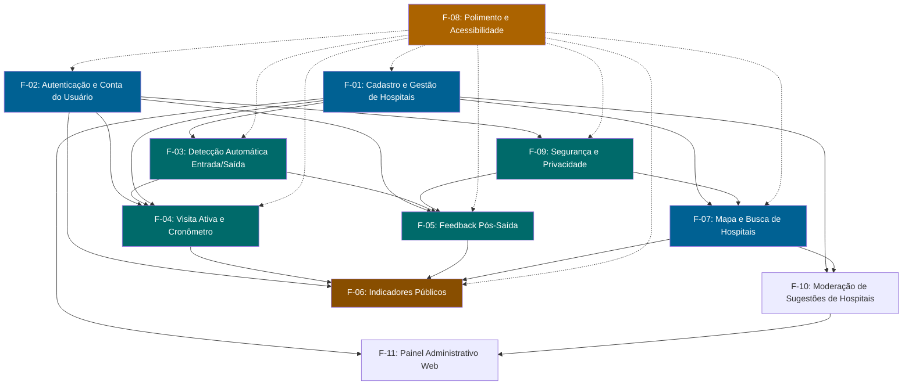

# 🎯 Features do MVP — Clinical Sanctuary v2.0

> **Decomposição funcional executável do MVP — sistema de monitoramento hospitalar por geolocalização com feedback pós-atendimento**
>
> | Campo | Valor |
> |---|---|
> | **Versão** | 2.0 |
> | **Status** | Proposta — validada contra código real em 08/08/2026 (ver `Relatorio-Aderencia-Codigo-vs-Features.md`) |
> | **Data** | 07/08/2026 |
> | **Autor** | Gabriel Vogado (Product Owner) |
> | **Referências** | Documento Negocial v2.0 · Backlog MVP v2.0 · Padrão UI/UX v2.0 · Árvore Tecnológica v2.0 |
> | **Arquivo-irmão** | `Backlog-MVP-v2.0.md` — estórias detalhadas com critérios de aceite atômicos |
> | **Relatório de aderência** | `Relatorio-Aderencia-Codigo-vs-Features.md` — mapeamento completo do código existente × features |

---

## 1. Visão do MVP

O Clinical Sanctuary é um aplicativo mobile que **detecta automaticamente** quando um cidadão entra e sai de um hospital — sem nenhum toque —, registra o tempo de permanência e, após a saída, convida a responder um **formulário de feedback de 4 perguntas em menos de 45 segundos**. Com esses dados, o app publica a **nota média e o tempo médio de atendimento** de cada hospital, acessíveis a qualquer pessoa sem login.

O MVP prioriza **zero fricção**: detecção por geofence nativo (sem drenar bateria), formulário pulável, acesso anônimo à consulta pública, e feedback opcional que funciona sem conta. A meta em 90 dias é alcançar 1.000 usuários ativos semanais, ≥ 25% de taxa de resposta de feedback, e 20 hospitais com avaliação pública válida (N ≥ 5).

---

## 2. Épicos e Features (tabela resumo)

| Feature ID | Nome | Épico(s) | Prioridade | Status Código | Estórias vinculadas | RN principais | Esforço |
|---|---|---|---|---|---|---|---|
| **F-01** | Cadastro e gestão de hospitais | Épico 1 | P0 | 🔴 Inexistente | E1-01, E1-02, E1-03, E1-04 | — | M (16) |
| **F-02** | Autenticação e conta do usuário | Fase 0 + Épico 5 | P0 | 🟡 Parcial | F0-01, F0-02, F0-05, E5-04, E5-03 | RN-20, RN-21, RN-22 | M (18) |
| **F-03** | Detecção automática de entrada/saída | Épico 2 | P0 | 🔴 Inexistente | E2-01, E2-02, E2-03, E2-04, E2-05, E2-09 | RN-01..RN-07, RN-23 | L (19) |
| **F-04** | Visita ativa e cronômetro | Épico 2 | P0 | 🔴 Inexistente | E2-06, E2-07, E2-08, E2-10 | RN-07, RN-24 | M (21) |
| **F-05** | Feedback pós-saída | Épico 3 | P0 | 🔴 Inexistente | E3-01, E3-02, E3-03, E3-04, E3-05, E3-06 | RN-08..RN-13 | M (16) |
| **F-06** | Indicadores públicos por hospital | Épico 4 | P0 | 🔴 Inexistente | E4-01, E4-02, E4-03, E4-04, E4-05 | RN-14..RN-19 | M (20) |
| **F-07** | Mapa e busca de hospitais | Épico 1 + Épico 6 | P0 | 🟡 Parcial | E1-03, E1-05, E6-01 | — | S (8) |
| **F-08** | Polimento e acessibilidade | Épico 6 | P1 | 🟡 Parcial | E6-02, E6-03, E6-04, E6-05 | — | M (20) |
| **F-09** | Segurança e privacidade | Fase 0 + Épico 5 | P0 | 🔴 Não conforme | F0-03, F0-04, E5-01, E5-02, E5-05 | RN-21, RNF-05, RNF-06 | M (18) |
| **F-10** | Moderação de sugestões de hospitais | Épico 1 | P1 | 🔴 Inexistente | E1-06 | — | S (5) |
| **F-11** | Painel Administrativo Web (hospitais + georreferenciamento) | Épico 7 | P0 | 🔴 Inexistente | E7-01..E7-09 | — | L (25) |

> **Legenda de status:** ✅ Existente (funcional) · 🟡 Parcial (precisa refatoração) · 🔴 Inexistente/Inexistente (construir do zero) · 🔴 Não conforme (violação de segurança/LGPD — corrigir antes de qualquer deploy). Verificação completa: `Relatorio-Aderencia-Codigo-vs-Features.md`.

> **Nota sobre prioridades:** P0 = MVP obrigatório (sem isso o produto não cumpre a proposta de valor); P1 = fortemente recomendado no MVP (qualidade percebida e retenção); P2 = pós-MVP. F-08 (Polimento) é P1 porque o produto funciona sem design system refinado, mas a experiência do paciente exige cuidado visual e acessibilidade como diferencial.

---

## 3. Features Detalhadas

---

### Feature F-01: Cadastro e Gestão de Hospitais

- **ID:** F-01
- **Épico:** Épico 1 — Cadastro de Hospitais e Geofences
- **Prioridade:** P0 — sem hospital cadastrado não há geofence, sem geofence não há detecção de visita
- **Status de implementação:** 🔴 **Inexistente** — zero arquivos backend, zero arquivos frontend. Nenhum endpoint, documento MongoDB, controller, serviço ou tela foi implementado. Construção total do zero. (Ver `Relatorio-Aderencia-Codigo-vs-Features.md` §F-01)
- **Descrição:** Esta feature fornece o backoffice administrativo para cadastrar hospitais no sistema, com seus dados cadastrais (nome, CNPJ, endereço, tipo público/privado) e — crucialmente — a definição da **área geográfica (geofence)** como polígono GeoJSON desenhado sobre o mapa. É o alicerce de todo o produto: toda detecção de entrada/saída, todo feedback e todo indicador público dependem de um hospital com geofence correto.

  O cadastro é exclusivo de administradores (não acessível ao público). O endpoint público de listagem retorna apenas hospitais ativos com seus geofences, para que o app mobile possa detectar entrada. A edição e desativação são imediatas — desativar um hospital remove-o da listagem pública no ato (visitas em andamento não são afetadas, apenas não se iniciam novas).

- **User Stories vinculadas:** E1-01, E1-02, E1-03, E1-04
- **Critérios de aceite:**
  1. Administrador cadastra hospital com nome, CNPJ (validado, único), endereço, tipo (público/privado), contato e status ativo; campos obrigatórios retornam mensagem de erro em português quando ausentes
  2. Administrador desenha polígono de geofence sobre o mapa (mínimo 3 vértices, fechado, sem auto-interseção); validação ocorre no backend e rejeita geometrias inválidas com mensagem clara
  3. Polígono é armazenado como GeoJSON Polygon no documento MongoDB e indexado com `2dsphere` para consultas `$geoIntersects`
  4. Endpoint público `GET /api/v2/hospitais` retorna apenas hospitais ativos com nome, tipo, coordenadas do centroide e geofence; resposta em < 300ms (p95)
  5. Edição revalida o polígono; desativação (soft delete: `ativo = false`) reflete imediatamente na API pública
  6. Nome e CNPJ são únicos no sistema; tentativa de duplicação retorna erro 409 com mensagem em português
- **Regras de negócio aplicáveis:** N/A (infraestrutura — habilita RN-01, RN-03, RN-05)
- **Dependências:** Nenhuma. F-01 é o alicerce e pode ser iniciada em paralelo com F-02 (Autenticação). F-03 (Detecção) depende de F-01 para ter hospitais com geofence.
- **Esforço estimado:** **M** (2 sprints). Justificativa: CRUD de hospital é simples (3 endpoints REST), mas a implementação do desenho de polígono no mapa administrativo (leaflet/Google Maps + edição de vértices) e a validação GeoJSON + índice 2dsphere exigem domínio de geoespacial. Estórias: 4.
- **Riscos:**
  - **Geofence impreciso:** polígono mal desenhado gera falsos positivos/negativos (usuário dentro do hospital mas fora do polígono, ou vice-versa). Mitigação: guia de desenho com raio sugerido de 100–150m a partir do centroide, validação de área mínima e máxima, e teste de campo em ≥ 3 hospitais reais.
  - **CNPJs desatualizados:** hospitais podem ter múltiplos CNPJs (matriz/filial). Mitigação: CNPJ não é impedimento para cadastro — é informativo; unicidade é por nome + coordenadas.
- **Critério de pronto (DoD específico):**
  - Polígono de geofence testado com `$geoIntersects` em device real (não apenas mock) em ≥ 3 hospitais físicos — calibragem de raio e tolerância
  - Endpoint de listagem pública com teste de carga (≥ 100 req/s simuladas) garantindo p95 < 300ms

---

### Feature F-02: Autenticação e Conta do Usuário

- **ID:** F-02
- **Épico:** Fase 0 (Estabilização e Segurança) + Épico 5 (Conta, Consentimento e Privacidade)
- **Prioridade:** P0 — endpoints protegidos não podem existir sem autenticação; senha em texto puro é bloqueante de segurança
- **Status de implementação:** 🟡 **Parcial** — 7 arquivos backend + 4 frontend existem (login/cadastro funcionais), mas **senha salva em texto puro** (`AuthServiceImpl.java`) e **sem emissão de JWT** — o login apenas grava um documento MongoDB sem token. Frontend tem LoginScreen e UserScreen funcionais, mas sem SecureStore/JWT. (Ver `Relatorio-Aderencia-Codigo-vs-Features.md` §F-02)
- **Descrição:** Esta feature implementa a base de segurança do sistema e a experiência de conta do usuário. No backend: hash BCrypt para senhas, emissão de JWT (access token 15 min + refresh token 30 dias), proteção de endpoints e exclusão de conta conforme LGPD. No app: fluxo de cadastro/login **opcional** (o usuário pode usar toda a jornada principal sem conta), tela de perfil com dados pessoais e histórico.

  A conta é um **acelerador de retenção**, não um gate: o usuário cria quando quiser consultar seu histórico ou gerenciar preferências. O feedback anônimo (sem login) continua funcionando — o vínculo ao usuário logado é interno e nunca exposto publicamente. O JWT é armazenado no dispositivo via `expo-secure-store`.

- **User Stories vinculadas:** F0-01, F0-02, F0-05, E5-04, E5-03
- **Critérios de aceite:**
  1. Senha de cadastro é hasheada com BCrypt (nunca armazenada em texto puro); teste unitário comprova irreversibilidade do hash
  2. Login retorna access token JWT (15 min) + refresh token (30 dias); endpoint protegido retorna 401 sem token válido
  3. Refresh token rotaciona (cada uso invalida o anterior e emite novo par); logout revoga refresh token
  4. Cadastro exige nome, e-mail (validado, único) e senha (mín. 8 caracteres); confirmação de aceite dos termos LGPD registrada com data/versão
  5. Usuário logado acessa `GET /api/v2/usuario/me/visitas` e `GET /api/v2/usuario/me/feedbacks` (apenas seus dados, paginados)
  6. Exclusão de conta (`DELETE /api/v2/usuario/me`) remove dados pessoais e feedbacks vinculados; agregações permanecem anônimas; endpoint retorna confirmação em até 15 dias (prazo LGPD)
  7. Exportação de dados pessoais (`GET /api/v2/usuario/me/export`) retorna JSON com todas as visitas e feedbacks do usuário
- **Regras de negócio aplicáveis:** RN-20 (uso sem login), RN-21 (consentimento), RN-22 (histórico pessoal), RNF-05 (segurança), RNF-06 (LGPD)
- **Dependências:** F-02 é pré-requisito para qualquer endpoint protegido. F-04 (Visita ativa) e F-05 (Feedback) consomem autenticação para usuários logados, mas funcionam em modo anônimo independentemente.
- **Esforço estimado:** **M** (1-2 sprints). Justificativa: Spring Security + JWT + BCrypt é implementação padrão mas exige cuidado com refresh token rotation e blacklist; tela de perfil com histórico paginado é trabalho de frontend médio. Estórias: 5.
- **Riscos:**
  - **Complexidade de refresh token:** rotação mal implementada pode deixar tokens válidos após logout. Mitigação: blacklist curta de refresh tokens revogados (TTL = 30 dias); teste de integração cobre renovação + revogação.
  - **Cadastro muito cedo na jornada:** se o app pedir cadastro na abertura, usuários abandonam. Mitigação: conta fica restrita à aba Perfil; onboarding não menciona cadastro; o primeiro convite ao cadastro ocorre após o primeiro feedback (tela de agradecimento com CTA secundário "Crie uma conta para ver seu histórico").
- **Critério de pronto (DoD específico):**
  - Teste de penetração básico: senha nunca trafega em texto puro; token expirado é rejeitado; refresh token revogado não gera novo access token
  - Fluxo de exclusão de conta testado ponta a ponta (app → API → MongoDB → confirmação) com verificação de que agregações não foram corrompidas

---

### Feature F-03: Detecção Automática de Entrada/Saída

- **ID:** F-03
- **Épico:** Épico 2 — Detecção de Visitas (Geofence)
- **Prioridade:** P0 — é o core do produto. Sem detecção automática, o app vira um formulário manual de pesquisa de satisfação
- **Status de implementação:** 🔴 **Inexistente** — o frontend tem `GeoLocalizacaoScreen` com `watchPositionAsync` (GPS contínuo, drena bateria), mas **nenhum geofencing nativo**, zero endpoints de checkin/checkout no backend, zero queries geoespaciais, zero índice 2dsphere. O que existe precisa ser **totalmente substituído** por `startGeofencingAsync` + `expo-task-manager`. (Ver `Relatorio-Aderencia-Codigo-vs-Features.md` §F-03) (commodity).
- **Descrição:** Esta feature implementa o motor de geofencing que detecta quando o usuário **entra** e **sai** da área de um hospital, sem nenhuma ação manual. No dispositivo, utiliza `expo-location.startGeofencingAsync()` + `expo-task-manager` para monitorar regiões em background (substituindo o `watchPositionAsync` contínuo atual que drena bateria). No backend, expõe endpoints para registrar eventos de entrada/saída (`POST /api/v2/visitas/entrada`, `POST /api/v2/visitas/{id}/saida`) e executa um job de expiração para visitas "presas".

  As regras de tolerância são fundamentais:
  - **Entrada:** requer ≥ 2 minutos contínuos dentro do geofence (evita "atravessou a rua")
  - **Saída:** requer ≥ 5 minutos contínuos fora do geofence (evita "saiu para fumar")
  - **Expiração:** apenas após 24 horas sem heartbeat (esperas reais de 12h+ no SUS são mantidas ativas)
  - **Conflito:** se dois hospitais têm áreas sobrepostas, escolhe o mais próximo; se empate, pergunta em 1 toque
  - **GPS interrompido:** mantém a visita por até 10 min; após, encerra com status `GPS_INTERROMPIDO`

  O sistema também envia heartbeats periódicos (a cada 30 min) para distinguir "pessoa esperando no hospital" de "GPS preso na região" — a ausência de heartbeat por 2h marca a visita como `SUSPEITA`, e por 24h a expira.

- **User Stories vinculadas:** E2-01, E2-02, E2-03, E2-04, E2-05, E2-09
- **Critérios de aceite:**
  1. App detecta entrada em geofence hospitalar após ≥ 2 min contínuos e registra `POST /visitas/entrada` com status `EM_ATENDIMENTO`; permanências < 2 min são ignoradas silenciosamente
  2. App detecta saída após ≥ 5 min contínuos fora do geofence; registra `POST /visitas/{id}/saida` com `duracao_minutos` calculado; saídas curtas (< 5 min) não encerram a visita
  3. Heartbeat (`POST /visitas/{id}/heartbeat`) enviado a cada 30 min enquanto houver visita ativa; ausência de 2h marca status `SUSPEITA`; ausência de 24h (job de expiração a cada 15 min) marca status `EXPIRADA`
  4. Visita ativa com heartbeats regulares **nunca expira por tempo de permanência** — esperas reais de 12h+ permanecem `EM_ATENDIMENTO`
  5. Conflito de áreas sobrepostas: app calcula distância ao centroide de cada hospital; escolhe o de menor distância; se empate (diferença ≤ 10m), exibe card "Você está em X ou Y?" com 2 opções
  6. Falha de GPS durante visita: app mantém status e tenta recuperar sinal por até 10 min; após, encerra com `GPS_INTERROMPIDO` e `duracao_minutos` parcial
  7. Consumo de bateria do monitoramento em background validado: ≤ 5% por dia em teste de campo de 8h com device real (Android + iOS)
  8. Geofencing funciona em background no iOS (com justificativa de uso no `Info.plist`) e no Android (foreground/background)
- **Regras de negócio aplicáveis:** RN-01, RN-02, RN-03, RN-04, RN-05, RN-06, RN-23
- **Dependências:** **F-01 (Cadastro de Hospitais)** — geofence depende de hospital cadastrado com polígono. Também depende da decisão de arquitetura **ADR-002** (geofencing nativo no lugar de watchPositionAsync).
- **Esforço estimado:** **L** (2-3 sprints). Justificativa: é a feature mais complexa do MVP — envolve geofencing nativo no mobile (que tem diferenças de comportamento entre Android e iOS), lógica de tolerância com múltiplos timers de entrada/saída, job de expiração no backend, heartbeat resiliente a falhas de rede, e calibragem em campo. Estórias: 6. **Esta feature define o cronograma.**
- **Riscos:**
  - **Precisão do geofence em área urbana densa:** hospitais próximos (ex.: Santa Casa e Hospital das Clínicas a 200m) podem ter áreas sobrepostas com GPS de precisão ~50–100m. Mitigação: tolerâncias de 2min/5min + fallback de escolha manual em 1 toque; teste de campo nos 3 hospitais mais próximos entre si.
  - **Restrições iOS de localização em background:** iOS pode matar a tarefa de geofence se o usuário não conceder "Sempre". Mitigação: onboarding explica o valor antes de pedir; fallback de `watchPositionAsync` apenas com app aberto; transparência no Perfil sobre o que está ativo.
  - **Falsos positivos em esperas longas:** GPS pode "grudar" em uma coordenada se o dispositivo estiver parado em uma maca/prateleira. Mitigação: heartbeat (RN-23) exige sinal periódico do dispositivo; se o dispositivo está realmente parado (usuário dormindo na sala de espera), o heartbeat continua sendo enviado e a visita permanece ativa — que é o comportamento correto.
- **Critério de pronto (DoD específico):**
  - **Teste de campo em ≥ 3 hospitais reais:** calibrar raio do geofence (100–150m), validar tempo de detecção de entrada (< 2 min), validar que saída não é disparada por "saí para fumar" (< 5 min), e validar heartbeat durante espera prolongada (≥ 4h de teste)
  - Teste de bateria: 8h de monitoramento em background com consumo documentado (relatório com gráfico de bateria vs. tempo)
  - Teste de estresse do job de expiração: 10.000 visitas simuladas com heartbeats aleatórios — verificar que apenas visitas > 24h sem sinal são expiradas

---

### Feature F-04: Visita Ativa e Cronômetro

- **ID:** F-04
- **Épico:** Épico 2 — Detecção de Visitas
- **Prioridade:** P0 — a experiência de "estou sendo monitorado sem fazer nada" é o principal diferencial do produto
- **Status de implementação:** 🔴 **Inexistente** — zero arquivos backend e frontend. Nenhuma coleção `visitas` no MongoDB, nenhum endpoint de heartbeat/tipo-permanencia, nenhum card de visita ativa no app, nenhum cronômetro, nenhuma pergunta de internação. Depende de F-03 (geofence). (Ver `Relatorio-Aderencia-Codigo-vs-Features.md` §F-04)
- **Descrição:** Esta feature implementa a **camada de experiência** sobre a detecção de geofence (F-03). Enquanto F-03 é o motor, F-04 é o painel: o card de permanência ativa que aparece sobre o mapa com o nome do hospital e o cronômetro ao vivo, a opção de check-in manual quando o GPS falha, o filtro de visitas muito curtas nas estatísticas, e a sinalização de internação/observação para evitar que longas permanências hospitalares (ex.: paciente internado por 5 dias) distorçam o indicador de "tempo de atendimento".

  O cartão de visita ativa (`CSGeoStatusCard`) é o elemento central da UX: glass sobre o mapa, com ícone pulsante, timer em `display-sm` Manrope com tabular-nums, e botão "Não estou aqui / Encerrar". Ele aparece automaticamente na detecção de entrada (F-03) e some na saída. O timer é acessível: `accessibilityLiveRegion="polite"` anuncia o tempo a cada minuto.

  O check-in manual (1 toque) é o **plano B de dignidade**: se o GPS estiver desligado ou a permissão negada, o usuário ainda pode registrar sua visita selecionando o hospital da lista. Visitas manuais recebem flag `manual = true`.

  A sinalização de internação (RN-24) aparece após 12h de visita ativa: um prompt de 1 toque pergunta "Você está em observação ou internado?". Se sim, a visita é excluída do indicador de pronto-atendimento mas permanece no histórico pessoal.

- **User Stories vinculadas:** E2-06, E2-07, E2-08, E2-10
- **Critérios de aceite:**
  1. Card `CSGeoStatusCard` aparece automaticamente ao detectar entrada (F-03), com slide-up 300ms; exibe nome do hospital (`title-lg`) e cronômetro (`display-sm`, tabular-nums, atualizado a cada minuto)
  2. Cronômetro é acessível: `accessibilityLiveRegion="polite"` anuncia "Tempo no hospital: 12 minutos e 34 segundos" a cada minuto; TalkBack/VoiceOver lê o card como grupo
  3. Card exibe botão "Não estou aqui" (encerramento manual); toque registra saída com flag `encerramento_manual = true`
  4. Botão "Estou em um hospital" disponível na home quando GPS está desligado ou permissão negada; abre lista de hospitais por proximidade; seleção registra visita com `manual = true`
  5. Visitas com duração < 2 minutos (ver RN-07) entram no histórico pessoal do usuário mas são **excluídas das estatísticas públicas** (filtro aplicado no job de agregação F-06)
  6. Prompt de internação/observação: após 12h de visita ativa, notificação local pergunta "Você está em observação ou internado?"; resposta "Sim" grava `tipoPermanencia = OBSERVACAO | INTERNACAO`; resposta "Não" ou ignorar mantém `ATENDIMENTO` e contabilização normal
  7. Visitas com `tipoPermanencia = INTERNACAO | OBSERVACAO` são excluídas do cálculo de tempo médio de pronto-atendimento (F-06) mas mantidas no histórico pessoal
- **Regras de negócio aplicáveis:** RN-07 (mínimo 2 min para estatística), RN-24 (sinalização de internação/observação)
- **Dependências:** **F-03 (Detecção automática)** — o card de visita ativa consome os eventos de entrada/saída. O check-in manual depende de F-01 (lista de hospitais).
- **Esforço estimado:** **M** (1-2 sprints). Justificativa: componente de UI de complexidade média (glass card + timer animado + acessibilidade), mas é uma tela; check-in manual é uma lista simples; prompt de 12h é notificação local + endpoint. Estórias: 4.
- **Riscos:**
  - **Timer não confiável offline:** se o app perder conexão, o timer pode divergir do servidor. Mitigação: timer é local (calculado a partir do `timestamp` de entrada); o servidor é a fonte da verdade e reconcilia na saída; se houver divergência > 5%, prevalece o servidor com aviso no card.
  - **Usuário ignora prompt de internação:** se ninguém responde o prompt de 12h, internações longas podem distorcer o tempo médio. Mitigação: após 24h sem resposta, o sistema assume provável internação e aplica um peso reduzido (0.3) no agregado — mas somente se > 30% das visitas longas daquele hospital também forem `INTERNACAO` (evita viés).
- **Critério de pronto (DoD específico):**
  - **Validação com usuário real:** teste de usabilidade com ≥ 5 pacientes/acompanhantes em hospital real — medir: (a) perceberam o card automático sem hesitação? (b) entenderam o timer? (c) conseguiram encerrar manualmente quando necessário?
  - Teste de acessibilidade: TalkBack e VoiceOver leem o card e o timer corretamente; navegação por teclado (web) alcança o botão "Não estou aqui"
  - Teste de 12h: simular visita de 12h+ e verificar que o prompt de internação dispara, e que a resposta altera `tipoPermanencia`

---

### Feature F-05: Feedback Pós-Saída

- **ID:** F-05
- **Épico:** Épico 3 — Feedback Pós-Saída
- **Prioridade:** P0 — o feedback é o dado que alimenta o valor público do produto. Sem feedback, não há indicadores.
- **Status de implementação:** 🔴 **Inexistente** — zero arquivos. Nenhuma coleção `feedbacks`, nenhum endpoint, nenhum formulário no app, nenhuma notificação pós-saída (`expo-notifications` nem instalado). Depende de F-03 (saída detectada) e F-04 (visita finalizada). (Ver `Relatorio-Aderencia-Codigo-vs-Features.md` §F-05)
- **Descrição:** Esta feature implementa o **formulário de feedback pós-saída** completo: notificação local, formulário ramificado de até 4 telas respondível em < 45 segundos, envio ao backend, bloqueio de duplicatas, e tela de agradecimento. É o momento de verdade onde o app pede a opinião do usuário — e a regra de ouro é: **não ser cansativo**.

  O fluxo começa quando a visita é encerrada (F-03): o app aguarda de 1 a 5 minutos (configurável) e dispara uma notificação local. Essa espera é deliberada — evita pedir feedback com o usuário ainda no estacionamento ou dentro do transporte. O formulário tem **fluxo ramificado invisível** com até 4 telas (máx.) e barra de progresso visível + botão "Pular" sempre presente. O envio é possível com apenas a nota geral respondida (Tela 4).

  **Estrutura do fluxo (RN-10) — 4 telas ramificadas, < 45s:**
  - **Tela 1 — Triagem:** "Você passou pela triagem ao chegar na unidade?"
    - ✅ Sim → **Tela 2**
    - ❌ Não → **Tela 3** (pula especialidade)
  
  - **Tela 2 — Especialidade procurada + Atendimento** (só se triagem = Sim)
    - "Qual especialidade você procurava?" → select searchable (lista CNES/DATASUS)
    - "Conseguiu ser atendido por médico(a) desta especialidade?"
      - ✅ Sim → **Tela 3**
      - ❌ Não → **motivo** (radio obrigatório):
        - 🔴 **LOTACAO** — Superlotação / espera excessiva
        - 👨‍⚕️ **FALTA_MEDICO** — Falta de médico na especialidade
        - ⚪ **CLASSIFICACAO_RISCO** — Prioridade a casos mais graves (Protocolo Manchester: Vermelho/Laranja)
        - 🚪 **OUTRO** — campo curto opcional
    - → **Tela 3**
  
  - **Tela 3 — Tratamento pela equipe** (sempre exibida)
    - "Como foi o tratamento dos funcionários da unidade com você?"
    - Escala 5 pontos + "Não interagi": Muito bem / Bem / Regular / Mal / Muito mal / Não interagi
    - → **Tela 4**
  
  - **Tela 4 — Nota geral + Comentário** (sempre exibida)
    - "De 1 a 5, como avalia sua experiência geral hoje?" → ★★★★★
    - "Quer deixar algum comentário?" (opcional, max 500 chars)
    - Botão "Enviar"

  **Regras transversais do fluxo:**
  - `especialidadeProcurada` **sempre capturada** se triagem = Sim (mesmo se não atendido) → permite indicador de "falta de médico por especialidade"
  - `motivoNaoAtendido = CLASSIFICACAO_RISCO` **não é gap** — card "Fluxo Correto" no painel admin (verde)
  - `motivoNaoAtendido = FALTA_MEDICO` → gap RH (vermelho no painel)
  - `motivoNaoAtendido = LOTACAO` → gap Capacidade/Fluxo (laranja no painel)
  - **Frontend mostra label amigável** `CASOS_MAIS_GRAVES_PRIORIDADE`; **backend normaliza para** `CLASSIFICACAO_RISCO`
  - Comentário opcional único no final; zero caixas de texto obrigatórias
  - Persistência local a cada tela; envio único no final (`POST /api/v1/feedback` com `visitaId`)
  - **Tela 2 — Especialidade + Atendimento (só se triagem=Sim):** "Qual especialidade você procurava?" → select searchable (lista CNES/DATASUS) + "Conseguiu ser atendido por médico(a) desta especialidade?" → Sim → Tela 3 | Não → motivo (radio obrigatório: LOTACAO | FALTA_MEDICO | CLASSIFICACAO_RISCO | OUTRO) → Tela 3
  - **Tela 3 — Tratamento pela equipe (sempre):** "Como foi o tratamento dos funcionários da unidade com você?" → Escala 5 pts + "Não interagi" (Muito bem / Bem / Regular / Mal / Muito mal / Não interagi) → Tela 4
  - **Tela 4 — Nota geral + Comentário (sempre):** "De 1 a 5, como avalia sua experiência geral hoje?" → ★★★★★ + "Quer deixar algum comentário?" (opcional, max 500 chars) → Enviar

  **Regras transversais (RN-10):**
  - `especialidadeProcurada` **sempre capturada** se triagem = Sim (mesmo se não atendido) → permite indicador de "falta de médico por especialidade"
  - `motivoNaoAtendido = CLASSIFICACAO_RISCO` **não é gap** — card "Fluxo Correto" no painel admin (verde)
  - `motivoNaoAtendido = FALTA_MEDICO` → gap RH (vermelho no painel)
  - `motivoNaoAtendido = LOTACAO` → gap Capacidade/Fluxo (laranja no painel)
  - Frontend mostra label amigável `CASOS_MAIS_GRAVES_PRIORIDADE`; backend normaliza para `CLASSIFICACAO_RISCO`
  - Comentário opcional único no final; zero caixas de texto obrigatórias
  - Persistência local a cada tela; envio único no final (`POST /api/v1/feedback` com `visitaId`)

  A janela de resposta é de 24 horas, com no máximo 1 lembrete (aproximadamente 6h após a primeira notificação). Após 24h, a visita recebe status `SEM_FEEDBACK` e o usuário nunca mais é incomodado por aquela visita. O feedback é anônimo por padrão: `usuario_id` pode ser nulo.

  O backend aplica deduplicação: 1 feedback por visita (unique index em `feedback.visita_id`).

- **User Stories vinculadas:** E3-01, E3-02, E3-03, E3-04, E3-05, E3-06
- **Critérios de aceite:**
  1. Notificação local é disparada entre 1 e 5 minutos após o registro de saída; delay é configurável; notificação nunca dispara enquanto o usuário está dentro de qualquer geofence hospitalar
  2. Toque na notificação (ou no card da home) abre o formulário `CSFeedbackForm` em tela cheia
  3. Formulário tem fluxo ramificado de até 4 telas com barra de progresso (altura 4px, track `surface-container-high`, fill gradiente primário) + label "Passo X de 4" + botão "Pular" sempre visível
  4. **Tela 1 — Triagem:** "Você passou pela triagem ao chegar na unidade?" — 2 chips: "Sim" / "Não". Se "Não", pula direto para Tela 3 (Tratamento)
  5. **Tela 2 — Especialidade + Atendimento** (apenas se Tela 1 = Sim): "Qual especialidade você procurava?" → select searchable (lista CNES/DATASUS) + "Conseguiu ser atendido por médico(a) desta especialidade?" → chips: Sim / Não. Se Não → radio obrigatório de motivo:
     - 🔴 **LOTACAO** — Superlotação / espera excessiva
     - 👨‍⚕️ **FALTA_MEDICO** — Falta de médico na especialidade
     - ⚪ **CLASSIFICACAO_RISCO** — Prioridade a casos mais graves (Protocolo Manchester: Vermelho/Laranja)
     - 🚪 **OUTRO** — campo curto opcional
  6. **Tela 3 — Tratamento pela equipe** (sempre exibida): "Como foi o tratamento dos funcionários da unidade com você?" → chips: Muito bem / Bem / Regular / Mal / Muito mal / Não interagi
  7. **Tela 4 — Nota geral + Comentário** (sempre exibida): `CSRatingStars` 5 estrelas (32×32, área de toque 48) com labels âncora (1 "Péssimo" … 5 "Excelente") + campo de comentário opcional (máx. 500 caracteres)
  8. Todas as perguntas são puláveis; envio é possível com ao menos a nota geral (Tela 4) respondida; botão "Enviar avaliação" (`CSButtonPrimary`) envia em 1 toque
  9. Tempo total de resposta ≤ 45 segundos (medido em teste de usabilidade com usuários reais)
  10. Após envio: tela `CSFeedbackThanks` com ícone `HeartHandshake`, mensagem de agradecimento e link para ver avaliação pública do hospital
  11. Feedback armazenado no backend com `visita_id` único; tentativa de reenvio retorna mensagem amigável "Você já avaliou esta visita"
  12. Janela de resposta de 24h; após, visita marcada `SEM_FEEDBACK`; 1 lembrete único ~6h após primeira notificação; sem mais incômodos
  13. Feedback anônimo funciona ponta a ponta: sem `usuario_id`, sem exposição de identidade, armazenado apenas com vínculo `visita_id`
  14. Em caso de erro de rede no envio: toast "Sem conexão — salvaremos e enviaremos depois"; respostas mantidas localmente; reenvio automático ao reconectar
- **Regras de negócio aplicáveis:** RN-08, RN-09, RN-10, RN-11, RN-12, RN-13
- **Dependências:** **F-03 (Detecção de saída)** — o feedback é consequência da visita encerrada. **F-01 (Hospitais)** — o feedback referencia `hospital_id`. Pode ser desenvolvida em paralelo com F-04 (ambas consomem F-03).
- **Esforço estimado:** **M** (1-2 sprints). Justificativa: UI de formulário multi-step ramificado com animações e acessibilidade é trabalho médio de frontend; backend é essencialmente 1 endpoint `POST /feedback` + validação de dedupe. A complexidade está na UX do formulário (tempo < 45s, pulável, ramificação invisível, micro-interações) e na lógica de notificação (delay 1-5min + lembrete 6h + expiração 24h). Estórias: 6.
- **Riscos:**
  - **Baixa taxa de resposta:** se o formulário for percebido como cansativo, a taxa de resposta cai abaixo de 25%. Mitigação: 4 telas é o limite; botão "Pular" sempre visível reduz ansiedade; notificação no momento certo (1-5 min pós-saída); feedback anônimo remove barreira de login.
  - **Usuário ignora a notificação:** notificações locais têm baixa taxa de abertura em alguns perfis de usuário. Mitigação: além da notificação, um card na home do app ("Você visitou o Hospital X — quer avaliar?") serve como segundo canal; 1 lembrete máximo.
  - **Feedback malicioso:** usuários podem avaliar mal um hospital repetidamente. Mitigação: 1 feedback por visita (dedupe por `visita_id` único); visitas < 2 min não geram convite de feedback; para o MVP, moderação humana de outliers é suficiente (fase 2 implementa detecção automatizada).
  - **Select CNES/DATASUS lento:** lista de especialidades pode ser grande. Mitigação: cache local da lista CNES/DATASUS; debounce no searchable select; carregamento preguiçoso.
- **Critério de pronto (DoD específico):**
  - **Validação com usuário real:** teste de usabilidade com ≥ 10 pacientes/acompanhantes recém-saídos de hospital real — medir: (a) tempo médio de resposta ≤ 45s, (b) taxa de abandono no meio do formulário ≤ 20%, (c) compreensão das perguntas sem hesitação, (d) NPS do formulário ≥ 8
  - Teste de notificação: verificar que a notificação dispara no delay configurado e que o lembrete único aparece ~6h depois
  - Teste de dedupe: tentar enviar 2 feedbacks para a mesma visita — segundo retorna erro amigável
  - Acessibilidade: formulário navegável por TalkBack/VoiceOver; estrelas respondem a swipe; chips são `role="checkbox"`; ramificação invisível não confunde leitores de tela
  - **Enum backend:** `MotivoNaoAtendido` com valores `FALTA_MEDICO`, `LOTACAO`, `CLASSIFICACAO_RISCO`, `OUTRO` implementado e testado

---

### Feature F-06: Indicadores Públicos por Hospital

- **ID:** F-06
- **Épico:** Épico 4 — Indicadores Públicos por Hospital
- **Prioridade:** P0 — é o valor de utilidade pública que justifica o app para quem não está visitando um hospital no momento
- **Status de implementação:** 🔴 **Inexistente** — zero arquivos. Nenhuma coleção `agregados_hospitais`, nenhum job de agregação, nenhum endpoint de indicadores/ranking, nenhuma tela de detalhe público do hospital. Depende de F-03/F-04 (visitas) e F-05 (feedbacks). (Ver `Relatorio-Aderencia-Codigo-vs-Features.md` §F-06)
- **Descrição:** Esta feature agrega os dados de visitas e feedbacks e os transforma em **indicadores públicos**: nota média (1–5) e tempo médio de atendimento (mediana em minutos) por hospital. É o que o cidadão consulta para decidir onde buscar atendimento. A transparência metodológica é parte do design: a tela pública sempre mostra o período da amostra (últimos 90 dias), N de avaliações, e data da última atualização.

  O cálculo segue regras estatísticas rigorosas:
  - **Nota média:** média aritmética das notas (1–5) dos feedbacks dos últimos 90 dias
  - **Tempo médio:** **mediana** (não média) dos tempos de permanência das visitas finalizadas de até 24h, excluindo visitas marcadas como `INTERNACAO`/`OBSERVACAO` (RN-24) — a mediana é robusta a outliers (ex.: uma pessoa que esperou 14h não distorce o indicador como faria com a média)
  - **Amostra mínima:** nota e tempo só são exibidos com N ≥ 5; abaixo disso, badge "Ainda sem avaliações suficientes"
  - **Atualização:** job de agregação roda a cada novo feedback ou em batch (a cada 15 min); leitura pública sempre servida de documento materializado `AGREGADO_HOSPITAL` (cache)

  A tela de detalhe do hospital mostra: nota com estrelas, tempo médio formatado (ex.: "2h05"), N de avaliações, período ("últimos 90 dias"), data da última atualização, e — como evolução — barras de distribuição por categoria (recepção, enfermagem, médico, medicação) se houver dados suficientes.

- **User Stories vinculadas:** E4-01, E4-02, E4-03, E4-04, E4-05
- **Critérios de aceite:**
  1. Endpoint `GET /api/v2/hospitais/{id}/agregado` retorna `AGREGADO_HOSPITAL` com: `nota_media`, `tempo_mediano_minutos`, `n_avaliacoes`, `periodo_inicio`, `periodo_fim`, `atualizado_em`; resposta < 300ms (p95)
  2. Nota média é média aritmética das notas 1–5 dos feedbacks dos últimos 90 dias (janela deslizante)
  3. Tempo médio é **mediana** (percentil 50) das durações de visitas `FINALIZADA` com `duracao_minutos ≤ 1440` (24h) e `tipoPermanencia ≠ INTERNACAO, OBSERVACAO`; visitas `GPS_INTERROMPIDO` entram apenas se cobertura de heartbeat ≥ 90%
  4. Visitas com `tipoPermanencia = INTERNACAO | OBSERVACAO` são excluídas do cálculo de tempo médio de pronto-atendimento
  5. Ambos os indicadores só são exibidos com N ≥ 5; caso contrário, API retorna `n_avaliacoes` real mas `nota_media = null` e `tempo_mediano_minutos = null`
  6. Job de agregação recalcula `AGREGADO_HOSPITAL` a cada novo feedback (trigger) ou em batch a cada 15 min (fallback); leitura pública sempre servida do documento materializado (nunca calculada em tempo real)
  7. Tela de detalhe do hospital (`CSHospitalDetail`) exibe: nome + tipo + endereço, nota com `CSRatingStars` (meia estrela para decimais), tempo médio formatado ("2h05"), N de avaliações, período e data de atualização; carrega em < 2s (p95) em 4G
  8. Tela de lista/ranking de hospitais (`CSHospitalList`) ordenável por nota (padrão) e tempo médio; cada card (`CSHospitalCard`) exibe nome, distância, nota compacta (`CSRatingPill`) e tempo médio; paginação infinita
  9. Badge "Ainda sem avaliações suficientes" exibido no card e no detalhe quando N < 5
  10. Transparência: tela pública sempre mostra N, período e data da última atualização; link "Como calculamos?" abre explicação em linguagem simples (mediana, janela 90 dias, exclusão de internações)
- **Regras de negócio aplicáveis:** RN-14, RN-15, RN-16, RN-17, RN-18, RN-19
- **Dependências:** **F-05 (Feedback)** — agregados dependem de feedbacks válidos. **F-03 (Visitas finalizadas)** — tempo médio depende de durações de visita. Não depende de F-04 (Visita ativa) diretamente. Pode iniciar desenvolvimento do backend de agregação com dados mockados enquanto F-05 está em progresso.
- **Esforço estimado:** **M** (1-2 sprints). Justificativa: backend de agregação é 1 job + 1 endpoint de leitura; a complexidade está no cálculo correto da mediana com exclusão de internações/observações e na lógica de cache/materealização. Frontend de detalhe é 1 tela com componentes do Design System. Estórias: 5.
- **Riscos:**
  - **Agregação custosa sob alto volume:** recálculo do agregado para todos os hospitais a cada novo feedback pode ser pesado com milhares de feedbacks. Mitigação: materialização incremental — apenas o hospital do novo feedback é recalculado; batch de 15 min é fallback para eventos perdidos.
  - **Amostra insuficiente por longos períodos:** hospitais menores podem nunca atingir N ≥ 5. Mitigação: badge "Ainda sem avaliações" não é erro, é estado normal; comunicação clara no app; meta de aquisição focada em densidade (20 hospitais com N ≥ 5 em 90 dias é a meta do MVP).
  - **Manipulação por volume:** um hospital pode incentivar pacientes a avaliar bem em massa (ou um concorrente a avaliar mal). Mitigação: 1 feedback por visita limita volume por pessoa; para MVP, a deduplicação por visita é suficiente; fase 2 implementa detecção de anomalias estatísticas.
- **Critério de pronto (DoD específico):**
  - Teste de consistência estatística: 100 feedbacks sintéticos com distribuição conhecida → verificar que nota média e mediana batem com cálculo manual (tolerância ± 0.01)
  - Teste de performance: endpoint de agregado com 10.000 feedbacks no banco → p95 < 300ms
  - Teste de atualização: enviar feedback → verificar que agregado do hospital é recalculado em < 15 min

---

### Feature F-07: Mapa e Busca de Hospitais

- **ID:** F-07
- **Épico:** Épico 1 (Listagem) + Épico 6 (Navegação)
- **Prioridade:** P0 — é a porta de entrada para consulta pública; sem mapa, o cidadão não descobre hospitais próximos
- **Status de implementação:** 🟡 **Parcial** — `GeoLocalizacaoScreen` já renderiza `MapView` + `Marker` da posição do usuário com `react-native-maps` instalado. Mas **não exibe hospitais** (zero marcadores de hospital, zero polígonos de geofence), não tem busca por nome/tipo, e o GPS é modo contínuo (será substituído por geofencing em F-03). Aproveita-se o MapView e a estrutura de tela; o resto é novo. (Ver `Relatorio-Aderencia-Codigo-vs-Features.md` §F-07)
- **Descrição:** Esta feature implementa as telas de descoberta de hospitais: o **mapa** interativo com pins de hospitais e posição do usuário, a **lista** com busca por nome e ordenação, e a **navegação inferior** (Bottom Tabs) que organiza o app em 3 abas: Mapa, Hospitais e Perfil. A migração de Drawer (atual) para Bottom Tabs é parte desta feature, pois a navegação de 1 polegar é mandatória para a persona paciente (mãos ocupadas, pressa, uma mão só).

  O mapa (`react-native-maps`) exibe hospitais ativos como pins `MapPin` em `primary`, com geofence renderizado como polígono translúcido. O FAB centraliza no GPS do usuário. Ao tocar em um pin, abre o card de detalhe rápido com nome, distância e nota — toque no card leva ao Detalhe do Hospital (F-06).

  A lista de hospitais oferece busca por nome (filtro local no client ou query parametrizada `GET /api/v2/hospitais?nome=X`) e ordenação por nota ou tempo médio. O empty state "Nenhum hospital perto de você" inclui CTA "Sugerir hospital" (E1-05), que envia uma sugestão para revisão administrativa.

  A migração de navegação de Drawer → Bottom Tabs com 3 abas (Mapa, Hospitais, Perfil) segue estritamente o Padrão UI/UX v2.0 (§4.3), utilizando `CSBottomNav` com glass morphism.

- **User Stories vinculadas:** E1-03, E1-05, E6-01
- **Critérios de aceite:**
  1. Mapa (`CSMapScreen`) renderiza hospital ativo como `MapPin` em posição do centroide do geofence; polígono de geofence renderizado com opacidade 20% em `primary-container`
  2. Posição do usuário exibida como `CircleDot` azul com pulso de opacidade; FAB "Centralizar no GPS" (`CSFloatingActionButton`) reposiciona o mapa
  3. Toque no pin exibe card de detalhe rápido (glass sobre o mapa) com nome, distância formatada ("1.2 km") e nota compacta (`CSRatingPill`); toque no card navega para Detalhe do Hospital
  4. Lista de hospitais (`CSHospitalList`) renderiza cards (`CSHospitalCard`) com avatar circular, nome, distância, estrelas + nota + N avaliações, e chips de métricas
  5. Busca por nome filtra a lista em tempo real (< 300ms); sem resultados → `CSEmptyState` "Nenhum hospital encontrado com esse nome"
  6. Ordenação: padrão por nota (decrescente); alternável para tempo médio (crescente); opção visível no header da lista
  7. Sugestão de hospital (E1-05): CTA "Sugerir hospital" disponível no empty state do mapa e da lista; formulário simples (nome + endereço opcional) envia `POST /api/v2/hospitais/sugestoes`
  8. Navegação Bottom Tabs (`CSBottomNav`) com 3 abas: Mapa (MapPin), Hospitais (Building2), Perfil (UserRound); glass morphism com blur 30px; crossfade de 200ms na troca de aba
  9. Drawer de navegação anterior removido; telas de Login/Cadastro integradas ao fluxo via stack navigation a partir da aba Perfil
- **Regras de negócio aplicáveis:** N/A (feature de interface/descoberta)
- **Dependências:** **F-01 (Hospitais cadastrados)** — sem hospital, o mapa fica vazio (estado normal: empty state). **F-06 (Indicadores)** — o card exibe nota que depende de agregação. Pode iniciar com dados mockados.
- **Esforço estimado:** **S** (1 sprint). Justificativa: `react-native-maps` já está no projeto; Bottom Tabs é refatoração de navegação existente (React Navigation já é stack + drawer, migrar para tabs é trabalho de configuração). A complexidade está no glass morphism da bottom nav (expo-blur) e no polyline do geofence. Estórias: 3.
- **Riscos:**
  - **Performance do mapa com muitos polígonos:** renderizar 20+ geofences como polígonos pode travar o mapa em devices antigos. Mitigação: renderizar apenas polígonos dos hospitais visíveis na viewport (clusterização no client); desabilitar renderização de polígonos abaixo de zoom nível 14 (mostrar apenas pins).
  - **Migração de navegação:** Drawer → Bottom Tabs pode quebrar deep links e navegação existente. Mitigação: refatoração guiada por testes de navegação; manter rotas existentes mapeadas 1:1 para a nova estrutura.
- **Critério de pronto (DoD específico):**
  - Mapa testado em device real (Android + iOS) com ≥ 10 hospitais mockados — scroll, zoom e toque em pin fluentes (sem jank)
  - Busca por nome com 100+ hospitais — resposta < 300ms
  - Navegação testada em dispositivo de 1 mão (polegar alcança todas as abas sem reposicionar o aparelho)
  - Empty states funcionais em todas as variações: sem GPS, sem hospitais no raio, sem resultados de busca

---

### Feature F-08: Polimento e Acessibilidade

- **ID:** F-08
- **Épico:** Épico 6 — Experiência e Polimento (Cross)
- **Prioridade:** P1 — o app funciona sem Design System refinado, mas a qualidade percebida pelo paciente (que está cansado
- **Status de implementação:** 🟡 **Parcial** — `UserScreen` e `HomeScreen` já seguem o novo design (lucide-react-native, tokens de cor). Mas `LoginScreen` ainda usa assets antigos (doutor.gif, ícones PNG) e selos "HIPAA Compliant" (padrão americano, não brasileiro). Navegação é Drawer (perfil gestor), não Bottom Tabs (perfil paciente). Não há componentes padronizados de loading/empty/error. Sem verificação WCAG. (Ver `Relatorio-Aderencia-Codigo-vs-Features.md` §F-08)/ansioso) é diretamente impactada por inconsistências visuais e falta de acessibilidade
- **Descrição:** Esta feature é transversal: aplica o **Design System v2.0** (Padrão UI/UX v2.0) a todas as telas do app, garantindo consistência visual (tokens de cor, tipografia Manrope+Inter, raios, sombras), substitui assets antigos (GIF, PNGs de ícones, selos "HIPAA") pelos componentes do novo padrão e ícones `lucide-react-native`, implementa **empty states, loading states e error states** em todas as telas, e garante **acessibilidade WCAG 2.2 AA** como gate de aceite.

  A migração visual inclui: correção dos badges de conformidade (trocar "HIPAA Compliant" por "LGPD", "Criptografia ponta a ponta", "Dados anônimos e agregados"), substituição de ícones PNG por `lucide-react-native`, aplicação dos componentes `CSButton*`, `CSTextField`, `CSCard`, `CSRatingStars`, `CSGeoStatusCard`, `CSFeedbackForm` em todas as telas, e remoção de assets obsoletos.

  A acessibilidade é gate: contraste verificado em todos os pares de texto (tabela 5.1.4 do Padrão UI/UX), alvos de toque ≥ 48dp, suporte a TalkBack/VoiceOver com `accessibilityLabel`/`accessibilityRole`/`accessibilityLiveRegion` em todos os elementos interativos, foco visível em navegação por teclado (web), e respeito a `prefers-reduced-motion`.

- **User Stories vinculadas:** E6-02, E6-03, E6-04, E6-05
- **Critérios de aceite:**
  1. Design System v2.0 aplicado em 100% das telas: tokens de cor (seção 5.1), tipografia Manrope+Inter (seção 5.2), espaçamento escala 8pt (seção 5.3), raios (seção 5.4), sombras (seção 5.5)
  2. Componentes padronizados (`CSButton*`, `CSTextField`, `CSCard`, `CSRatingStars`, `CSGeoStatusCard`, `CSFeedbackForm`, `CSBottomNav`, etc.) utilizados em substituição a implementações ad-hoc
  3. Ícones `lucide-react-native` substituem todos os PNGs/GIFs de ícones; assets antigos removidos do bundle
  4. Badges de conformidade atualizados: "HIPAA Compliant" removido; "LGPD" (`ShieldCheck`), "Criptografia ponta a ponta" (`Lock`), "Dados anônimos e agregados" (`Users`) exibidos no login/cadastro
  5. `CSEmptyState` implementado em todas as telas com estados vazios: Mapa (sem hospitais), Hospitais (sem resultados), Perfil (histórico vazio), Detalhe do Hospital (sem avaliações)
  6. `CSLoading` (skeleton com pulso de opacidade) em todas as primeiras cargas de lista; spinner em ações (login, envio de feedback)
  7. `CSOfflineBanner` exibido no topo de todas as telas quando sem conexão; nunca bloqueia a navegação
  8. Erros com ação de retry (`CSEmptyState` + CTA "Tentar novamente") em todas as telas que consomem API; mensagens de erro em português com instrução de recuperação
  9. **Acessibilidade (gate):** contraste AA verificado em todos os pares de texto (ferramenta automatizada no CI); alvos de toque ≥ 48dp em todos os elementos interativos; TalkBack/VoiceOver navega por todas as telas sem elementos inacessíveis; navegação por teclado funcional na versão web
  10. Notificações locais (E6-05): opt-in explicado no onboarding; permissão não obrigatória; desabilitar em Perfil → Preferências
  11. Layout suporta escala de fonte do sistema até 200% sem cortar texto
  12. `prefers-reduced-motion`: animações de movimento substituídas por fade 150ms; pulsos desligados
- **Regras de negócio aplicáveis:** RNF-01 (usabilidade), RNF-08 (WCAG AA)
- **Dependências:** Todas as outras features (F-01 a F-07) devem estar implementadas para que o polimento seja aplicado. Pode ser iniciada incrementalmente à medida que cada feature é concluída, mas a verificação final é holística.
- **Esforço estimado:** **M** (1-2 sprints). Justificativa: muito trabalho de CSS/tokens e substituição de componentes, mas é essencialmente refatoração visual e adição de acessibilidade — não altera lógica de negócio. Estórias: 4.
- **Riscos:**
  - **Acessibilidade subestimada:** WCAG AA completo é raro em apps mobile brasileiros; pode revelar problemas estruturais (ex.: navegação por gestos sem alternativa). Mitigação: auditoria de acessibilidade na sprint 5 (antes da sprint de polimento) para identificar gaps cedo.
  - **Regressão visual:** migração de design system pode quebrar layouts em devices específicos (ex.: Android 8 com densidade de tela não padrão). Mitigação: testes visuais automatizados (screenshot diff) em 3 devices Android + 2 iOS.
  - **Bundle size:** adicionar `lucide-react-native` + componentes do DS pode aumentar o bundle. Mitigação: tree-shaking dos ícones (importar apenas os usados); verificação de bundle size no CI.
- **Critério de pronto (DoD específico):**
  - **Validação com usuário real:** teste de usabilidade com ≥ 5 usuários (incluindo ao menos 1 com deficiência visual e 1 idoso) — medir: (a) conseguem completar a jornada principal sem ajuda? (b) contraste e tamanho de fonte são confortáveis? (c) leitor de tela anuncia corretamente o timer, as estrelas e os chips?
  - Auditoria WCAG AA aprovada (ferramenta automatizada + revisão manual de 100% das telas)
  - Screenshot diff aprovado em 5 devices (3 Android + 2 iOS)
  - Nenhum asset antigo (GIF, PNG de ícone, selo "HIPAA") remanescente no bundle

---

### Feature F-09: Segurança e Privacidade

- **ID:** F-09
- **Épico:** Fase 0 (Estabilização) + Épico 5 (Privacidade)
- **Prioridade:** P0 — segurança e LGPD não são negociáveis para um app que lida com dados de saúde e localização
- **Status de implementação:** 🔴 **Não conforme** — violação crítica: `AuthServiceImpl.java` linha ~28 grava `request.password()` **direto no MongoDB sem hash**. Não há emissão de JWT (login apenas salva documento). Zero endpoints de consentimento/exclusão LGPD. Zero rate limiting. Selos "HIPAA Compliant" no frontend (padrão errado para Brasil). **Nenhum deploy pode ocorrer antes da Fase 0.** (Ver `Relatorio-Aderencia-Codigo-vs-Features.md` §F-09)
- **Descrição:** Esta feature implementa as **camadas de defesa** do sistema — diferente de F-02 (que cuida da autenticação do usuário), F-09 cuida da proteção da API e da privacidade do titular de dados. Inclui: envelope de erro padronizado, rate limiting em endpoints sensíveis, consentimento de localização em etapas com explicação clara (LGPD), aceite de termos e política de privacidade, e revogação de permissões.

  O consentimento é implementado como um **onboarding de 3 etapas**: (1) boas-vindas e explicação do valor, (2) pedido de localização com justificativa, (3) pedido de notificações (opcional). A permissão de localização é granular: o app explica que precisa de "Durante o uso do app" para o básico e "Sempre" apenas para detecção em segundo plano, informando o custo de bateria.

  A política de privacidade (em linguagem simples, não jurídica) e os termos de uso são apresentados no onboarding e acessíveis em 2 toques (Perfil → Dados e Privacidade). O aceite é registrado com data e versão.

  A revogação de consentimento é tratada com dignidade: se o usuário revogar localização, o monitoramento para, visitas ativas são encerradas, e o app continua funcionando em modo manual (botão "Estou em um hospital").

  O rate limiting protege endpoints de abuso: login (10 req/min por IP), agregados públicos (60 req/min), envio de feedback (20 req/min por dispositivo).

- **User Stories vinculadas:** F0-03, F0-04, E5-01, E5-02, E5-05
- **Critérios de aceite:**
  1. Envelope de erro padronizado: toda resposta de erro da API contém `{ "codigo": 400, "mensagem": "...", "timestamp": "...", "traceId": "..." }`; `GlobalExceptionHandler` cobre validação, 401, 403, 404, 409, 429, 500
  2. Rate limiting: login > 10 req/min por IP retorna 429 com `Retry-After`; endpoints públicos de agregado > 60 req/min por IP retornam 429; headers `X-RateLimit-*` informam limite e剩余
  3. Onboarding de 3 etapas exibido apenas no primeiro uso: Etapa 1 "Boas-vindas — o app detecta automaticamente quando você está em um hospital"; Etapa 2 "Permissão de localização — usamos apenas para detectar entrada/saída"; Etapa 3 "Notificações — para avisar quando sair e pedir sua opinião rápida"
  4. Permissão de localização solicitada com explicação nativa customizada (Android: justificativa no dialog; iOS: `NSLocationWhenInUseUsageDescription` e `NSLocationAlwaysUsageDescription` com texto claro em português)
  5. Permissão negada: onboarding prossegue; app funciona em modo manual; link "Ativar localização nas configurações" disponível em Perfil → Dados e Privacidade
  6. Termos de uso e política de privacidade exibidos como checkbox no onboarding e no cadastro; aceite registrado com `data_aceite` e `versao_termos`
  7. Política de privacidade acessível em 2 toques: Perfil → Dados e Privacidade → Política de Privacidade
  8. Revogação de localização: ao desligar nas configurações do SO, monitoramento para imediatamente; visitas ativas encerradas com status `PERMISSAO_REVOGADA`; app exibe modo manual
- **Regras de negócio aplicáveis:** RN-21 (consentimento), RNF-05 (segurança — rate limit), RNF-06 (privacidade — LGPD)
- **Dependências:** F-02 (Autenticação) fornece o JWT que o rate limiting protege. Onboarding depende de F-07 (Mapa) para o fluxo pós-onboarding. Pode ser desenvolvida em paralelo com F-01 e F-02.
- **Esforço estimado:** **M** (1 sprint). Justificativa: rate limiting é configuração de filtro/middleware; envelope de erro é refatoração de `GlobalExceptionHandler` existente; onboarding é 3 telas simples. A complexidade está no fluxo de permissões (tratar todos os estados: concedido, negado, negado permanentemente, revogado depois). Estórias: 5.
- **Riscos:**
  - **Permissão "Sempre" rejeitada em iOS:** usuários iOS tendem a negar "Sempre" por preocupação com privacidade. Mitigação: onboarding explica o valor antes de pedir; fallback de "Durante o uso" permite detecção com app aberto; modo manual como última alternativa.
  - **Fadiga de permissões:** onboarding com 3 etapas pode cansar. Mitigação: cada etapa tem valor autoexplicativo em 1 frase; progresso visível (3 bolinhas); todas as permissões são puláveis (com consequência clara).
  - **Burla de rate limit:** atacantes podem rotacionar IPs (VPN/proxy). Mitigação: para MVP, rate limit por IP é suficiente; fase 2 adiciona device fingerprinting e CAPTCHA em endpoints críticos.
- **Critério de pronto (DoD específico):**
  - Teste de rate limiting: script de 15 requisições de login em 1 min → verificar que a 11ª retorna 429 e a 16ª (após 1 min) volta a aceitar
  - Teste de onboarding: fluxo completo com permissão concedida, negada e revogada depois — verificar que o app reage corretamente a cada estado
  - Política de privacidade revisada por DPO ou consultor LGPD antes do lançamento

---

### Feature F-10: Moderação de Sugestões de Hospitais

- **ID:** F-10
- **Épico:** Épico 1 — Cadastro de Hospitais e Geofences
- **Prioridade:** P1 — sem moderação, as sugestões públicas acumulam-se como `PENDENTE` e não geram valor; com ela, o mapa cresce de forma confiável
- **Status de implementação:** 🔴 **Inexistente** — zero endpoints admin de revisão, zero tela de fila de moderação, nenhuma transição de status além do armazenamento `PENDENTE` inicial.
- **Descrição:** Esta feature permite que administradores revisem as sugestões de novos hospitais enviadas por usuários anônimos ou logados (E1-05). Ao aprovar, o admin vincula a sugestão a um hospital oficial completo, com geofence validado. Ao rejeitar, deve informar um motivo. Toda decisão é auditada (`revisadoPor`, `revisadoEm`, `motivoRecusa`) e a transição de status é irreversível.

  O fluxo de aprovação reutiliza o formulário de hospital existente (F-01), pré-preenchendo nome e endereço a partir da sugestão. O admin completa ou corrige os dados (CNPJ, tipo, contato, geofence) e, ao salvar, o sistema cria o hospital e marca a sugestão como `APROVADA` com o `hospitalId` vinculado. A rejeição é uma ação mais simples, feita via modal com campo de motivo.

- **User Stories vinculadas:** E1-06
- **Critérios de aceite:**
  1. Endpoint admin `GET /api/v1/hospitais/sugestoes` retorna sugestões filtráveis por `status` (`PENDENTE`, `APROVADA`, `RECUSADA`), ordenadas por `criadoEm` decrescente, paginadas; resposta `< 300 ms` (p95)
  2. Endpoint admin `GET /api/v1/hospitais/sugestoes/{id}` retorna detalhe completo da sugestão, incluindo audit quando `APROVADA`/`RECUSADA`
  3. Endpoint admin `POST /api/v1/hospitais/sugestoes/{id}/aprovar` recebe `{ hospitalId }` e vincula a sugestão a um hospital existente; atualiza `status = APROVADA`, `revisadoPor`, `revisadoEm`, `hospitalId`
  4. Endpoint admin `POST /api/v1/hospitais/sugestoes/{id}/rejeitar` recebe `{ motivo }` (`@Size(min=5, max=500)`), atualiza `status = RECUSADA`, `revisadoPor`, `revisadoEm`, `motivoRecusa`
  5. Transições permitidas apenas `PENDENTE → APROVADA` e `PENDENTE → RECUSADA`; tentativa de reaprovar/rejeitar uma sugestão já decidida retorna `409 CONFLITO` com mensagem pt-BR
  6. Todos os endpoints de moderação exigem papel `ADMIN`; usuários comuns recebem `403 ACESSO_NEGADO`
  7. Tela de fila de moderação no app lista sugestões pendentes com badge de status, nome, cidade/UF e data; inclui pull-to-refresh e `CSEmptyState`
  8. Tela de revisão exibe detalhes da sugestão, botão "Aprovar e cadastrar hospital" (pré-preenche `HospitalFormScreen`) e "Rejeitar" (modal com motivo)
  9. Feedback visual: toast/snackbar confirma ação e lista é atualizada automaticamente
  10. Audit trail: todo evento de aprovação/rejeição registra id do admin, timestamp e motivo (no caso de rejeição)
- **Regras de negócio aplicáveis:** N/A (infraestrutura de cadastro — habilita RN-01, RN-03, RN-05)
- **Dependências:** F-01 (Cadastro e Gestão de Hospitais) fornece o formulário e a validação de geofence. F-07 (Mapa e Busca) contém E1-05 (sugestão pública), que gera os registros a serem moderados. F-10 depende de F-02 (Autenticação) apenas para identificar o admin via token JWT.
- **Esforço estimado:** **S** (1 sprint). Justificativa: endpoints admin são CRUD simples com duas transições de status; frontend reutiliza telas e componentes existentes (`CSHospitalCard`, `CSButton`, `CSModal`, `HospitalFormScreen`). A maior atenção é na validação de transições de status e no audit trail. Estórias: 1.
- **Riscos:**
  - **Aprovação sem geofence criar hospital inválido:** mitigação — o fluxo de aprovação obriga o admin a passar pelo `HospitalFormScreen` completo (com validação de geofence) antes de vincular a sugestão.
  - **Spam de sugestões falsas:** mitigação — rate limiting no endpoint público `POST /sugestoes`; moderação manual no MVP; futuro: reCAPTCHA/device fingerprinting.
  - **Admin aprovar duplicata:** mitigação — verificar nome + endereço normalizado antes de criar hospital; exibir alerta de possível duplicata quando similaridade > threshold.
  - **UI mobile de moderação ruim:** mitigação — reutilizar componentes do design system; se volume de sugestões for alto, evoluir para painel web na Fase 2.
- **Critério de pronto (DoD específico):**
  - Endpoints admin testados com usuário `ADMIN` (sucesso) e `USER` (403)
  - Teste de transição de status: aprovar e rejeitar sugestões pendentes; tentar reaprovar retorna 409
  - Tela de fila de moderação funcional no app, acessível apenas para admin
  - Rejeição exige motivo e persiste audit
  - Aprovação cria hospital com geofence válido e vincula `hospitalId` na sugestão
  - Cobertura de testes unitários ≥ 70% nos novos métodos de serviço

---

### Feature F-11: Painel Administrativo Web (Hospitais + Georreferenciamento)

- **ID:** F-11
- **Épico:** Épico 7 — Painel Administrativo Web
- **Prioridade:** P0 — a partir desta feature, **toda a gestão administrativa deixa de existir no app mobile** e passa a viver exclusivamente na aplicação web; sem ela, não há como operar o cadastro de hospitais e a moderação de sugestões (F-10) de forma apropriada ao perfil de uso (desktop, múltiplas camadas de mapa, formulários extensos).
- **Status de implementação:** 🔴 **Inexistente** — nenhuma aplicação web existe hoje; o cadastro/edição de hospitais e a moderação (F-01, F-10) haviam sido desenhados para o app mobile e são **realocados** para este painel.
- **Descrição:** Aplicação web separada do app mobile, destinada exclusivamente a administradores (papel `ADMIN`), consumindo a mesma API REST do backend (nenhum endpoint novo é criado por esta feature além dos já previstos em E1/E1-06). Oferece:
  1. **Listagem de todos os hospitais** cadastrados (ativos e inativos), com filtros por nome, tipo, status e por divisão geográfica (Região Administrativa, Região de Saúde, Macrorregião de Saúde).
  2. **Visualização em mapa** com 4 camadas geográficas sobrepostas e alternáveis: Região Administrativa, Região Integrada de Desenvolvimento, Regiões de Saúde e Macrorregiões de Saúde — construídas a partir dos shapefiles em `D:\saude-monitor\multiplas_camadas_saude_14` (convertidos para GeoJSON e servidos pelo backend).
  3. **Detalhe do hospital** ao clicar no ícone no mapa (ou na linha da lista): exibe todos os dados cadastrais, permite editar ou desativar. Hospital desativado passa a ser exibido com **ícone de hospital em cor cinza** (tanto na lista quanto no mapa), diferenciando-o visualmente do ativo (ícone colorido).
  4. **Bloqueio de escrita sobre feedbacks**: o painel nunca expõe ação de criar/editar/excluir feedback de usuário — apenas indicadores agregados de leitura (nota média, N), reaproveitando os endpoints públicos de indicadores.
  5. **Menu de navegação** fixo com as opções "Hospitais" (lista), "Mapa" (visão georreferenciada) e "Sugestões pendentes" (reaproveita a fila de moderação de F-10).
- **User Stories vinculadas:** E7-01, E7-02, E7-03, E7-04, E7-05, E7-06, E7-07, E7-08, E7-09
- **Critérios de aceite:**
  1. Login web autentica via `POST /auth/login`; acesso ao painel exige papel `ADMIN` (usuário sem esse papel é redirecionado/rejeitado)
  2. Listagem de hospitais consome `GET /hospitais` (variante admin, incluindo inativos), paginada e ordenável
  3. Filtros combináveis por nome, tipo, status e por Região Administrativa/Região de Saúde/Macrorregião de Saúde
  4. Mapa renderiza as 4 camadas de divisão geográfica como GeoJSON independentes, com toggle de visibilidade por camada
  5. Pins de hospitais sobrepostos ao mapa; clique no pin ou na linha da lista abre a tela de detalhe (`GET /hospitais/{id}`)
  6. Tela de detalhe permite editar (`PUT /hospitais/{id}`) com revalidação de geofence, e desativar/reativar (`PATCH /hospitais/{id}/status`)
  7. Hospital inativo é exibido com ícone cinza (lista e mapa); hospital ativo mantém o ícone colorido padrão
  8. Nenhuma tela do painel expõe formulário de escrita sobre feedbacks; indicadores aparecem apenas como leitura agregada
  9. Menu fixo com "Hospitais", "Mapa" e "Sugestões pendentes" (esta última reaproveitando as telas equivalentes de F-10, agora migradas para a web)
  10. Responsivo o suficiente para uso em desktop (resolução mínima alvo: 1366×768); não é requisito rodar em mobile
- **Regras de negócio aplicáveis:** RN-19 (transparência dos indicadores públicos), RN-22 (integridade e imparcialidade do feedback — admin não altera)
- **Dependências:** depende do backend de F-01 (Cadastro e Gestão de Hospitais) e F-10 (Moderação de Sugestões) já existirem — reaproveita os mesmos endpoints, sem exigir novos contratos de API. Depende da conversão dos shapefiles de `multiplas_camadas_saude_14` para GeoJSON (nova responsabilidade desta feature, documentada no plano técnico correspondente). Ver `02-arquitetura-tecnica/Plano-Tecnico-Painel-Administrativo-Web-v1.0.md` para stack, estrutura de pastas e consumo da API.
- **Esforço estimado:** **L** (2 sprints/1 frente dedicada). Justificativa: é uma aplicação nova (não reaproveita telas mobile), com mapa multi-camada, CRUD completo e autenticação própria; compensado por não precisar criar endpoints novos no backend. Estórias: 9.
- **Riscos:**
  - **Volume/peso dos GeoJSON das 4 camadas administrativas** (arquivos de Macrorregiões chegam a ~400KB de shapefile): mitigação — simplificação de geometria (`mapshaper`/`topojson`) antes de servir ao cliente, cache no backend.
  - **Divergência de nomenclatura entre bases** (ex.: "Sudoeste/Octogonal" vs. "Sudoeste"): mitigação — normalizar nomes de região no processo de importação, com relatório de auditoria (mesmo padrão já usado para hospitais em `07-dados/`).
  - **Confusão de escopo entre app mobile e painel web**: mitigação — nenhuma tela administrativa remanescente no app mobile (F-01/F-10 migram integralmente para F-11); reforçar via este documento e revisão de PR.
  - **Acesso indevido de admin a dados de feedback**: mitigação — nenhum endpoint de escrita de feedback é exposto ao papel `ADMIN` no backend (Spring Security), reforçado por ausência de UI correspondente.
- **Critério de pronto (DoD específico):**
  - Login exige papel `ADMIN`; usuário `USER` não acessa o painel
  - Mapa exibe corretamente as 4 camadas com toggle, sobre dados reais de `multiplas_camadas_saude_14`
  - Clique no pin/linha da lista abre detalhe correto do hospital
  - Edição e desativação funcionam ponta a ponta; hospital desativado aparece cinza em lista e mapa
  - Nenhuma ação de escrita sobre feedback é alcançável pela UI ou pela API a partir do papel `ADMIN`
  - Filtros combináveis testados (nome, tipo, status, região)

---

## 4. Mapa de Dependências entre Features



> **Legenda:** seta sólida = dependência forte (não inicia sem); seta tracejada = dependência fraca (aplica-se após). Cores: azul = fundação, verde = core, laranja = valor público, âmbar = polimento.

### Sequência de construção recomendada

```
Fase 0 (fundações):  F-01 + F-02 + F-09  →  [paralelo, 2 sprints]
Fase 1 (core):       F-03 + F-07         →  [F-03 é crítica, 2-3 sprints; F-07 em paralelo]
Fase 2 (valor):      F-04 + F-05         →  [dependem de F-03; podem rodar em paralelo entre si]
Fase 3 (público):    F-06                →  [depende de F-04 + F-05; 1-2 sprints]
Fase 4 (polimento):  F-08                →  [sobre tudo; incremental ou sprint dedicada]
```

---

## 5. Riscos Cross-Feature

| # | Risco | Features afetadas | Prob. | Impacto | Mitigação |
|---|---|---|---|---|---|
| **RC-01** | **Precisão do geofence em campo** — GPS urbano tem erro de 50-100m, podendo gerar falsos positivos/negativos em hospitais próximos | F-03, F-04, F-06 | Alta | Alto | Teste de campo em ≥ 3 hospitais reais com calibragem de raio/tolerâncias (2min entrada, 5min saída); fallback manual em 1 toque; F-06 usa N ≥ 5 para compensar imprecisão estatística |
| **RC-02** | **Baixa taxa de adoção** — usuários não concedem permissão de localização ou abandonam após onboarding | F-03, F-04, F-05, F-06, F-09 | Alta | Crítico | Onboarding com valor explicado antes do pedido (F-09); modo manual como dignidade (F-04); produto funciona parcialmente sem localização (consulta pública F-06 independente) |
| **RC-03** | **Amostra insuficiente (N < 5)** — poucos hospitais atingem avaliação pública, reduzindo utilidade do produto | F-05, F-06 | Alta | Alto | Formulário de 4 perguntas < 45s maximiza taxa de resposta (F-05); feedback anônimo remove barreira de login (F-05); meta de aquisição focada em densidade geográfica (20 hospitais com N ≥ 5) |
| **RC-04** | **Dependência do ecossistema Expo** — bibliotecas `expo-location`, `expo-task-manager` e `expo-notifications` podem quebrar em atualizações de SDK | F-03, F-04, F-05, F-07 | Média | Alto | Permanecer na versão estável Expo 55 durante todo o MVP; testar geofencing em device real a cada release; ter fallback `watchPositionAsync` como plano C |
| **RC-05** | **Complexidade de background no iOS** — iOS pode matar a tarefa de geofence agressivamente para economizar bateria | F-03, F-04 | Alta | Alto | Geofencing nativo (`startGeofencingAsync`) é a API recomendada pela Apple e tem permissão de background; justificativa clara no `Info.plist`; teste de campo com iOS real por ≥ 8h |
| **RC-06** | **LGPD — consentimento inadequado** — onboarding ou política de privacidade não atendem aos requisitos do Art. 7º (consentimento) e Art. 18 (direitos do titular) | F-02, F-05, F-09 | Média | Crítico | Revisão por DPO ou consultor LGPD antes do lançamento; consentimento granular com registro de data/versão (F-09); exclusão de conta com remoção de dados pessoais (F-02); política em linguagem simples (F-08) |
| **RC-07** | **Estouro do cronograma por F-03** — a detecção automática é a feature mais complexa (geofencing nativo multi-plataforma) e está no caminho crítico | F-03, F-04, F-05, F-06 | Média | Alto | F-03 é a primeira feature da Fase 1; começar o mais cedo possível; paralelizar F-01 e F-02 na Fase 0 para liberar o time mobile para F-03; desenvolver backend com mocks enquanto mobile implementa geofencing |
| **RC-08** | **Conflito entre navegação e geofence** — Bottom Tabs (F-07) e card de visita ativa (F-04) competem por espaço na tela | F-04, F-07, F-08 | Baixa | Médio | Card de visita ativa é `CSGlassCard` sobre o mapa (flutuante, não bloqueia); Bottom Nav é glass com altura 64dp; espaço entre eles é ≥ 16dp; validado em dispositivo real |

---

## 6. Glossário de Features

| Termo | Definição |
|---|---|
| **Feature** | Agrupamento coeso de 2–5 user stories que entrega uma capacidade completa e testável do produto. Uma feature é "done" quando todos os seus critérios de aceite passam, o DoD específico é atendido, e o valor de negócio é demonstrável. |
| **Geofence** | Área geográfica virtual (polígono GeoJSON) que delimita o perímetro de um hospital. Entrada e saída são detectadas pelo SO do dispositivo via `startGeofencingAsync`. |
| **Heartbeat** | Sinal periódico (a cada 30 min) enviado pelo app enquanto a visita está ativa. Distingue "usuário esperando no hospital" de "GPS preso na região sem o usuário". Ausência por 24h expira a visita. |
| **Visita** | Registro de uma permanência contínua do usuário dentro de um geofence hospitalar. Estados: `EM_ATENDIMENTO`, `SUSPEITA` (sem heartbeat por 2h), `FINALIZADA`, `EXPIRADA` (sem heartbeat por 24h), `GPS_INTERROMPIDO`. |
| **Feedback** | Resposta do usuário ao formulário pós-saída (até 4 perguntas + comentário opcional). Anônimo por padrão; 1 por visita. Alimenta os indicadores públicos. |
| **Agregado público** | Documento materializado com nota média, N e tempo mediano por hospital. Recalculado a cada novo feedback ou em batch a cada 15 min. Servido pelo endpoint público de leitura. |
| **Tempo médio de atendimento** | Mediana dos tempos de permanência das visitas finalizadas de pronto-atendimento (até 24h, excluindo `INTERNACAO`/`OBSERVACAO`). Mediana é robusta a outliers — uma espera de 14h não distorce o indicador como faria a média. |
| **Nota média** | Média aritmética das notas 1–5 dos feedbacks dos últimos 90 dias. Exibida apenas com N ≥ 5. |
| **N (amostra)** | Quantidade de avaliações no período. N ≥ 5 é o piso para exibição pública. |
| **Check-in manual** | Alternativa de 1 toque quando o GPS está indisponível: o usuário seleciona o hospital em uma lista. Visita é registrada com flag `manual = true`. |
| **Bottom Tabs** | Navegação inferior com 3 abas (Mapa, Hospitais, Perfil). Substitui o Drawer anterior. Navegação de 1 polegar — adequada ao contexto do paciente (pressa, mãos ocupadas). |
| **Glass morphism** | Efeito visual: fundo com opacidade 80% + `backdrop-blur` 20-40px + borda fantasma 20%. Usado no Bottom Nav e no card de geofence sobre o mapa. |
| **DoD (Definition of Done)** | Critério de pronto: condições que uma feature deve atender para ser considerada concluída. Inclui o DoD geral do MVP (código revisado, testado, documentado) + critérios específicos da feature. |
| **ADR (Architecture Decision Record)** | Registro de decisão de arquitetura. Referenciado nas features quando impactam implementação. Ex.: ADR-001 (JWT + BCrypt), ADR-002 (geofencing nativo). |
| **LGPD** | Lei Geral de Proteção de Dados (Lei 13.709/2018). O app trata dados de localização e saúde — o consentimento granular, a anonimização e os direitos do titular são implementados em F-09 e F-02. |
| **WCAG 2.2 AA** | Web Content Accessibility Guidelines — padrão de acessibilidade. Gate de aceite em F-08: contraste, alvos de toque, leitores de tela, navegação por teclado. |

---

## 7. Critérios de Pronto (DoD) — Nível MVP

Além dos DoDs específicos de cada feature, toda feature considerada "concluída" deve atender:

- ✅ Código revisado por pares e mergeado na branch principal
- ✅ Testes unitários com cobertura ≥ 70% nas regras de negócio da feature
- ✅ Contratos de API documentados (OpenAPI/Swagger) e testados via testes de integração
- ✅ Verificação de acessibilidade (WCAG 2.2 AA) nos componentes novos da feature
- ✅ Consentimento LGPD implementado e funcional na feature (quando aplicável)
- ✅ Feature demo gravada (3 min máx.) demonstrando o fluxo completo em device real
- ✅ Métricas de produto instrumentadas na feature (eventos de analytics para funil)

---

## 8. Matriz de Rastreabilidade

### 8.1 Features × Regras de Negócio

| Feature | RN-01 | RN-02 | RN-03 | RN-04 | RN-05 | RN-06 | RN-07 | RN-08 | RN-09 | RN-10 | RN-11 | RN-12 | RN-13 | RN-14 | RN-15 | RN-16 | RN-17 | RN-18 | RN-19 | RN-20 | RN-21 | RN-22 | RN-23 | RN-24 |
|---|---|---|---|---|---|---|---|---|---|---|---|---|---|---|---|---|---|---|---|---|---|---|---|---|---|
| F-01 | — | — | — | — | — | — | — | — | — | — | — | — | — | — | — | — | — | — | — | — | — | — | — | — |
| F-02 | — | — | — | — | — | — | — | — | — | — | — | — | — | — | — | — | — | — | — | ✅ | ✅ | ✅ | — | — |
| F-03 | ✅ | ✅ | ✅ | ✅ | ✅ | ✅ | — | — | — | — | — | — | — | — | — | — | — | — | — | — | — | — | ✅ | — |
| F-04 | — | — | — | — | — | — | ✅ | — | — | — | — | — | — | — | — | — | — | — | — | — | — | — | — | ✅ |
| F-05 | — | — | — | — | — | — | — | ✅ | ✅ | ✅ | ✅ | ✅ | ✅ | — | — | — | — | — | — | — | — | — | — | — |
| F-06 | — | — | — | — | — | — | — | — | — | — | — | — | — | ✅ | ✅ | ✅ | ✅ | ✅ | ✅ | — | — | — | — | — |
| F-07 | — | — | — | — | — | — | — | — | — | — | — | — | — | — | — | — | — | — | — | — | — | — | — | — |
| F-08 | — | — | — | — | — | — | — | — | — | — | — | — | — | — | — | — | — | — | — | — | — | — | — | — |
| F-09 | — | — | — | — | — | — | — | — | — | — | — | — | — | — | — | — | — | — | — | — | ✅ | — | — | — |

> ✅ = Feature implementa ou depende diretamente da regra. Células vazias = sem relação direta (regra pode ser habilitada pela feature, mas a lógica está em outra).

### 8.2 Features × Requisitos Funcionais e Não-Funcionais

| Feature | RF-01 | RF-02 | RF-03 | RF-04 | RF-05 | RF-06 | RF-07 | RF-08 | RNF-01 | RNF-02 | RNF-03 | RNF-04 | RNF-05 | RNF-06 | RNF-07 | RNF-08 |
|---|---|---|---|---|---|---|---|---|---|---|---|---|---|---|---|---|---|
| F-01 | — | — | — | — | — | — | — | ✅ | — | — | — | — | — | — | — | — |
| F-02 | — | — | — | — | — | ✅ | — | — | — | — | — | — | ✅ | ✅ | — | — |
| F-03 | ✅ | ✅ | — | — | — | — | — | — | — | — | ✅ | — | — | — | ✅ | — |
| F-04 | — | ✅ | — | — | — | — | — | — | ✅ | — | — | — | — | — | — | — |
| F-05 | — | — | — | ✅ | — | — | — | — | ✅ | — | — | — | — | ✅ | — | — |
| F-06 | — | — | ✅ | — | — | — | — | — | — | ✅ | — | ✅ | — | — | — | — |
| F-07 | — | — | ✅ | — | ✅ | — | — | — | — | — | — | — | — | — | ✅ | — |
| F-08 | — | — | — | — | — | — | — | — | ✅ | — | — | — | — | — | — | ✅ |
| F-09 | — | — | — | — | — | — | ✅ | — | — | — | — | — | ✅ | ✅ | — | — |

### 8.3 Features × User Stories do Backlog

| Feature | Estórias vinculadas | Total |
|---|---|---|
| F-01 | E1-01, E1-02, E1-03, E1-04 | 4 |
| F-02 | F0-01, F0-02, F0-05, E5-04, E5-03 | 5 |
| F-03 | E2-01, E2-02, E2-03, E2-04, E2-05, E2-09 | 6 |
| F-04 | E2-06, E2-07, E2-08, E2-10 | 4 |
| F-05 | E3-01, E3-02, E3-03, E3-04, E3-05, E3-06 | 6 |
| F-06 | E4-01, E4-02, E4-03, E4-04, E4-05 | 5 |
| F-07 | E1-03, E1-05, E6-01 | 3 |
| F-08 | E6-02, E6-03, E6-04, E6-05 | 4 |
| F-09 | F0-03, F0-04, E5-01, E5-02, E5-05 | 5 |
| **Total** | — | **42** (31 estórias únicas + 5 da Fase 0; algumas estórias aparecem em >1 feature como dependência de contexto) |

> Nota: o backlog tem 31 estórias nos épicos + 5 na Fase 0 = 36 estórias totais. Algumas estórias (ex.: E1-03) são referenciadas por mais de uma feature quando atuam como ponte (E1-03 provê dados tanto para F-01 quanto para F-07).

---

## 9. Cenários de Teste Cross-Feature (Jornada Completa)

### 9.1 Cenário 1 — Jornada feliz completa (Marina)

| # | Passo | Feature | Verificação |
|---|---|---|---|
| 1 | App instalado, primeiro uso | F-09 | Onboarding de 3 etapas exibido; permissão de localização concedida |
| 2 | Mapa carrega com hospitais próximos | F-07 | Pins de hospitais renderizados; FAB de GPS funcional |
| 3 | Marina entra na área do Hospital Santa Casa | F-03 | Após 2 min, card `CSGeoStatusCard` aparece com nome do hospital e timer iniciado |
| 4 | Timer visível na home | F-04 | Cronômetro `display-sm` com tabular-nums; acessibilidade anuncia tempo |
| 5 | Marina sai da área após 2h15 | F-03 | Após 5 min fora, visita encerrada com `duracao_minutos = 135` |
| 6 | Notificação recebida em 3 min | F-05 | Notificação local: "Como foi sua visita ao Hospital Santa Casa?" |
| 7 | Marina abre o formulário | F-05 | Formulário com 4 passos; barra de progresso; botão "Pular" visível |
| 8 | Responde: atendida, sem médico, fez triagem, nota 3, com comentário | F-05 | Tempo de resposta < 45s; envio em 1 toque; tela de agradecimento |
| 9 | Agregado do hospital atualizado | F-06 | Em até 15 min, nota média e tempo médio recalculados; N incrementado |
| 10 | Marina consulta o hospital | F-06, F-07 | Detalhe mostra nota 3.2, tempo "2h15", N=1 (ainda sem N≥5, badge "Sem avaliações") |
| 11 | Marina cria conta | F-02 | Cadastro via Perfil; histórico mostra a visita recém-finalizada |
| 12 | Marina exporta seus dados | F-02 | JSON com visita + feedback vinculados à conta |

### 9.2 Cenário 2 — GPS desligado / permissão negada (Carlos)

| # | Passo | Feature | Verificação |
|---|---|---|---|
| 1 | Carlos nega permissão de localização no onboarding | F-09 | Onboarding prossegue; modo manual explicado |
| 2 | Mapa mostra empty state | F-07 | "Nenhum hospital detectado — ative a localização ou use o modo manual" |
| 3 | Carlos toca "Estou em um hospital" | F-04 | Lista de hospitais por proximidade (usando última localização conhecida ou busca textual) |
| 4 | Seleciona "Hospital São Lucas" | F-04 | Visita registrada com `manual = true`; card de permanência aparece |
| 5 | Timer inicia | F-04 | Cronômetro ativo; sem dependência de GPS |
| 6 | Carlos encerra manualmente ao sair | F-04 | Visita finalizada com `encerramento_manual = true` |
| 7 | Feedback funciona normalmente | F-05 | Notificação dispara; formulário idêntico ao Cenário 1 |
| 8 | Dados da visita manual entram nas estatísticas | F-06 | Visita manual é contabilizada (com flag para análise futura de viés) |

### 9.3 Cenário 3 — Espera longa no SUS (12h+) com sinalização de internação

| # | Passo | Feature | Verificação |
|---|---|---|---|
| 1 | Usuário entra no Hospital Público Municipal às 06:00 | F-03 | Visita `EM_ATENDIMENTO` iniciada |
| 2 | Heartbeats enviados a cada 30 min | F-03 | `ultimoHeartbeat` atualizado; sem risco de expiração |
| 3 | Após 12h (18:00), prompt de internação aparece | F-04 | Notificação: "Você está em observação ou internado?" |
| 4 | Usuário confirma "Sim, estou internado" | F-04 | `tipoPermanencia = INTERNACAO`; visita permanece ativa |
| 5 | Usuário recebe alta após 3 dias | F-03 | Saída detectada; `duracao_minutos = 4320` (72h) |
| 6 | Visita NÃO entra no tempo médio de atendimento | F-06 | `tipoPermanencia = INTERNACAO` → excluída da mediana de pronto-atendimento |
| 7 | Visita PERMANECE no histórico pessoal | F-02 | Usuário vê a visita de 3 dias no histórico |

### 9.4 Cenário 4 — Conflito de hospitais sobrepostos

| # | Passo | Feature | Verificação |
|---|---|---|---|
| 1 | Dois hospitais têm geofences com sobreposição de ~30% | F-01 | Ambos ativos com polígonos válidos |
| 2 | Usuário entra na área de sobreposição | F-03 | GPS detecta 2 hospitais candidatos |
| 3 | App calcula distância ao centroide de cada um | F-03 | Hospital A: 45m; Hospital B: 120m |
| 4 | App seleciona Hospital A (menor distância) | F-03 | Visita inicia no Hospital A |
| 5 | Se diferença ≤ 10m, card pergunta "Você está em A ou B?" | F-03 | Usuário escolhe em 1 toque; visita inicia no escolhido |

### 9.5 Cenário 5 — Deduplicação e anti-fraude

| # | Passo | Feature | Verificação |
|---|---|---|---|
| 1 | Usuário finaliza visita e envia feedback | F-05 | Feedback gravado com `visita_id` único |
| 2 | Usuário tenta reenviar feedback para a mesma visita | F-05 | API retorna erro 409: "Você já avaliou esta visita" |
| 3 | Usuário tenta burlar criando nova visita de 30 segundos | F-03 | Visita < 2 min não gera convite de feedback (RN-01, RN-07) |
| 4 | Visita < 2 min não entra nas estatísticas | F-06 | Agregação filtra `duracao_minutos < 2` |

---

## 10. Notas de Decisão e Inconsistências Encontradas

Durante a extração e organização das features a partir dos documentos de referência, foram identificados os seguintes pontos que requerem atenção:

### 10.1 Inconsistências entre documentos

| # | Inconsistência | Documentos | Resolução proposta |
|---|---|---|---|
| **INC-01** | **N mínimo para exibição pública:** Documento Negocial (RN-15) define N ≥ 5; Padrão UI/UX (§8.3) define N ≥ 10 | Negocial v2.0 vs UI/UX v2.0 | **Adotar N ≥ 5** (Documento Negocial). O valor de 10 do UI/UX parece ser um resquício de versão anterior. O Negocial é o documento canônico para regras de negócio. Atualizar UI/UX na próxima revisão. |
| **INC-02** | **Estrutura das perguntas do feedback:** Documento Negocial (RN-10) define ordem: atendido → médico → triagem → nota; Padrão UI/UX (§5.8.7) sugere: atendido → nota → quem atendeu → comentário | Negocial v2.0 vs UI/UX v2.0 | **Adotar RN-10** (Documento Negocial) para a ordem das perguntas. A variação do UI/UX é aceitável como teste A/B futuro, mas a ordem canônica do MVP segue o Negocial. |
| **INC-03** | **Visitas GPS_INTERROMPIDO nas estatísticas:** RN-06/RN-17 diz que entram "apenas se o tempo parcial for confiável (≥ 90% do período coberto)"; F-06 adota esse critério | Negocial v2.0 | **Manter como está.** O critério de 90% de cobertura de heartbeat é objetivo e testável. |

### 10.2 Decisões de design tomadas neste documento

| # | Decisão | Justificativa |
|---|---|---|
| **DEC-01** | F-02 e F-09 são features separadas (Autenticação vs Segurança/Privacidade) | Embora relacionadas, têm donos diferentes: F-02 é conta do usuário (backend auth + perfil), F-09 é defesa da API e consentimento LGPD. Separá-las permite paralelismo e responsabilidade clara. |
| **DEC-02** | F-04 (Visita ativa) é separada de F-03 (Detecção) | F-03 é o motor (geofencing nativo, backend de entrada/saída, heartbeat, expiração). F-04 é o painel (UX do card, check-in manual, prompt de internação). Separá-las evita que a feature mais complexa (F-03) bloqueie a entrega de valor visível (F-04 pode ser mockada com visitas sintéticas). |
| **DEC-03** | E1-05 (Sugestão de hospital) foi alocada em F-07 (Mapa), não em F-01 (Cadastro) | Embora a sugestão alimente o cadastro, a interação do usuário ocorre no mapa/lista. O backoffice de aprovação é parte de F-01, mas o endpoint de sugestão pública é F-07. |
| **DEC-04** | Rate limiting (F0-04) e envelope de erro (F0-03) estão em F-09 (Segurança), não em F-02 (Autenticação) | Seguem a lógica de que F-02 = identidade do usuário, F-09 = proteção do sistema. Rate limit e erros padronizados são concerns de infraestrutura/defesa. |

---

## 11. Roteiro de Validação do MVP (Pré-Lançamento)

Antes de declarar o MVP pronto para lançamento público, as seguintes validações holísticas devem ser executadas:

### 11.1 Validação técnica

| # | Validação | Features cobertas | Critério de sucesso |
|---|---|---|---|
| V-01 | **Teste de campo de geofence** | F-01, F-03, F-04 | 3 hospitais reais, 8h de teste cada; precisão de detecção ≥ 90%; falsos positivos ≤ 5% |
| V-02 | **Teste de bateria** | F-03 | 8h de monitoramento em background; consumo ≤ 5% da bateria (Android + iOS) |
| V-03 | **Teste de carga da API** | F-02, F-06 | 100 req/s no endpoint de agregados; p95 < 300ms; 0 erros 5xx |
| V-04 | **Teste de penetração básico** | F-02, F-09 | Senha nunca em texto puro; JWT expirado rejeitado; refresh token revogado inutilizável; rate limit funcional |
| V-05 | **Teste de compatibilidade** | F-07, F-08 | Android 8, 10, 13, 14 + iOS 15, 16, 17; versão web (Chrome, Safari, Firefox) |

### 11.2 Validação de produto

| # | Validação | Features cobertas | Critério de sucesso |
|---|---|---|---|
| V-06 | **Teste de usabilidade com pacientes reais** | F-04, F-05, F-07 | ≥ 10 usuários; jornada completa sem ajuda externa; tempo de feedback < 45s; NPS do app ≥ 8 |
| V-07 | **Teste de acessibilidade** | F-08 | WCAG 2.2 AA auditado (ferramenta + manual); ≥ 1 usuário com deficiência visual completou a jornada |
| V-08 | **Revisão LGPD** | F-02, F-05, F-09 | DPO ou consultor revisou consentimento, política de privacidade e fluxo de exclusão |
| V-09 | **Teste de retenção (beta fechado)** | Todas | 30 dias de beta com ≥ 50 usuários; taxa de resposta de feedback ≥ 25%; retenção D7 ≥ 30% |

### 11.3 Validação de negócio

| # | Validação | Critério de sucesso |
|---|---|---|
| V-10 | **Hospitais com N ≥ 5** | ≥ 20 hospitais com avaliação pública válida em até 90 dias do lançamento |
| V-11 | **Usuários ativos semanais** | ≥ 1.000 WAUs em até 90 dias |
| V-12 | **Cobertura geográfica inicial** | ≥ 3 cidades com hospitais cadastrados e avaliações públicas |

---

## 12. Mapeamento Feature × Arquitetura Técnica

### 12.1 Backend — Módulos, Coleções e Endpoints por Feature

| Feature | Módulo Spring | Coleção MongoDB | Principais endpoints | ADR relacionada |
|---|---|---|---|---|
| F-01 | `hospital` | `hospitais` | `POST /api/v2/hospitais`, `GET /api/v2/hospitais`, `PUT /api/v2/hospitais/{id}`, `DELETE /api/v2/hospitais/{id}` | ADR-003 (MongoDB 2dsphere) |
| F-02 | `auth`, `usuario` | `usuarios`, `auth_tokens`, `auth_logins` | `POST /api/v2/auth/login`, `POST /api/v2/auth/refresh`, `POST /api/v2/auth/logout`, `POST /api/v2/usuarios`, `GET /api/v2/usuarios/me`, `DELETE /api/v2/usuarios/me`, `GET /api/v2/usuarios/me/visitas`, `GET /api/v2/usuarios/me/feedbacks`, `GET /api/v2/usuarios/me/export` | ADR-001 (JWT + BCrypt) |
| F-03 | `visita` | `visitas` | `POST /api/v2/visitas/entrada`, `POST /api/v2/visitas/{id}/saida`, `POST /api/v2/visitas/{id}/heartbeat`, `GET /api/v2/visitas/{id}` | ADR-002 (geofencing nativo), ADR-003 (2dsphere) |
| F-04 | `visita` (extensão) | `visitas` (mesma coleção) | `POST /api/v2/visitas/entrada` (com `manual=true`), `POST /api/v2/visitas/{id}/tipo-permanencia` | — |
| F-05 | `feedback` | `feedbacks` | `POST /api/v2/feedbacks`, `GET /api/v2/feedbacks/{id}` | — |
| F-06 | `agregado` | `agregados_hospital` (materializada) | `GET /api/v2/hospitais/{id}/agregado`, `GET /api/v2/hospitais/ranking` | ADR-004 (sem Kafka — job in-process) |
| F-07 | `hospital` | `hospitais`, `sugestoes_hospital` | `GET /api/v2/hospitais` (com `?nome=`, `?lat=`, `?lon=`, `?raio=`), `POST /api/v2/hospitais/sugestoes` | — |
| F-08 | Cross-cutting | — | Sem endpoints novos — refatoração visual e de acessibilidade | — |
| F-09 | `auth` (extensão), config | — | Rate limit via filtro; consentimento via `usuarios.consentimentos` | ADR-001 |

### 12.2 Frontend — Telas e Componentes por Feature

| Feature | Tela(s) | Componentes principais | Biblioteca crítica |
|---|---|---|---|
| F-01 | Tela de administração (web separada ou seção admin) | `CSAdminMap` (desenho de polígono), `CSHospitalForm` | Leaflet/Google Maps (admin) |
| F-02 | `LoginScreen`, `CadastroScreen`, `PerfilScreen`, `HistoricoScreen`, `PrivacidadeScreen` | `CSButtonPrimary`, `CSTextField`, `CSCard`, `CSModal`, `CSHeader` | `expo-secure-store` (JWT storage) |
| F-03 | Background (geofencing via `expo-task-manager`) | `TaskManager.defineTask` para `GEOFENCE_TASK` | `expo-location.startGeofencingAsync`, `expo-task-manager` |
| F-04 | `MapaScreen` (card de permanência), `SelecaoHospitalScreen` (manual) | `CSGeoStatusCard`, `CSGlassCard`, `CSBottomSheet` | `react-native-maps`, `react-native-reanimated` |
| F-05 | `FeedbackScreen` (full-screen), `FeedbackThanksScreen` | `CSFeedbackForm`, `CSRatingStars`, `CSChipSelect`, `CSButtonPrimary`, `CSFeedbackThanks` | `expo-notifications` |
| F-06 | `HospitalDetailScreen`, `HospitalListScreen` (ranking) | `CSHospitalDetail`, `CSHospitalCard`, `CSRatingStars`, `CSRatingPill`, `CSBadgeInfo`, `CSDataPill`, `CSEmptyState`, `CSLoading` | — |
| F-07 | `MapaScreen`, `HospitalListScreen`, `BottomNav` | `CSBottomNav`, `CSMapScreen`, `CSHospitalList`, `CSFloatingActionButton`, `CSEmptyState` | `react-native-maps` |
| F-08 | Todas as telas (cross-cutting) | Design System completo (seção 5 Padrão UI/UX), `CSEmptyState`, `CSLoading`, `CSOfflineBanner`, `CSToast` | `lucide-react-native` |
| F-09 | `OnboardingScreen` (3 etapas), `PrivacidadeScreen`, `TermosScreen` | `CSOnboarding`, `CSCheckbox`, `CSButtonPrimary`, `CSButtonSecondary` | `expo-location` (permissões) |
| F-10 | `SugestoesPendentesScreen`, `RevisarSugestaoScreen`, `HospitalFormScreen` (pré-preenchido) | `CSHeader`, `CSHospitalCard`, `CSButtonPrimary`, `CSButtonSecondary`, `CSModal`, `CSEmptyState`, `CSToast` | — |

### 12.3 Sequência de implementação técnica por sprint

Com base na Árvore Tecnológica (Fase 0 → 1 → 2) e nas dependências do roadmap de features:

| Sprint | Duração | Foco | Features | Backend | Frontend | Infra |
|---|---|---|---|---|---|---|
| **S0** | 2 sem | Fundações | F-02, F-09 (segurança) | Hash BCrypt, JWT, GlobalExceptionHandler, rate limit, testes auth | — | CI/CD setup básico |
| **S1** | 2 sem | Hospitais + Mapa + Moderação de sugestões | F-01, F-07, F-10 | CRUD hospital, GeoJSON validation, índice 2dsphere, endpoint público, endpoints admin de sugestões | Bottom Tabs, Mapa com pins, lista de hospitais, tela de fila de moderação | Seed de 10 hospitais mock |
| **S2** | 2 sem | Geofence core | F-03 (início) | Endpoints entrada/saída/heartbeat, `$geoIntersects`, job de expiração | `startGeofencingAsync`, `TaskManager`, card de geofence | Mock de geofences para teste |
| **S3** | 2 sem | Geofence robustez + Visita UX | F-03 (conclusão), F-04 | Conflito de áreas, GPS interrompido, check-in manual, tipo permanência | `CSGeoStatusCard`, timer, prompt 12h, modo manual | Teste de campo ≥ 3 hospitais |
| **S4** | 2 sem | Feedback | F-05 | Endpoint feedback, dedupe, validação | `CSFeedbackForm`, notificação local, lembrete, agradecimento | Teste de usabilidade feedback |
| **S5** | 2 sem | Indicadores + Conta | F-06, F-02 (perfil) | Job agregação, endpoint agregado, ranking, histórico usuário | `CSHospitalDetail`, `CSHospitalList`, tela de perfil/histórico | Teste de carga agregados |
| **S6** | 2 sem | Polimento + Lançamento | F-08, F-09 (onboarding) | Ajustes finos de API, revisão LGPD | Design System, acessibilidade WCAG, empty/loading/error states, onboarding | Auditoria, deploy produção |

---

## 13. Métricas de Feature (por feature)

| Feature | KPIs diretos | Como medir | Meta MVP |
|---|---|---|---|
| F-01 | Hospitais cadastrados, geofences com área correta | Dashboard admin | 50 hospitais cadastrados; 0 geofences inválidos em produção |
| F-02 | Cadastros, logins, taxa de conta criada pós-feedback | Analytics (evento `conta_criada`, `login`) | 20% dos usuários de feedback criam conta em 30 dias |
| F-03 | Precisão de detecção, falsos positivos, consumo de bateria | Logs de visita + teste de campo | ≥ 90% detecções corretas; ≤ 5% falsos positivos; bateria ≤ 5%/dia |
| F-04 | Uso de check-in manual, resposta ao prompt de 12h | Analytics (`checkin_manual`, `prompt_internacao_respondido`) | ≤ 30% das visitas são manuais; ≥ 40% respondem prompt de 12h |
| F-05 | Taxa de resposta, tempo médio, abandono | Analytics (`feedback_iniciado`, `feedback_enviado`, `feedback_abandonado`, duração) | ≥ 25% taxa de resposta; < 45s tempo médio; < 20% abandono |
| F-06 | Hospitais com N ≥ 5, atualização ≤ 15 min | Query no banco + health check do job | 20 hospitais com N ≥ 5; 100% das atualizações em ≤ 15 min |
| F-07 | Buscas realizadas, hospitais visualizados | Analytics (`busca_hospital`, `detalhe_hospital_aberto`) | ≥ 500 buscas/semana |
| F-08 | Nota WCAG, tempo de carregamento, crashes | Lighthouse/axe + Crashlytics | WCAG AA 100%; p95 carregamento < 2s; crash-free ≥ 99.5% |
| F-09 | Permissões concedidas, termos aceitos, rate limits disparados | Analytics + logs | ≥ 60% concedem localização; 100% aceitam termos; ≤ 1% de req bloqueadas por rate limit |
| F-10 | Sugestões moderadas (tempo médio de fila), taxa de aprovação, rejeições com motivo | Query no banco + analytics | 100% das sugestões pendentes > 7 dias moderadas; taxa de aprovação acompanha; 0 rejeições sem motivo |
| F-11 | Hospitais editados/desativados via painel, uso por camada de mapa, tempo até localizar um hospital via filtro | Logs de auditoria + analytics do painel web | 100% das operações de CRUD feitas via painel (zero mais via mobile); 0 incidentes de acesso indevido a feedback |

---

## 14. Fluxo de Dados entre Features

```mermaid
sequenceDiagram
    participant User as 👤 Usuário
    participant App as 📱 App Mobile
    participant API as 🖥️ API (Spring Boot)
    participant DB as 🗄️ MongoDB
    participant Job as ⚙️ Job Agregação

    Note over User,Job: Fluxo completo — Entrada → Permanência → Saída → Feedback → Indicador

    rect rgb(0, 97, 147, 0.1)
        Note over App,DB: F-01 + F-07: Descoberta e cadastro
        App->>API: GET /hospitais (?lat=&lon=&raio=)
        API->>DB: find({ ativo: true })
        DB-->>API: [hospitais com geofence]
        API-->>App: JSON (nome, tipo, coordenadas, geofence)
    end

    rect rgb(0, 97, 147, 0.1)
        Note over App,DB,User: F-10: Moderação de sugestões (ADMIN)
        User->>App: Sugere hospital anônimo/logado
        App->>API: POST /hospitais/sugestoes
        API->>DB: insertOne(SUGESTAO { status: PENDENTE })
        DB-->>API: OK
        API-->>App: { sugestao_id }
        AdminApp->>API: GET /hospitais/sugestoes?status=PENDENTE
        API->>DB: find({ status: PENDENTE })
        DB-->>API: [sugestões]
        AdminApp->>API: POST /hospitais/sugestoes/{id}/aprovar (hospitalId)
        API->>DB: updateOne(SUGESTAO { status: APROVADA, hospitalId, revisadoPor, revisadoEm })
    end

    rect rgb(0, 106, 106, 0.1)
        Note over App,DB: F-03: Entrada detectada
        App->>App: Geofence dispara (≥ 2 min)
        App->>API: POST /visitas/entrada { hospital_id, coordenadas }
        API->>DB: insertOne(VISITA { status: EM_ATENDIMENTO })
        DB-->>API: OK
        API-->>App: { visita_id, hospital_nome }
    end

    rect rgb(0, 106, 106, 0.1)
        Note over App,DB: F-03 + F-04: Permanência ativa
        loop A cada 30 min
            App->>API: POST /visitas/{id}/heartbeat
            API->>DB: updateOne({ ultimoHeartbeat: now })
        end
        loop A cada 15 min (job)
            Job->>DB: find({ ultimoHeartbeat < now-24h })
            Job->>DB: updateMany({ status: EXPIRADA })
        end
    end

    rect rgb(0, 106, 106, 0.1)
        Note over App,DB: F-03: Saída detectada
        App->>App: Geofence exit (≥ 5 min)
        App->>API: POST /visitas/{id}/saida
        API->>DB: updateOne({ status: FINALIZADA, saida, duracao_minutos })
        DB-->>API: OK
        API-->>App: { duracao_minutos, status }
    end

    rect rgb(136, 78, 0, 0.1)
        Note over App,DB: F-05: Feedback
        App->>App: Aguarda 1-5 min → notificação local
        User->>App: Abre formulário de feedback
        User->>App: Responde 4 perguntas + comentário (opcional)
        App->>API: POST /feedbacks { visita_id, respostas, nota }
        API->>DB: insertOne(FEEDBACK)
        API->>DB: findOne({ visita_id }) — dedupe check
        DB-->>API: OK
        API-->>App: { feedback_id, mensagem }
        App->>User: Tela de agradecimento
    end

    rect rgb(136, 78, 0, 0.1)
        Note over Job,DB: F-06: Agregação
        Job->>DB: aggregate(feedbacks + visitas, 90 dias)
        Job->>DB: Calcular média notas + mediana tempos
        Job->>DB: upsert(AGREGADO_HOSPITAL)
    end

    rect rgb(0, 97, 147, 0.1)
        Note over App,DB: F-06 + F-07: Consulta pública
        App->>API: GET /hospitais/{id}/agregado
        API->>DB: findOne(AGREGADO_HOSPITAL)
        DB-->>API: { nota_media, tempo_mediano, N, periodo }
        API-->>App: JSON
        App->>User: Tela de detalhe do hospital
    end
```

---

## 15. Entregáveis por Sprint (Checklist de Feature Sign-off)

### Sprint 0 — Fundações (Features: F-02 parcial, F-09 parcial) ✅ Concluído

- [x] Hash BCrypt implementado e testado (senha nunca em texto puro)
- [x] JWT access + refresh funcional com rotação
- [x] `GlobalExceptionHandler` padronizado com envelope pt-BR
- [x] Rate limiting configurado em `login` e endpoints públicos
- [x] Endpoint de exclusão de conta (`DELETE /usuarios/me`) funcional
- [x] Cadastro + login via API funcionais com validação

### Sprint 1 — Hospitais, Mapa e Moderação de Sugestões (Features: F-01, F-07, F-10) ✅ Concluído

- [x] CRUD de hospital com validação de polígono GeoJSON
- [x] Índice `2dsphere` criado e verificado
- [x] Endpoint público `GET /hospitais` com filtro `?nome=`, `?lat=`, `?lon=`
- [x] Bottom Tabs implementados (Mapa, Hospitais, Perfil)
- [x] Mapa funcional com pins de hospitais + FAB de GPS
- [x] Lista de hospitais com busca por nome
- [x] 10 hospitais seedados para desenvolvimento
- [x] Endpoints admin de moderação de sugestões (`GET /hospitais/sugestoes`, `POST /hospitais/sugestoes/{id}/aprovar`, `POST /hospitais/sugestoes/{id}/rejeitar`)
- [ ] Tela de fila de moderação de sugestões no app (apenas admin)
- [ ] Fluxo de aprovação pré-preenche formulário de hospital e vincula sugestão a hospital criado

### Sprint 2 — Geofence Core (Features: F-03 início)

- [ ] `startGeofencingAsync` implementado e testado em device real (Android + iOS)
- [ ] `POST /visitas/entrada` com `$geoIntersects` funcional
- [ ] `POST /visitas/saida` com cálculo de duração
- [ ] `POST /visitas/{id}/heartbeat` registrando `ultimoHeartbeat`
- [ ] Job de expiração (24h sem heartbeat) funcional
- [ ] Consumo de bateria documentado em teste de 4h

### Sprint 3 — Geofence Robustez + Visita UX (Features: F-03 conclusão, F-04)

- [ ] Conflito de áreas sobrepostas resolvido (menor distância)
- [ ] GPS interrompido tratado (10 min de tolerância)
- [ ] `CSGeoStatusCard` implementado (glass sobre mapa, timer, "Não estou aqui")
- [ ] Check-in manual funcional (lista de hospitais)
- [ ] Prompt de internação/observação (12h) implementado
- [ ] Teste de campo executado em ≥ 3 hospitais reais (relatório)

### Sprint 4 — Feedback (Feature: F-05)

- [ ] `POST /feedbacks` com deduplicação (`visita_id` único)
- [ ] `CSFeedbackForm` implementado (4 passos, barra de progresso, "Pular")
- [ ] `CSRatingStars` funcional (estrelas 32×32, labels âncora, acessibilidade)
- [ ] Notificação local disparada 1-5 min pós-saída
- [ ] Lembrete único (~6h após) funcional
- [ ] Expiração de 24h (status `SEM_FEEDBACK`) funcional
- [ ] Feedback anônimo ponta a ponta
- [ ] Teste de usabilidade com ≥ 10 usuários reais (tempo médio ≤ 45s, abandono ≤ 20%)

### Sprint 5 — Indicadores + Conta (Features: F-06, F-02 perfil)

- [ ] Job de agregação funcional (média + mediana, janela 90 dias)
- [ ] `AGREGADO_HOSPITAL` materializado e servido em < 300ms (p95)
- [ ] `GET /hospitais/{id}/agregado` e `GET /hospitais/ranking`
- [ ] Exclusão de internações/observações da mediana
- [ ] `CSHospitalDetail` implementado (nota, tempo, N, período, data)
- [ ] `CSHospitalList` com ordenação por nota e tempo médio
- [ ] Tela de histórico do usuário (apenas seus dados, paginado)
- [ ] Exportação de dados pessoais (JSON)
- [ ] Teste de carga do endpoint de agregados (100 req/s)

### Sprint 6 — Polimento + Lançamento (Features: F-08, F-09 onboarding)

- [ ] Design System v2.0 aplicado em 100% das telas (tokens, tipografia, componentes)
- [ ] Assets antigos removidos; `lucide-react-native` em todos os ícones
- [ ] Selos "HIPAA" substituídos por "LGPD", "Criptografia", "Dados anônimos"
- [ ] `CSEmptyState` em todas as telas com estado vazio
- [ ] `CSLoading` (skeleton) em todas as primeiras cargas
- [ ] `CSOfflineBanner` em todas as telas
- [ ] Onboarding de 3 etapas implementado (valor → localização → notificações)
- [ ] Auditoria WCAG 2.2 AA aprovada (ferramenta + manual)
- [ ] Screenshot diff aprovado em 5 devices
- [ ] Política de privacidade revisada por DPO/consultor LGPD
- [ ] Beta fechado iniciado com ≥ 50 usuários

---

## 16. Alocação Sugerida de Time por Feature

| Feature | Backend (devs) | Frontend (devs) | QA | Design | Complexidade | Duração sugerida |
|---|---|---|---|---|---|---|
| F-01 | 1 (sênior) | 1 (pleno) | 0.5 | 0.5 (geofence UX admin) | Média | 2 sprints |
| F-02 | 1 (sênior) | 1 (pleno) | 0.5 | 0.25 | Média | 2 sprints |
| F-03 | 1 (sênior) | 1 (sênior mobile) | 1 | 0.5 (card geofence) | **Alta** | 2-3 sprints |
| F-04 | 0.5 (mesmo de F-03) | 0.5 (mesmo de F-03) | 0.25 | 0.25 | Média | 1-2 sprints |
| F-05 | 1 (pleno) | 1 (pleno) | 0.5 | 0.5 (formulário) | Média | 1-2 sprints |
| F-06 | 1 (pleno/sênior) | 1 (pleno) | 0.5 | 0.5 (detalhe hospital) | Média | 1-2 sprints |
| F-07 | 0.5 | 1 (pleno) | 0.25 | 0.25 | Baixa | 1 sprint |
| F-08 | 0 | 1 (pleno) + 1 (design) | 1 | 1 | Média (volume) | 1-2 sprints |
| F-09 | 0.5 | 0.5 | 0.5 | 0.25 | Média | 1 sprint |
| F-10 | 0.5 | 0.5 (pleno) | 0.25 | 0.25 | Baixa | 1 sprint |
| F-11 | 0.25 | 1 (pleno, web) | 0.5 | 0.5 | Média | 2 sprints |

> **Time sugerido total:** 2 backend (1 sênior + 1 pleno), 2 mobile (1 sênior + 1 pleno), 1 QA, 1 designer de produto. Total: 6 pessoas em dedicação parcial (50-100% conforme sprint).

---

*Fim do documento de Features do MVP v2.0 — próximo passo: refinamento com time técnico para estimativas e sequenciamento de sprints.*
