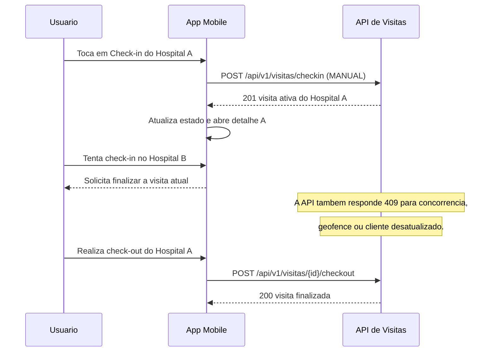

# Registro de Correcao - Check-in Manual e Performance v1.0

> **Data:** 01/09/2026
> **Status:** Implementado e validado
> **Escopo:** aplicativo mobile Expo/React Native e API Spring Boot
> **Referencias:** Documento Negocial v2.0 (RN-03) · Especificacao da API v2.0 (`/api/v1/visitas`) · F-03, F-04 e F-07

---

## Contexto

O fluxo de check-in manual apresentava tres problemas: o toque no botao tambem abria o detalhe por haver um `Pressable` dentro de outro; o backend permitia iniciar outra visita em hospital diferente; e a primeira lista de hospitais aguardava o debounce de 400 ms sem necessidade.

O login foi analisado: a API busca o usuario diretamente por e-mail e executa uma unica comparacao BCrypt. Nenhuma espera artificial foi encontrada nessa rota nesta correcao.

## Regra de Negocio Consolidada

### RN-03A - Exclusividade de visita ativa

Um usuario autenticado ou dispositivo anonimo pode manter **no maximo uma visita ativa** nos status `EM_ATENDIMENTO` ou `SUSPEITA`, independentemente da origem `MANUAL` ou `GEOFENCE`.

| Situacao | Resultado |
|---|---|
| Nenhuma visita ativa | Cria a visita (`201 Created`). |
| Visita ativa no mesmo hospital | Retorna a visita existente de forma idempotente (`200 OK`). |
| Visita ativa em outro hospital | Rejeita com `409 Conflict`; exige check-out antes de iniciar outra visita. |

Essa regra vale para `usuarioId` e `dispositivoId`. Portanto, uma visita automática por geofence bloqueia um check-in manual em outro hospital, e uma visita manual bloqueia uma nova visita automática em local diferente.

## Alteracoes Implementadas

### Backend

- `VisitaServiceImpl.checkin` consulta a visita ativa global do usuario ou dispositivo antes de criar uma nova.
- O retorno idempotente foi mantido apenas para o mesmo hospital.
- Visita ativa em outro hospital resulta em `ConflitoException` com orientacao para finalizar o check-in atual.
- Foi adicionado teste unitario para tentativa de check-in anonimo em hospital diferente com visita ativa.

### Mobile

- `CSHospitalCard` separa o botao de check-in da area que navega ao detalhe; nao ha mais `Pressable` aninhado.
- `HospitaisScreen` desabilita os demais hospitais enquanto existir visita ativa, inclusive de geofence.
- A resposta do check-in atualiza o estado local antes de navegar ao detalhe, evitando cards habilitados transitoriamente.
- O botao do hospital com visita ativa abre o detalhe correspondente; outro hospital apresenta orientacao para finalizar a visita atual.
- A primeira carga da lista ocorre imediatamente. O debounce de 400 ms e mantido somente para mudancas de busca e filtro.

## Fluxo Esperado

## Evidencias de Validacao

| Camada | Comando | Resultado |
|---|---|---|
| Backend | `backend\\gradlew.bat test --tests "br.com.saude_monitor.api.visita.service.impl.VisitaServiceImplTest"` | Aprovado. |
| Frontend | `npm run typecheck` em `frontend/` | Aprovado. |
| Frontend | `npm test -- --runInBand src/__tests__/screens/auth/LoginService.test.js src/__tests__/screens/visitas/VisitaService.test.js` em `frontend/` | Aprovado: 2 suites e 23 testes. |

## Validacao Pendente em Dispositivo

1. Fazer check-in manual e confirmar que somente o hospital selecionado fica ativo.
2. Confirmar que o app nao encerra ao tocar em `Check-in` ou abrir o detalhe do hospital ativo.
3. Tentar outro check-in com visita manual e com visita de geofence ativas; confirmar bloqueio.
4. Realizar check-out e confirmar que um novo check-in volta a ser permitido.
5. Medir login e primeira lista no ambiente de destino para separar latencia de rede/backend da latencia do cliente.