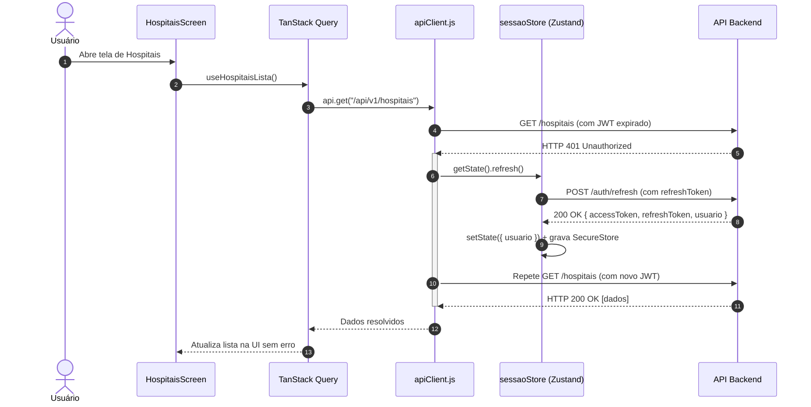
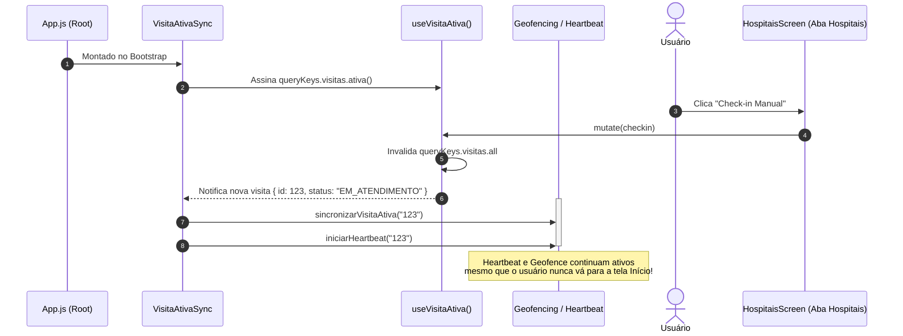

# Software Design Document (SDD) — Implementação de TanStack Query v5 e Zustand v5
**Projeto:** Saúde Monitor — Frontend Mobile  
**Versão:** 1.0  
**Data:** Outubro de 2026  
**Status:** Aprovado para Implementação  
**Autor:** Engenharia de Software / Arquitetura Frontend  
**Público-alvo:** Desenvolvedores Frontend Mobile, Tech Leads, QA  
**Documentos Relacionados:** [Relatório de Auditoria Técnica v4.0](./Relatorio-Auditoria-Tecnica-v4.0.md), [ADRs do Projeto](./adrs.md)

---

## 1. Visão Geral e Objetivos

Este documento especifica a arquitetura, desenho técnico, contratos de interface e plano de migração para a modernização da gestão de estado no aplicativo móvel **Saúde Monitor** (Expo SDK 55, React Native 0.83, React 19.2), introduzindo:

1. **TanStack Query (React Query v5):** para gerenciamento de **Server State** (cache assíncrono, deduplicação em trânsito, revalidação automática, paginação, sincronização offline/background e mutações com feedback otimista).
2. **Zustand v5:** para gerenciamento de **Client State Global** (sessão do usuário, tokens de acesso, preferências locais de interface e controle de estado sincronizado fora da árvore React).

### 1.1 Objetivos de Negócio e Qualidade
- **Eliminar inconsistências de sessão e visita:** resolver a dessincronia entre telas e o encerramento inadvertido de sessões por requisições concorrentes.
- **Corrigir o ciclo de vida de background:** desacoplar a manutenção do Heartbeat e do Geofencing de telas específicas (como a aba Início), garantindo a confiabilidade do monitoramento hospitalar.
- **Melhorar a percepção de performance (TTI e fluidez):** substituir telas em branco e indicadores de carregamento repetitivos por dados instantâneos provenientes do cache (*stale-while-revalidate*).
- **Reduzir a complexidade de código:** eliminar mais de 350 linhas de código *boilerplate* de controle manual (`useState`, `useEffect`, `useFocusEffect`, refs anti-corrida como `geracaoRef`, `buscandoMaisRef`, flags `cancelado`).
- **Resiliência a variações de rede:** integração transparente com a infraestrutura existente de retry exponencial, timeout e fila offline.

---

## 2. Diagnóstico do Estado Atual

No estado atual do código-fonte (analisado na Auditoria Técnica v4.0), identificamos os seguintes gargalos arquiteturais:

```
┌────────────────────────────────────────────────────────────────────────┐
│ Cenário Atual: Descentralização e Duplicação                           │
├────────────────────────────────────────────────────────────────────────┤
│                                                                        │
│   [HomeScreen]           [HospitaisScreen]       [HospitalDetalhe]     │
│   - useState(visita)     - useState(visita)      - useState(visita)    │
│   - useFocusEffect       - useFocusEffect        - useFocusEffect      │
│   - carregarVisita()     - carregarVisita()      - carregarVisita()    │
│            │                     │                       │             │
│            ▼                     ▼                       ▼             │
│    VisitaService.js      VisitaService.js        VisitaService.js      │
│   (Request isolado)     (Request isolado)       (Request isolado)      │
│            │                     │                       │             │
│            └──────────────┬──────┴───────────────────────┘             │
│                           ▼                                            │
│                 Chamadas HTTP Paralelas                                │
│              (Sem cache, sem deduplicação)                             │
│                                                                        │
└────────────────────────────────────────────────────────────────────────┘
```

### 2.1 Principais Deficiências Técnicas
1. **Re-fetch redundante ao trocar de aba:** Toda transição de foco aciona `buscarAtiva()`, `listar()` ou `usuarioLogado()` diretamente contra a rede ou `AsyncStorage`.
2. **Fragilidade anti-corrida:** As telas de listagem (`HospitaisScreen`, `RankingScreen`) mantêm referências manuais (`geracaoRef`, `buscandoMaisRef`, `cargaEmAndamentoRef`) para descartar respostas defasadas que chegam após nova digitação no filtro de busca.
3. **Ponto Cego de Background:** `HomeScreen.js` é a única tela que sincroniza a visita ativa com `GeofencingTaskService` e `HeartbeatService`. Se o usuário fizer check-in pela lista de hospitais e permanecer nela ou no detalhe, o heartbeat não é iniciado.
4. **Acoplamento Fora da Árvore React:** O interceptor HTTP 401 (`sessao.js` / serviços) e a tarefa em segundo plano (`GeofencingTaskService.js`) operam fora do ciclo de renderização do React e precisam inspecionar/modificar a sessão ativa.

---

## 3. Matriz Comparativa: Zustand vs. Context API

Uma das decisões centrais do projeto é a escolha da ferramenta de gerenciamento do estado global do cliente.

| Critério de Avaliação | React Context API | Zustand v5 | Impacto no Projeto Saúde Monitor | Vencedor |
|:---|:---|:---|:---|:---:|
| **Acesso fora do React** | ❌ Não suportado nativamente. Requer hacks (Singletons, EventEmitters). | ✅ Nativo: `store.getState()`, `store.setState()`, `store.subscribe()`. | **Crítico:** o interceptor HTTP 401 e a `GeofencingTask` rodam fora da árvore de componentes. | **Zustand** |
| **Granularidade de Re-render** | ❌ Re-renderiza todos os consumidores do Provider quando o valor muda. | ✅ Seletivo por padrão via seletores finos e `useShallow`. | **Alto:** mudanças de token ou timestamp de heartbeat não devem re-renderizar a árvore inteira. | **Zustand** |
| **Persistência Integrada** | ❌ Manual via `useEffect` no Provider raiz. | ✅ Middleware `persist` com serialização customizada (`createJSONStorage`). | **Médio:** integração direta com `TokenStorage` (SecureStore/AsyncStorage). | **Zustand** |
| **Boilerplate & Árvore JSX** | ⚠️ Provider hell (`<AuthProvider>`, `<Theme>`, `<VisitaProvider>`). | ✅ Zero Providers: hooks criados diretamente no escopo global. | **Alto:** simplifica `App.js` e facilita testes unitários. | **Zustand** |
| **Tamanho de Bundle** | ✅ 0 KB (nativo do React). | ✅ ~1.2 KB (min+gzip). | **Neutro:** impacto negligenciável no bundle Metro. | **Empate** |
| **Curva de Aprendizado** | ✅ Padrão React conhecido. | ✅ Padrão minimalista baseado em hooks simples. | **Neutro:** sintaxe direta e expressiva. | **Empate** |

### 3.1 Veredito Arquitetural
- **Zustand v5 é adotado como a solução de Estado Global de Cliente** devido à sua capacidade indispensável de leitura e escrita síncrona/reativa fora de componentes React (`store.getState()` / `store.setState()`).
- **Context API permanece exclusivamente para escopos locais e isolados**, especificamente no `GeolocalizacaoContext.js`, onde o fluxo contínuo de coordenadas GPS (`watchPositionAsync`) está restrito à tela de Mapa e não precisa vazar para o restante do app.

---

## 4. Divisão de Responsabilidades (Architecture Boundaries)

Para garantir escalabilidade e manutenção clara, os estados da aplicação são categorizados estritamente em quatro camadas:

```
┌─────────────────────────────────────────────────────────────────────────────────┐
│                      Camadas de Estado da Aplicação                             │
├─────────────────────────────────────────────────────────────────────────────────┤
│                                                                                 │
│  1. SERVER STATE (TanStack Query v5)                                            │
│     • Hospitais (listagem, detalhe, ranking, geofence GeoJSON)                  │
│     • Visita ativa do servidor (status remoto, histórico)                       │
│     • Feedbacks (avaliações registradas, histórico pessoal)                     │
│     • Regras: cache com TTL, stale-while-revalidate, dedupe, mutações           │
│                                                                                 │
│  2. CLIENT GLOBAL STATE (Zustand v5)                                            │
│     • Sessão do Usuário (dados cadastrais do perfil em memória)                 │
│     • Tokens JWT e status de autenticação (logado / anônimo)                    │
│     • Coordenação da Fila Offline ativa (contadores para badge da UI)           │
│     • Regras: acessível dentro e fora do React, persistência seletiva           │
│                                                                                 │
│  3. COMPONENT / SCREEN STATE (useState / useReducer)                            │
│     • Valores temporários de inputs de formulário                               │
│     • Modais, dialogs e bottoms-sheets abertos/fechados                         │
│     • Animações e controle de abas locais                                       │
│                                                                                 │
│  4. NATIVE SENSORS & HARDWARE STATE (Context ou Listeners)                      │
│     • GPS contínuo da tela de mapa (`GeolocalizacaoContext`)                    │
│     • Subscrições de AppState e Network                                         │
│                                                                                 │
└─────────────────────────────────────────────────────────────────────────────────┘
```

---

## 5. Arquitetura da Solução Proposta

```
frontend/src/
├── core/
│   ├── api/
│   │   ├── apiClient.js            # Cliente HTTP unificado (fetchComRetry + Mutex + AbortSignal)
│   │   └── apiError.js             # Classe padronizada ApiError { status, data, message }
│   ├── query/
│   │   ├── queryClient.js          # Instância do QueryClient com configurações padrão
│   │   ├── queryKeys.js            # Factory centralizada de chaves de query (type-safe)
│   │   └── setupQueryClient.js     # Integração com AppState (focusManager) e Network (onlineManager)
│   └── stores/
│       ├── sessaoStore.js          # Store global de autenticação e sessão com persistência
│       └── uiStore.js              # Store de controle de interface global (opcional)
├── hooks/
│   ├── useHospitais.js             # Queries de hospitais, detalhes e rankings
│   ├── useVisita.js                # Query de visita ativa e mutations (checkin/checkout)
│   ├── useFeedback.js              # Mutations e queries de feedback pós-visita
│   └── useSyncVisitaBackground.js  # Hook global montado na raiz para background tasks
```

---

## 6. Especificação Técnica Detalhada

### 6.1 Pré-requisito Fundamental: `apiClient.js` e `ApiError.js`

Antes de configurar as queries, o cliente HTTP deve ser consolidado para fornecer suporte a:
- Tratamento uniforme de envelopes de erro contendo `.status` e `.data`.
- Suporte a `signal` (`AbortSignal`) repassado pelo TanStack Query para cancelamento de requisições obsoletas.
- Interceptação 401 usando o método de renovação do `sessaoStore`.

```javascript
// src/core/api/apiError.js
export class ApiError extends Error {
  constructor(message, status, data) {
    super(message);
    this.name = "ApiError";
    this.status = status;
    this.data = data;
    this.classificado = true;
  }
}
```

```javascript
// src/core/api/apiClient.js
import { buildApiUrl } from "../../config/api";
import { classificarErroDeRede, fetchComRetry } from "../../config/http";
import { deveEncerrarSessao, geracaoDaSessao, renovarSessao } from "../../config/sessao";
import { useSessaoStore } from "../stores/sessaoStore";
import TokenStorage from "../../services/TokenStorage";
import { ApiError } from "./apiError";

async function authHeaders() {
  const token = await TokenStorage.getAccessToken();
  return token ? { Authorization: `Bearer ${token}` } : {};
}

export async function apiRequest(path, {
  method = "GET",
  body,
  headers = {},
  signal,
  idempotente,
} = {}) {
  const doFetch = async () => {
    const url = buildApiUrl(path);
    const config = {
      method,
      signal,
      headers: {
        "Content-Type": "application/json",
        ...(await authHeaders()),
        ...headers,
      },
    };

    if (body !== undefined) {
      config.body = typeof body === "string" ? body : JSON.stringify(body);
    }

    try {
      return await fetchComRetry(url, config, { idempotente });
    } catch (error) {
      throw await classificarErroDeRede(error, url);
    }
  };

  const geracao = geracaoDaSessao();
  let response = await doFetch();

  if (response.status === 401) {
    const refreshToken = await TokenStorage.getRefreshToken();
    if (refreshToken) {
      try {
        await renovarSessao(async () => {
          const { refresh } = useSessaoStore.getState();
          return await refresh();
        }, geracao);
        response = await doFetch();
      } catch (erroRenovacao) {
        if (deveEncerrarSessao(erroRenovacao)) {
          const { logout } = useSessaoStore.getState();
          await logout();
          throw new ApiError("Sessão expirada. Faça login novamente.", 401, null);
        }
        throw erroRenovacao;
      }
    }
  }

  const raw = await response.text();
  let data = null;
  if (raw) {
    try { data = JSON.parse(raw); } catch { data = null; }
  }

  if (!response.ok) {
    const message = data?.message || data?.error || `Falha na requisição (HTTP ${response.status}).`;
    throw new ApiError(message, response.status, data);
  }

  return data;
}

export const api = {
  get: (path, opts) => apiRequest(path, { ...opts, method: "GET" }),
  post: (path, body, opts) => apiRequest(path, { ...opts, method: "POST", body }),
  put: (path, body, opts) => apiRequest(path, { ...opts, method: "PUT", body }),
  patch: (path, body, opts) => apiRequest(path, { ...opts, method: "PATCH", body }),
  delete: (path, opts) => apiRequest(path, { ...opts, method: "DELETE" }),
};
```

---

### 6.2 Cliente TanStack Query e Integração com Ciclo de Vida Mobile

O React Native exige ponte explícita entre os eventos do sistema operacional (`AppState` e `Network`) e os gerenciadores do TanStack Query.

```javascript
// src/core/query/setupQueryClient.js
import { AppState, Platform } from "react-native";
import { focusManager, onlineManager } from "@tanstack/react-query";
import * as Network from "expo-network";

export function setupMobileQueryManagers() {
  // 1. Sincronização de Conectividade de Rede
  onlineManager.setEventListener((setOnline) => {
    const subscription = Network.addNetworkStateListener?.((state) => {
      setOnline(Boolean(state.isConnected && state.isInternetReachable !== false));
    });

    Network.getNetworkStateAsync().then((state) => {
      setOnline(Boolean(state.isConnected && state.isInternetReachable !== false));
    }).catch(() => {});

    return () => {
      subscription?.remove?.();
    };
  });

  // 2. Sincronização de Foco do Aplicativo (Foreground / Background)
  const appStateSubscription = AppState.addEventListener("change", (status) => {
    if (Platform.OS !== "web") {
      focusManager.setFocused(status === "active");
    }
  });

  return () => {
    appStateSubscription.remove();
  };
}
```

```javascript
// src/core/query/queryClient.js
import { QueryClient } from "@tanstack/react-query";

export const queryClient = new QueryClient({
  defaultOptions: {
    queries: {
      // Dados são considerados atualizados por 2 minutos
      staleTime: 1000 * 60 * 2,
      // Cache permanece em memória por 15 minutos sem uso
      gcTime: 1000 * 60 * 15,
      // Retry gerenciado prioritariamente pelo fetchComRetry interno do apiClient
      retry: (failureCount, error) => {
        // Não repetir se erro foi 4xx de cliente (ex: 401, 403, 404, 409)
        if (error?.status >= 400 && error?.status < 500) return false;
        return failureCount < 2;
      },
      refetchOnWindowFocus: true,
      refetchOnReconnect: true,
    },
    mutations: {
      retry: false, // Mutações não repetem por padrão para evitar duplicidade
    },
  },
});
```

---

### 6.3 Query Key Factory Centralizada

Para prevenir colisões de chave e garantir invariantes de tipagem, todas as chaves de query são geradas por uma fábrica centralizada:

```javascript
// src/core/query/queryKeys.js
export const queryKeys = {
  hospitais: {
    all: ["hospitais"],
    listas: () => [...queryKeys.hospitais.all, "lista"],
    lista: (filtros) => [...queryKeys.hospitais.listas(), filtros],
    detalhes: () => [...queryKeys.hospitais.all, "detalhe"],
    detalhe: (id) => [...queryKeys.hospitais.detalhes(), id],
    ranking: (ordem, tipo) => [...queryKeys.hospitais.all, "ranking", { ordem, tipo }],
    geofence: (id) => [...queryKeys.hospitais.all, "geofence", id],
  },
  visitas: {
    all: ["visitas"],
    ativa: (dispositivoOuUserId) => [...queryKeys.visitas.all, "ativa", dispositivoOuUserId ?? "anonimo"],
    historico: (filtros) => [...queryKeys.visitas.all, "historico", filtros],
  },
  feedback: {
    all: ["feedback"],
    porVisita: (visitaId) => [...queryKeys.feedback.all, "visita", visitaId],
    historico: (filtros) => [...queryKeys.feedback.all, "historico", filtros],
  },
  conta: {
    all: ["conta"],
    perfil: () => [...queryKeys.conta.all, "perfil"],
    consentimentos: () => [...queryKeys.conta.all, "consentimentos"],
  },
};
```

---

### 6.4 Store Global com Zustand v5: `sessaoStore.js`

O `sessaoStore` coordena o ciclo de autenticação, persistindo o perfil no `AsyncStorage` e os tokens no `SecureStore`.

```javascript
// src/core/stores/sessaoStore.js
import { create } from "zustand";
import { persist, createJSONStorage } from "zustand/middleware";
import AsyncStorage from "@react-native-async-storage/async-storage";
import TokenStorage from "../../services/TokenStorage";
import LoginService from "../../screens/auth/service/LoginService";
import { queryClient } from "../query/queryClient";

export const useSessaoStore = create(
  persist(
    (set, get) => ({
      usuario: null,
      inicializado: false,

      // Getters computados
      isAuthenticated: () => Boolean(get().usuario),

      // Inicialização segura no startup
      inicializar: async () => {
        try {
          const usuario = await TokenStorage.getUsuario();
          const token = await TokenStorage.getAccessToken();
          set({ usuario: token ? usuario : null, inicializado: true });
        } catch {
          set({ usuario: null, inicializado: true });
        }
      },

      // Ações de Autenticação
      login: async (credenciais) => {
        const resposta = await LoginService.login(credenciais);
        set({ usuario: resposta.usuario });
        // Invalida dados sensíveis de conta e histórico para recarregar
        queryClient.invalidateQueries({ queryKey: ["conta"] });
        queryClient.invalidateQueries({ queryKey: ["visitas"] });
        return resposta;
      },

      refresh: async () => {
        const resposta = await LoginService.refresh();
        if (resposta.usuario) {
          set({ usuario: resposta.usuario });
        }
        return resposta;
      },

      logout: async () => {
        await LoginService.logout();
        set({ usuario: null });
        // Limpa o cache do TanStack Query para evitar vazamento de dados entre sessões
        queryClient.clear();
      },

      setUsuario: (usuario) => {
        set({ usuario });
        if (usuario) {
          AsyncStorage.setItem("@saude_monitor:usuario", JSON.stringify(usuario)).catch(() => {});
        } else {
          AsyncStorage.removeItem("@saude_monitor:usuario").catch(() => {});
        }
      },
    }),
    {
      name: "@saude_monitor:sessao_store",
      storage: createJSONStorage(() => AsyncStorage),
      partialize: (state) => ({ usuario: state.usuario }), // Tokens residem no SecureStore
    }
  )
);
```

---

### 6.5 Resolução do Bug Crítico de Background: `useSyncVisitaBackground`

Para resolver a vulnerabilidade arquitetural em que o `GeofencingTaskService` e o `HeartbeatService` só eram alimentados quando o usuário abria a aba **Início**, criamos um componente/hook observador de raiz montado dentro de `App.js`:

```javascript
// src/hooks/useSyncVisitaBackground.js
import { useEffect } from "react";
import { useQuery } from "@tanstack/react-query";
import { queryKeys } from "../core/query/queryKeys";
import VisitaService from "../screens/visitas/service/VisitaService";
import { sincronizarVisitaAtiva } from "../screens/visitas/service/GeofencingTaskService";
import { iniciarHeartbeat, pararHeartbeat } from "../screens/visitas/service/HeartbeatService";
import { useSessaoStore } from "../core/stores/sessaoStore";

export function useSyncVisitaBackground() {
  const usuario = useSessaoStore((s) => s.usuario);
  const userIdOuAnonimo = usuario?.id ?? "anonimo";

  const { data: visitaData } = useQuery({
    queryKey: queryKeys.visitas.ativa(userIdOuAnonimo),
    queryFn: () => VisitaService.buscarAtiva(),
    staleTime: 1000 * 30, // 30 segundos
    refetchInterval: (query) => {
      // Se houver visita ativa, faz polling a cada 60s em foreground
      return query.state.data?.visita?.id ? 60000 : false;
    },
  });

  const visitaAtivaId = visitaData?.visita?.id || null;

  useEffect(() => {
    // Sincroniza independentemente da aba ou tela aberta
    sincronizarVisitaAtiva(visitaAtivaId);

    if (visitaAtivaId) {
      iniciarHeartbeat(visitaAtivaId);
    } else {
      pararHeartbeat();
    }
  }, [visitaAtivaId]);

  return { visitaAtiva: visitaData?.visita || null };
}
```

```jsx
// src/components/VisitaAtivaSync.jsx
import { useSyncVisitaBackground } from "../hooks/useSyncVisitaBackground";

export function VisitaAtivaSync() {
  useSyncVisitaBackground();
  return null; // Componente lógico puramente reativo sem UI
}
```

---

### 6.6 Custom Hooks de Negócio com TanStack Query

#### A. Hook de Hospitais com Paginação Infinita
Substitui as refs anti-corrida (`geracaoRef`, `buscandoMaisRef`) e estados manuais de `HospitaisScreen.js`:

```javascript
// src/hooks/useHospitais.js
import { useInfiniteQuery, useQuery } from "@tanstack/react-query";
import { queryKeys } from "../core/query/queryKeys";
import HospitalService from "../screens/hospitais/service/HospitalService";

const TAMANHO_PAGINA = 50;

export function useHospitaisLista({ busca, tipo }) {
  return useInfiniteQuery({
    queryKey: queryKeys.hospitais.lista({ busca, tipo }),
    queryFn: async ({ pageParam = 0, signal }) => {
      return await HospitalService.listar({
        busca,
        tipo,
        page: pageParam,
        size: TAMANHO_PAGINA,
        signal,
      });
    },
    initialPageParam: 0,
    getNextPageParam: (lastPage, allPages) => {
      const totalCarregado = allPages.length * TAMANHO_PAGINA;
      const total = lastPage?.totalElements ?? totalCarregado;
      const lista = lastPage?.content || lastPage || [];
      return (lista.length > 0 && totalCarregado < total) ? allPages.length : undefined;
    },
    select: (data) => ({
      pages: data.pages,
      pageParams: data.pageParams,
      hospitais: data.pages.flatMap((page) => page?.content || page || []),
    }),
  });
}

export function useHospitalDetalhe(id) {
  return useQuery({
    queryKey: queryKeys.hospitais.detalhe(id),
    queryFn: async ({ signal }) => {
      const [hospital, indicadores] = await Promise.all([
        HospitalService.buscarPorId(id, { signal }),
        HospitalService.buscarIndicadores(id, { signal }).catch(() => null),
      ]);
      return {
        ...hospital,
        indicadores: indicadores || hospital?.indicadores || null,
      };
    },
    enabled: Boolean(id),
    staleTime: 1000 * 60 * 5, // 5 minutos de cache estável
  });
}
```

#### B. Hook de Mutações de Check-in e Check-out
Substitui o estado local e sincroniza a fila offline com a UI:

```javascript
// src/hooks/useVisitaMutations.js
import { useMutation, useQueryClient } from "@tanstack/react-query";
import { queryKeys } from "../core/query/queryKeys";
import VisitaService from "../screens/visitas/service/VisitaService";

export function useCheckinMutation() {
  const queryClient = useQueryClient();

  return useMutation({
    mutationFn: (dados) => VisitaService.checkin(dados),
    onSuccess: (novaVisita) => {
      // Invalida e atualiza imediatamente a query de visita ativa
      queryClient.setQueriesData(
        { queryKey: queryKeys.visitas.all },
        (old) => ({ ...(old || {}), visita: novaVisita })
      );
      queryClient.invalidateQueries({ queryKey: queryKeys.visitas.all });
    },
  });
}

export function useCheckoutMutation() {
  const queryClient = useQueryClient();

  return useMutation({
    mutationFn: ({ id, params }) => VisitaService.checkout(id, params),
    onSuccess: () => {
      queryClient.setQueriesData(
        { queryKey: queryKeys.visitas.all },
        (old) => ({ ...(old || {}), visita: null })
      );
      queryClient.invalidateQueries({ queryKey: queryKeys.visitas.all });
    },
  });
}
```

---

## 7. Diagramas de Sequência e Fluxo

### 7.1 Fluxo de Autenticação e 401 Interceptor com Zustand



### 7.2 Ciclo de Vida Global da Visita e Heartbeat (Resolução do Bug)



---

## 8. Estratégia de Testes

### 8.1 Setup de Testes com TanStack Query e Zustand

Adicionar o wrapper de teste para `react-test-renderer` e `@testing-library/react-native`:

```javascript
// src/__tests__/helpers/renderComProviders.js
import React from "react";
import { render } from "@testing-library/react-native";
import { QueryClient, QueryClientProvider } from "@tanstack/react-query";
import { SafeAreaProvider } from "react-native-safe-area-context";

export function criarTestQueryClient() {
  return new QueryClient({
    defaultOptions: {
      queries: {
        retry: false, // Desativa retry em testes para execução rápida
        gcTime: Infinity,
      },
      mutations: {
        retry: false,
      },
    },
  });
}

export function renderComProviders(ui, { queryClient = criarTestQueryClient(), ...options } = {}) {
  const Wrapper = ({ children }) => (
    <SafeAreaProvider initialMetrics={{ insets: { top: 0, left: 0, right: 0, bottom: 0 }, frame: { x: 0, y: 0, width: 390, height: 844 } }}>
      <QueryClientProvider client={queryClient}>
        {children}
      </QueryClientProvider>
    </SafeAreaProvider>
  );

  return {
    ...render(ui, { wrapper: Wrapper, ...options }),
    queryClient,
  };
}
```

### 8.2 Isolamento entre Testes
- Adicionar ao `jest.setup.js` o reset automático do Zustand store:
```javascript
beforeEach(() => {
  useSessaoStore.setState({ usuario: null, inicializado: true });
});
```

---

## 9. Plano de Migração Incremental (Rollout Plan)

O plano de migração é dividido em 5 etapas sem quebras (*zero-downtime*):

```
┌────────────────────────────────────────────────────────────────────────┐
│                        Fases de Implementação                          │
├────────────────────────────────────────────────────────────────────────┤
│                                                                        │
│  FASE 0: Instalação & Infraestrutura Base                              │
│  ├─ Instalar @tanstack/react-query e zustand                           │
│  ├─ Criar src/core/api/apiClient.js e apiError.js                      │
│  ├─ Configurar queryClient.js e setupQueryClient.js                    │
│  └─ Criar sessaoStore.js com persistência                              │
│                                                                        │
│  FASE 1: Sessão Reativa e Autenticação                                 │
│  ├─ Conectar LoginScreen ao useSessaoStore                             │
│  ├─ Conectar PerfilScreen e HistoricoScreen ao useSessaoStore          │
│  └─ Injetar refresh do store no apiClient (eliminando import circular) │
│                                                                        │
│  FASE 2: Sincronização Global da Visita Ativa                          │
│  ├─ Criar queryKeys.js e useVisita.js                                  │
│  ├─ Implementar VisitaAtivaSync no App.js                              │
│  └─ Remover o acoplamento do heartbeat/geofencing do HomeScreen.js     │
│                                                                        │
│  FASE 3: Leitura e Listagem de Hospitais                               │
│  ├─ Migrar HospitaisScreen para useInfiniteQuery                       │
│  ├─ Migrar RankingScreen para useQuery                                 │
│  ├─ Migrar HospitalDetalheScreen para useQuery                         │
│  └─ Remover refs manuais de anti-corrida                               │
│                                                                        │
│  FASE 4: Mutações e Módulo de Feedback                                 │
│  ├─ Migrar Check-in e Check-out para useMutation                       │
│  ├─ Migrar envio e edição de Feedback                                  │
│  └─ Otimização com FlashList nas telas de catálogo                     │
│                                                                        │
└────────────────────────────────────────────────────────────────────────┘
```

---

## 10. Compatibilidade e Riscos

| Risco Identificado | Severidade | Mitigação Arquitetural |
|:---|:---:|:---|
| **Conflito de Versões do React 19** | Baixa | TanStack Query v5 e Zustand v5 possuem compatibilidade total comprovada com React 19. |
| **Limpeza Indesejada de Cache** | Média | Definir `staleTime: 2min` e `gcTime: 15min`. Não zerar queries públicas durante logout (zerar apenas chaves `conta` e `visitas`). |
| **Corrida com Fila Offline (OPS-05)** | Alta | Nas mutações otimistas, verificar se o erro foi `ErroEnfileirado`. Se foi enfileirado, marcar na query local como `origem: "MANUAL", pendenteSincronizacao: true` até o retorno da rede. |
| **Aumento de Tamanho do Bundle** | Baixa | `@tanstack/react-query` (~12 KB) + `zustand` (~1.2 KB) somam menos de 15 KB, amplamente compensados pela remoção de código manual nas telas. |

---

## 11. Critérios de Sucesso e Aceite

1. **Zero requisições duplicadas de `buscarAtiva()`** ao alternar entre as 4 abas da Bottom Navigation.
2. **Heartbeat operando normalmente** mesmo que o usuário faça check-in pela listagem de hospitais e nunca acerte o foco na aba Início.
3. **Logout automático consistente:** quando o refresh token for revogado no backend, toda a aplicação reage de imediato, redirecionando para a visualização não autenticada sem exigir refresh manual da tela.
4. **Redução comprovada de complexidade:** eliminação dos campos `geracaoRef`, `buscandoMaisRef`, `cargaEmAndamentoRef` em `HospitaisScreen.js` e `RankingScreen.js`.
5. **Aprovação nos testes unitários e de integração:** manutenção de 100% de aprovação na suíte `npm test`.
