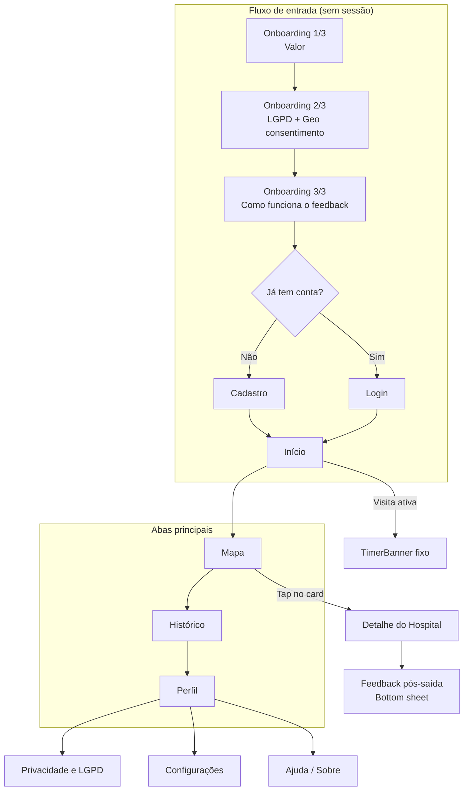
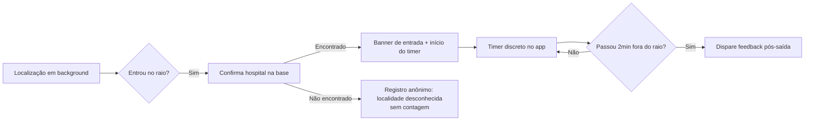
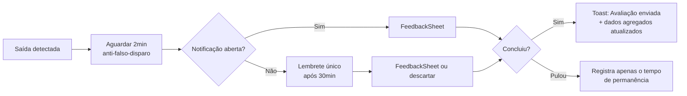

# Padrão UI/UX v2.0 — Clinical Sanctuary

**App de Monitoramento Hospitalar por Geolocalização**

| Campo | Valor |
|---|---|
| Documento | Padrao-UI-UX-v2.0.md |
| Versão | 2.0 |
| Status | Proposta para desenvolvimento |
| Data | 2026-08-07 |
| Base anterior | `_historico/v1.2-design-clinical-sanctuary/stitch_tela_de_cadastro_hospitalar/DESIGN.md` + telas existentes (Home, Login, Cadastro, Geolocalização) |
| Plataforma | Mobile — React Native + Expo 55 (RN 0.83), `react-native-maps`, `expo-location`, `lucide-react-native`, `react-navigation` (stack + bottom tabs) |
| Idioma padrão da UI | pt-BR |
| Acessibilidade alvo | WCAG 2.2 AA |

> **Autocontido**: este documento não exige leitura de outros arquivos. Ele preserva a identidade **Clinical Sanctuary** já iniciada (paleta Material 3 tonal, regra "no-line", glassmorphism, gradiente 135°, "cloud shadow") e a **evolui** para o usuário final — o paciente —, adicionando navegação por abas, fluxo de feedback pós-saída, telas públicas de avaliação e conformidade LGPD.

---

## 1. Visão Geral e Princípios de UX

### 1.1 O produto em uma frase

O app **detecta automaticamente quando o usuário entra em uma área hospitalar (geofence)**, mede o **tempo de permanência** e, ao sair, dispara um **feedback rápido e não-cansativo**; os resultados (tempo médio + nota média) são **agregados por hospital e exibidos publicamente** para todos os usuários.

### 1.2 Objetivos de negócio e de UX

| Objetivo de negócio | Tradução em UX |
|---|---|
| Coletar tempo real de permanência por hospital | Detecção automática por geofence, **sem nenhuma ação do usuário** para iniciar/parar a contagem |
| Coletar avaliação qualitativa do atendimento | Feedback pós-saída com **3–5 perguntas**, 1 toque por resposta, com opção de pular |
| Exibir dados públicos agregados por hospital | Telas públicas de score: nota média, tempo médio, nº de avaliações, distribuição |
| Construir confiança e transparência | Consentimento LGPD explícito, dados anonimizados, comunicação honesta |

### 1.3 Princípios de UX (norteadores)

1. **Zero fricção na coleta** — o app observa, o usuário não "trabalha". Entrar e sair do hospital é detectado sozinho. O único momento de esforço é o feedback pós-saída, e ele dura menos de 90 segundos.
2. **Feedback não-cansativo (regra dos 90 segundos)** — no máximo 5 perguntas; cada pergunta em uma tela; resposta com um toque (chip, estrela ou emoji); **pular** sempre visível; sem campos de texto obrigatórios; um único lembrete gentil (sem spam).
3. **Transparência radical** — os dados públicos são agregados e anônimos; o app mostra claramente o que coleta, por que coleta e como o usuário pode excluir.
4. **Calma visual (Clinical Sanctuary)** — hospital é um ambiente tenso; a UI compensa com superfícies claras, tons azul/teal, espaçamento generoso e ausência de bordas agressivas. O app nunca "grita".
5. **Confiança por consistência** — toda ação primária usa o mesmo padrão visual; toda métrica pública usa o mesmo formato; o usuário aprende o sistema uma vez e o reconhece em qualquer tela.
6. **Privacidade por design** — geolocalização só é coletada com consentimento explícito e granular; minimização de dados; nenhum dado individual é exposto publicamente.

### 1.4 Evolução do Clinical Sanctuary v1.2 → v2.0 (resumo)

| Aspecto | v1.2 (gestor hospitalar) | v2.0 (paciente / público) |
|---|---|---|
| Público | Gestor/administrador hospitalar | Paciente, acompanhante e público |
| Navegação | Stack + Drawer | Stack + **Bottom Tabs** (4 abas) |
| Foco das telas | Cadastro institucional, dados de gestão | Onboarding, Mapa/Geofence, Feedback pós-saída, Detalhe público do hospital |
| Badges de compliance | "End-to-End Encrypted", "HIPAA Compliant" | "Protegido pela LGPD", "Dados anonimizados" |
| Token primário | `#006193` | Mantido, com tokens estendidos para feedback (sucesso/erro/cautela) |
| Componentes novos | — | RatingStars, EmojiReaction, QuickChips, FeedbackSheet, ProgressDots, TimerBanner, HospitalCard público |
| Acessibilidade | Básica | WCAG 2.2 AA, alvos ≥48dp, leitor de tela, reduced motion |

---

## 2. Personas

### 2.1 Marina — paciente em consulta/exame (usuária principal)

- **Perfil**: 29 anos, trabalha em escritório, agenda consulta e exame em hospital público/privado, usa o celular o tempo todo.
- **Objetivo**: saber quanto tempo vai esperar e escolher o melhor horário/hospital.
- **Dores**: filas longas sem informação; não sabe se o hospital costuma atender rápido; receio de perder meio dia.
- **Necessidades**:
  - Detecção automática (esquece o app enquanto é atendida);
  - Feedback rápido, sem digitação, que possa responder no ônibus;
  - Ver nota e tempo médio do hospital antes de ir.
- **Momento crítico**: sai do hospital cansada/ansiosa → o formulário precisa ser leve, senão ela abandona (por isso: 3–5 perguntas, pular visível, ≤90s).

### 2.2 Carlos — acompanhante (usuário secundário ativo)

- **Perfil**: 47 anos, acompanha o pai idoso em consultas e emergências, costuma esperar na recepção.
- **Objetivo**: monitorar a espera e contribuir com a avaliação para ajudar outras famílias.
- **Dores**: ansiedade durante a espera; sente que a experiência do hospital não é medida em lugar nenhum.
- **Necessidades**:
  - Ver o tempo decorrido enquanto espera (feedback de progresso);
  - Responder avaliação sem atrapalhar o cuidado com o acompanhado;
  - Confiar que os dados são anônimos (não quer expor o familiar).
- **Momento crítico**: a saída pode ser corrida (levando o paciente) → o lembrete único pós-saída deve ser discreto e permitir responder depois.

### 2.3 Renata — gestora hospitalar (consumidora dos dados públicos)

- **Perfil**: 38 anos, diretora de qualidade de um hospital médio, responde a indicadores e à reputação.
- **Objetivo**: usar os dados públicos (tempo médio, nota média) como termômetro operacional e de reputação.
- **Dores**: reclamações informais; falta de métrica de percepção do paciente em tempo real.
- **Necessidades**:
  - Painel simples com nota média, tempo médio e nº de avaliações;
  - Comparação com hospitais vizinhos;
  - Entender os critérios avaliados (triagem, médico, enfermagem, recepção).
- **Momento crítico**: ela não é o usuário do app, mas a tela pública deve ser **legível por qualquer pessoa** — sem jargão, com números grandes e contexto ("baseado em N avaliações nos últimos 30 dias").

---

## 3. Jornada do Usuário Ponta a Ponta

```mermaid
flowchart LR
  A[Instala o app<br/>Onboarding] --> B[Concede permissão de<br/>localização LGPD]
  B --> C[Abre o app em casa<br/>Mapa sem hospitais próximos]
  C --> D[Entra na área hospitalar<br/>Geofence detecta]
  D --> E[Permanência<br/>Timer discreto no app]
  E --> F[Sai da área<br/>Geofence detecta]
  F --> G[Feedback pós-saída<br/>Bottom sheet 3-5 perguntas]
  G --> H[Pular ou concluir]
  H --> I[Dados agregados<br/>atualizam score público]
  I --> J[Consulta pública<br/>Nota e tempo médio do hospital]
  J --> K[Retorna em outra visita<br/>Repete o ciclo]
```



### 3.1 Momentos de verdade (Moments of Truth)

| # | Momento | Por que importa | Como o design protege |
|---|---|---|---|
| MV1 | **Entrada detectada** | Prova imediata de que o app funciona sozinho | Banner de entrada com nome do hospital + início silencioso da contagem; confirmação em <2s |
| MV2 | **Saída + feedback** | Maior risco de abandono (usuário cansado) | Bottom sheet leve, 1 pergunta por vez, progresso visível, pular sempre disponível |
| MV3 | **Retorno de valor** | Usuário vê que sua avaliação virou dado público útil | Tela "Como está seu hospital?" com nota/tempo médios e a mensagem "sua avaliação ajudou N pessoas" |

### 3.2 Redução de fricção (regras duras)

1. **Nunca** pedir feedback dentro do raio do hospital. Apenas após a saída (com janela de tolerância de 2 minutos para evitar falso disparo).
2. **Máximo 5 perguntas** por feedback; tempo estimado exibido ("Leva menos de 1 minuto").
3. **1 toque por resposta**: chips de múltipla escolha, estrelas ou emojis. Nada de teclado obrigatório.
4. **Pular** visível em todas as etapas, sem culpa; se pular tudo, envia apenas o tempo de permanência (dado anônimo já coletado com consentimento).
5. **1 lembrete único** por saída, silencioso, respeitando horários (ex.: não notificar entre 22h–7h, exceto opt-in).
6. **Sem login obrigatório** para responder feedback; login só para histórico pessoal.
7. Contador de permanência **discreto**: chip pequeno fixo, nunca modal bloqueante.

### 3.3 Estados a cobrir em cada fluxo

- **Entrada**: sem sinal de GPS / GPS impreciso / permissão negada / hospital desconhecido na base.
- **Permanência**: app em background / economia de bateria / usuário sai e volta (reentrada) / erro de contagem (auto-correção silenciosa).
- **Feedback**: saída falsa (voltou antes de responder) / sessão expirada / avaliação duplicada (mesma visita já avaliada).
- **Público**: hospital sem avaliações ainda (empty state) / poucas avaliações (n<5 → exibir "avaliação preliminar") / dados desatualizados (últimos 30 dias) / offline.

---

## 4. Arquitetura de Informação e Mapa de Navegação

### 4.1 Estrutura de navegação

- **Stack principal** (transições empilhadas): Onboarding → Login/Cadastro → Home → Detalhe do Hospital.
- **Bottom Tabs** (4 abas persistentes): **Início**, **Mapa**, **Histórico**, **Perfil**.
- **Feedback pós-saída**: apresentado como **bottom sheet** modal sobre qualquer aba (não é uma rota navegável).
- **Drawer removido** em v2.0 (a navegação por abas cobre os destinos principais; itens secundários — Privacidade, Sobre, Ajuda — ficam no Perfil).



### 4.2 Telas e ação primária

| Tela | Papel | Ação primária (visível em ≤2s) |
|---|---|---|
| **Onboarding 1/3** | Explicar valor em 1 frase | Continuar |
| **Onboarding 2/3** | Consentimento LGPD + permissão de localização | "Permitir localização" (com link "Saiba mais") |
| **Onboarding 3/3** | Explicar o feedback (promessa: ≤1 min, anônimo) | Começar |
| **Home (Início)** | Status da detecção + atalhos + "Como está seu hospital?" | "Ver hospitais no mapa" |
| **Login / Cadastro** | Autenticação opcional | Entrar / Criar conta |
| **Mapa** | Geofences visíveis, posição em tempo real, cards de hospitais | Tap no card → Detalhe |
| **Detalhe do Hospital** | Score público: nota média, tempo médio, N avaliações, critérios | "Como chegar" (secundário) + ver critérios |
| **Feedback pós-saída** | Coleta rápida (3–5 perguntas) | Resposta por toque + Enviar |
| **Histórico** | Visitas anteriores do usuário (tempo, nota, hospital) | Filtro por período |
| **Perfil** | Conta, permissões, preferências, LGPD | Gerenciar permissões |
| **Privacidade** | Política em camadas, direitos do titular | Excluir meus dados |

---

## 5. Design System — Clinical Sanctuary v2.0

> Convenção: tokens em `snake_case`; no React Native, mapear para `camelCase` (ex.: `color.primary` → `colors.primary`). Todos os valores são explícitos; nada de "padding grande" ou "sombra sutil".

### 5.1 Paleta de cores (Material 3 tonal)

**Tokens de superfície e texto**

| Token | Hex | Uso |
|---|---|---|
| `color.surface` | `#f7f9fb` | Fundo base do app |
| `color.surface_container_lowest` | `#ffffff` | Cards elevados, inputs, áreas "recessadas" |
| `color.surface_container_low` | `#f1f3f5` | Seções secundárias sobre `surface` (regra no-line) |
| `color.surface_container` | `#e9edf0` | Agrupamentos intermediários |
| `color.surface_container_high` | `#e2e7eb` | Elementos flutuantes sólidos |
| `color.surface_container_highest` | `#dce2e6` | Nav/persistentes sólidos |
| `color.on_surface` | `#191c1e` | Texto primário (nunca `#000000`) |
| `color.on_surface_variant` | `#44474a` | Texto secundário, metadados |
| `color.outline` | `#73777e` | Ícones, gráficos UI (exigência 3:1; não usar como texto) |
| `color.outline_variant` | `#c3c7ce` | Ghost border (usar a 20% de opacidade) |

**Tokens primários, secundários e terciários**

| Token | Hex | Uso |
|---|---|---|
| `color.primary` | `#006193` | Ações primárias, links, destaques |
| `color.on_primary` | `#ffffff` | Texto/ícone sobre primary |
| `color.primary_container` | `#007bb8` | Superfícies de acento (badges, barras), gradiente |
| `color.on_primary_container` | `#ffffff` | Texto sobre container (≥14px semibold ou 16px normal) |
| `color.secondary` | `#006a6a` | Confirmação calma: checkbox marcado, estados "ativo" |
| `color.on_secondary` | `#ffffff` | Texto/ícone sobre secondary |
| `color.secondary_container` | `#cdeaea` | Badge "ativo/ok", fundos de sucesso suave |
| `color.on_secondary_container` | `#004f4f` | Texto sobre secondary_container |
| `color.tertiary` | `#884e00` | Cautela (avisos que não são erro) |
| `color.on_tertiary` | `#ffffff` | Texto sobre tertiary |
| `color.tertiary_container` | `#fde8cd` | Badge "atenção suave" |
| `color.on_tertiary_container` | `#4a2a00` | Texto sobre tertiary_container |

**Tokens de feedback (erro/sucesso)**

| Token | Hex | Uso |
|---|---|---|
| `color.error` | `#ba1a1a` | Erros, validação |
| `color.on_error` | `#ffffff` | Texto sobre error |
| `color.error_container` | `#ffdad6` | Fundo de alerta de erro |
| `color.on_error_container` | `#410002` | Texto sobre error_container |
| `color.success` | `#1b7f3b` | Confirmação de envio (distinto do primary para não confundir) |
| `color.success_container` | `#d7f2dd` | Fundo de sucesso |
| `color.on_success_container` | `#0b3d1c` | Texto sobre success_container |

**Gradientes e vidro**

| Token | Valor | Uso |
|---|---|---|
| `gradient.primary` | `135deg` de `#006193` a `#007bb8` | CTA primário, hero do onboarding |
| `glass.background` | `color.surface` a 80% opacidade + `backdrop-blur(24px)` | Bottom tabs, bottom sheet, banner flutuante |
| `glass.scrim` | `#000000` a 32% opacidade | Escurecimento de fundo atrás de modais/sheets |

**Contraste verificado (WCAG 2.2 AA)**

| Par | Razão aprox. | AA normal (4.5:1) |
|---|---|---|
| `on_surface` `#191c1e` sobre `surface` `#f7f9fb` | ≈ 15.8:1 | ✅ |
| `primary` `#006193` sobre `surface` | ≈ 6.3:1 | ✅ |
| `on_primary` `#ffffff` sobre `primary` | ≈ 6.7:1 | ✅ |
| `on_primary` `#ffffff` sobre `primary_container` `#007bb8` | ≈ 4.6:1 | ✅ |
| `secondary` `#006a6a` sobre `surface` | ≈ 6.3:1 | ✅ |
| `tertiary` `#884e00` sobre `surface` | ≈ 5.9:1 | ✅ |
| `on_surface_variant` `#44474a` sobre `surface` | ≈ 8.0:1 | ✅ |
| `outline` `#73777e` sobre `surface` | ≈ 4.2:1 | ⚠️ usar só para ícones/UI (3:1), nunca texto |
| `error` `#ba1a1a` sobre `surface` | ≈ 6.0:1 | ✅ |
| `on_secondary_container` `#004f4f` sobre `secondary_container` `#cdeaea` | ≈ 7.2:1 | ✅ |
| `on_error_container` `#410002` sobre `error_container` `#ffdad6` | ≈ 7.0:1 | ✅ |

> Dark mode: planejar como tema futuro (Material 3 tonal escuro), não obrigatório nesta versão; toda decisão de cor deve ser por token, nunca valor solto.

### 5.2 Tipografia (dupla Manrope + Inter)

- **Manrope** — Display e Headlines (autoridade, dados grandes, welcome).
- **Inter** — Títulos de corpo, textos, labels (legibilidade de termos médicos).

| Role | Família | Tamanho / Linha | Peso | Tracking | Uso |
|---|---|---|---|---|---|
| Display-LG | Manrope | 40 / 48 | 700 | -0.5 | Números hero (tempo médio, nota grande) |
| Display-MD | Manrope | 32 / 40 | 700 | -0.5 | Headline de onboarding/detalhe |
| Display-SM | Manrope | 28 / 36 | 700 | -0.5 | Títulos de tela principais |
| Headline-LG | Manrope | 24 / 32 | 700 | -0.25 | Título de card grande |
| Headline-MD | Manrope | 22 / 28 | 700 | -0.25 | Título de seção |
| Headline-SM | Manrope | 20 / 26 | 700 | -0.25 | Título de card |
| Title-LG | Inter | 18 / 24 | 600 | 0 | Título de tela secundária |
| Title-MD | Inter | 16 / 22 | 600 | 0 | Título de lista/item |
| Title-SM | Inter | 14 / 20 | 600 | 0 | Título de chip/sumário |
| Body-LG | Inter | 16 / 24 | 400 | 0 | Texto corrido padrão |
| Body-MD | Inter | 14 / 20 | 400 | 0 | Texto secundário, descrições |
| Body-SM | Inter | 12 / 16 | 400 | 0 | Legenda (usar com parcimônia) |
| Label-LG | Inter | 14 / 20 | 600 | 0 | Botões, CTAs |
| Label-MD | Inter | 12 / 16 | 600 | 0.25 | Labels de campo |
| Label-SM | Inter | 11 / 16 | 600 | 0.5 | Microcopy, metadata (uppercase opcional) |
| Number/Data | Manrope | 22–40 | 800 | -0.5 | Timer de permanência, notas (tabular) |

Regras:
- Texto em `on_surface_variant` para metadados; nunca usar `outline` como cor de texto.
- Escala fluida: permitir `allowFontScaling: true` e testar até 200% (WCAG 1.4.4).
- Números com `fontVariant: ['tabular-nums']` para não "dançar" durante o timer.

### 5.3 Espaçamento e grade

- **Base 8px** (8-point grid), com unidade mínima 4px para micro-ajustes de ícone.
- Tokens: `space-1: 4` · `space-2: 8` · `space-3: 12` · `space-4: 16` · `space-5: 20` · `space-6: 24` · `space-7: 32` · `space-8: 40` · `space-9: 48` · `space-10: 64`.
- Margem padrão de tela: `space-5` (20px) horizontal.
- Respiro em torno de dados críticos (nota/tempo): `space-7`/`space-8`.
- Distância entre cards em lista: `space-4` (16px) vertical, sem divisores (regra no-line).

### 5.4 Raios (cantos)

| Token | Valor | Uso |
|---|---|---|
| `radius-sm` | 12px | Chips, pills, badges |
| `radius-md` | 16px | Inputs, botões secundários |
| `radius-lg` | 24px | Botão primário (1.5rem "xl" do v1.2) |
| `radius-xl` | 32px | Cards principais, bottom sheet |
| `radius-full` | 999px | Avatares, pills full, indicadores |

### 5.5 Elevação e sombras ("cloud shadow")

| Token | Valor | Uso |
|---|---|---|
| `elevation-0` | Sem sombra | Conteúdo plano |
| `elevation-1` (cloud-soft) | Y 4px · Blur 12px · `on_surface` 4% | Cards em superfícies tonais |
| `elevation-2` (cloud) | Y 8px · Blur 24px · `on_surface` 6% | Cards elevados, bottom sheet fechado |
| `elevation-3` (cloud-deep) | Y 12px · Blur 32px · `on_surface` 8% | Elementos flutuantes, FAB, sheets abertos |

> No React Native: `shadowColor: tokens.color.on_surface; shadowOffset: {width:0, height:Y}; shadowOpacity: 0.06; shadowRadius: 24; elevation: 8` (Android). Nunca usar sombras padrão de framework com aparência "barata".

### 5.6 Iconografia

- Biblioteca: **lucide-react-native** (já no projeto).
- Traço: `strokeWidth: 1.75` (padrão) e `2` para tamanhos ≤16.
- Tamanhos: `icon-sm: 16` · `icon-md: 20` · `icon-lg: 24` · `icon-xl: 32`.
- Ícones líderes em inputs e botões são **obrigatórios** (padrão v1.2).
- Ícones decorativos: `accessibilityElementsHidden` e `importantForAccessibility="no-hide-descendants"`.
- Alinhar ícones ao cap-height do texto adjacente.

### 5.7 Componentes principais

#### 5.7.1 Button (primário / secundário / terciário / ícone)

| Variante | Anatomia | Tokens | Estados |
|---|---|---|---|
| **Primary** | Gradiente 135° `#006193→#007bb8`, texto `on_primary`, ícone trailing obrigatório | H 56 · raio 24 · Label-LG · padding-x 24 · ícone 20 | default / pressed (opacidade 88% + scale 0.98) / loading (spinner branco após 400ms) / disabled (opacidade 40%) / focus (ring 2px `on_surface` offset 2px) |
| **Secondary** | Fundo transparente, ghost border `outline_variant` 20%, texto `primary`, ícone opcional | H 52 · raio 16 · Label-LG | default / pressed (fundo `primary` 8%) / disabled 40% |
| **Tertiary** | Texto `primary`, sem fundo | H 48 · Label-LG | default / pressed (texto 70%) |
| **IconButton** | Ícone 24, fundo transparente | 48×48 · raio full | default / pressed (fundo `primary` 10%) |

Regra: **alvo mínimo 48×48dp** (incluindo padding do toque se visual for menor).

#### 5.7.2 Input (texto, senha, busca)

- Anatomia: container H 60, fundo `surface_container_lowest`, raio 16, ícone líder 20 em `outline`, label acima (Label-MD `on_surface_variant`), texto Body-LG `on_surface`.
- Estados: default (sem borda visível) / focus (borda 2px `primary`, fundo mantém tom) / error (borda 2px `error`, mensagem Label-MD `error`) / disabled (opacidade 50%).
- Ghost border de apoio: `outline_variant` a 20% (nunca 100% opaco).

#### 5.7.3 Card

| Variante | Uso | Tokens |
|---|---|---|
| `Card.elevated` | Cards principais (hospital, resumo) | fundo `surface_container_lowest` (`#ffffff`), raio 32, `elevation-2` |
| `Card.tonal` | Agrupamentos secundários | fundo `surface_container_low`, raio 24, sem sombra |
| `Card.status` | Alerta/atenção | fundo `error_container`/`tertiary_container`, raio 24, sem sombra |

- Padding interno padrão: 20px; sem bordas; separação por shifts de tom (no-line).

#### 5.7.4 BottomNavigation (glass)

- 4 abas: Início, Mapa, Histórico, Perfil.
- Glassmorphism: fundo `surface` 80% + `backdrop-blur(24px)`, raio superior 24, altura 72 + safe area.
- Item ativo: ícone 24 em `primary` + label Label-MD `primary`; inativo: ícone `outline` + label `on_surface_variant`.
- Indicador ativo: pill `primary_container` a 15% atrás do ícone.

#### 5.7.5 Badge e DataPill

| Componente | Tokens | Uso |
|---|---|---|
| `Badge.success` | fundo `secondary_container`, texto `on_secondary_container` | "Atendido", "Ativo" |
| `Badge.warning` | fundo `tertiary_container`, texto `on_tertiary_container` | "Em triagem", "Preliminar" |
| `Badge.error` | fundo `error_container`, texto `on_error_container` | "Não atendido", "Superlotação" |
| `DataPill` | fundo `surface_variant`/`surface_container`, texto `on_surface_variant`, raio full, H 32 | Especialidade, departamento, "Últimos 30 dias" |

#### 5.7.6 RatingStars (avaliação por estrelas)

- Anatomia: 5 estrelas, tamanho `rating-sm: 24` (inline) · `rating-md: 32` (formulário) · `rating-lg: 44` (display público).
- Estados: vazia (`outline` a 60%) / preenchida (`#f5a623` âmbar — distinto do primary para comunicar "avaliação") / selecionada (scale 1.1).
- Acessível: grupo com `accessibilityRole="radiogroup"`, cada estrela `radio`, labels "1 de 5 estrelas" … "5 de 5 estrelas".
- Display público: estrelas + número (ex.: "4,2") — **nunca cor como único indicador**; texto sempre acompanha.
- Alvo de toque: área 48×48 por estrela (com padding invisível).

#### 5.7.7 EmojiReaction (alternativa de 1 toque)

- 5 emojis: 😞 😕 😐 🙂 😄 em chips, raio full, H 56.
- Selecionado: fundo `primary_container` 15% + borda 2px `primary` + scale 1.05.
- Acessível: label textual ("Muito ruim", "Ruim", "Neutro", "Bom", "Excelente") — emoji nunca é o único canal.

#### 5.7.8 QuickChips (respostas de múltipla escolha)

- Chips selecionáveis, H 48, raio full, fundo `surface_container_lowest`, texto Body-MD.
- Selecionado: fundo `primary_container` 15%, borda 2px `primary`, check `primary` 16.
- Múltipla escolha permitida (ex.: "Quem atendeu você?") com `accessibilityRole="checkbox"`.

#### 5.7.9 FeedbackSheet (bottom sheet pós-saída)

- Glass: fundo `surface` 96% + blur 24, raio superior 32, `elevation-3`.
- Estrutura: header (hospital + "Leva menos de 1 minuto") · **ProgressDots** (5 segmentos) · pergunta atual (1 por vez) · resposta (chips/estrelas/emoji) · rodapé fixo com **Pular** (tertiary) e **Continuar/Enviar** (primary).
- Sem barra de arraste obrigatória; suporta swipe-down para fechar com confirmação "Descartar avaliação?".

#### 5.7.10 ProgressDots / barra de progresso

- 5 segmentos horizontais, H 6, raio full, preenchido `primary`, vazio `surface_container_high`.
- Anima 300ms ease-out entre etapas; label "Pergunta 2 de 5".

#### 5.7.11 TimerBanner (permanência)

- Chip fixo (não modal): fundo glass, raio full, ícone `map-pin` 20 + texto "Em Hospital X · 12 min" (Manrope 800 16px).
- Posição: acima da bottom tab, flutuante, com `elevation-2`.
- Toca levemente ao iniciar (haptic selection); sem animação contínua por segundo (evita cansaço visual).

#### 5.7.12 EmptyState

- Anatomia: ícone 48 em círculo 96 (`surface_container_low`), título Headline-SM, texto Body-MD `on_surface_variant`, CTA opcional.
- Casos: "Nenhum hospital próximo", "Você ainda não avaliou nenhum hospital", "Ainda não há avaliações suficientes".

#### 5.7.13 LoadingState

- Skeleton: blocos de `surface_container_high` com shimmer de opacidade 0.5→1.0 (1.2s loop), raios conforme o componente; respeitar `prefers-reduced-motion` (estático).
- Spinner: 24px branco sobre CTA após 400ms de envio; página inteira só se carregamento > 600ms (evitar flash).

#### 5.7.14 NotificationBanner (entrada/saída)

- Entrada: banner superior slide-down, glass, ícone `map-pin`, "Você entrou em Hospital X — o tempo de permanência começou a contar".
- Saída: banner inferior acima da tab, "Você saiu de Hospital X. Que tal avaliar em 1 minuto?" com botão "Avaliar agora" e "Agora não".

---

## 6. Diretrizes de Micro-interações e Animações

### 6.1 Tokens de movimento

| Token | Valor |
|---|---|
| `motion-fast` | 150ms |
| `motion-base` | 250ms |
| `motion-slow` | 300ms |
| `easing-standard` | `cubic-bezier(0.2, 0, 0, 1)` (Material 3 standard) |
| `easing-emphasized` | `cubic-bezier(0.2, 0, 0, 1)` com deceleração no fim (Material emphasized) |
| `prefers-reduced-motion` | Toda animação não-essencial desativada; transições viram fades de 100ms ou estáticas |

### 6.2 Mapa de animações

| Interação | Trigger | Comportamento | Duração/Easing | Reduced motion |
|---|---|---|---|---|
| Entrada no hospital | Geofence detectado | Banner desliza de cima + haptic `notification` | 250ms emphasized | Fade 100ms |
| Timer inicia | Banner entra | Chip flutua acima da tab (slide-up 8px) | 250ms standard | Sem slide |
| Saída do hospital | Geofence sai | Banner inferior desliza de baixo | 250ms emphasized | Fade |
| FeedbackSheet abre | Tap "Avaliar" / notificação | Sheet sobe de baixo + scrim fade | 300ms emphasized | Fade 100ms |
| Troca de pergunta | Tap Continuar | ProgressDots preenche + conteúdo cross-fade | 300ms standard | Fade 100ms |
| Estrela selecionada | Tap | Scale 1.0→1.1→1.0 + haptic `selection` | 150ms spring suave | Sem scale, só cor |
| Chip selecionado | Tap | Borda/check aparecem + scale 0.98 | 150ms standard | Só cor |
| Envio concluído | Tap Enviar | Check verde animado (stroke draw) + sheet fecha | 300ms | Check estático |
| Troca de aba | Tap na tab | Ícone scale 0.9→1.0, cor cross-fade | 200ms standard | Só cor |
| Skeleton | Carregamento | Shimmer 0.5→1.0 opacidade | 1.2s loop | Estático |
| Scrim de modal | Abrir/fechar | Opacidade 0→32% | 250ms | Fade |

### 6.3 Regras

- **Nada de animação contínua** em dados que mudam a cada segundo (timer usa troca de dígito, não pulso).
- Animações de entrada/saída de elementos **≤300ms**; nunca bloquear interação com animação > 400ms.
- Usar haptics com moderação: seleção (estrelas/chips), notificação (entrada/saída), sucesso (envio). Nunca haptic em erro.
- Preferir **movimento vertical** (sheets, banners) a movimento horizontal; horizontal só para carrosséis de onboarding.

---

## 7. Acessibilidade (WCAG 2.2 AA)

| Critério | Diretriz | Verificação |
|---|---|---|
| Contraste de texto | Todas as combinações da seção 5.1 ≥ 4.5:1 (normal) / 3:1 (grande) | Tabela de contraste acima; `outline` proibido como texto |
| Contraste de UI (1.4.11) | Elementos visuais (ícones, bordas, estados) ≥ 3:1 contra adjacentes | Ghost border a 20% + `primary` em foco atendem |
| Alvos de toque (2.5.8 / Material) | **≥ 48×48dp** para todos os alvos; 56dp para ações críticas | Botões H≥48/52/56; estrelas com padding invisível |
| Leitores de tela (4.1.2) | `accessibilityRole` correto: `button`, `radiogroup`, `radio`, `checkbox`, `progressbar`, `tab` | RatingStars = radiogroup; QuickChips = checkbox; ProgressDots = progressbar com `accessibilityValue` |
| Live regions (4.1.3) | Timer de permanência e resultado de envio anunciam mudança | `accessibilityLiveRegion="polite"` no TimerBanner e no toast de sucesso |
| Texto alternativo (1.1.1) | Ícones decorativos ocultos; imagens informativas com `accessibilityLabel` | Ícones lucide decorativos marcados como ocultos |
| Redimensionamento de texto (1.4.4) | `allowFontScaling` ativo; layout testado até 200% sem corte | Teste de regressão com fontScale 1.0 / 1.3 / 2.0 |
| Redução de movimento (2.3.3) | `prefers-reduced-motion` desativa animações não essenciais | Mapa da seção 6.2, coluna "Reduced motion" |
| Não depender só de cor (1.4.1) | Estrelas + número, chips + texto, badges + texto | Nunca cor isolada |
| Foco visível (2.4.7) | Ring 2px `on_surface` com offset 2px em todos os focáveis | Teste de navegação por teclado |
| Ordem de foco (2.4.3) | Ordem lógica: header → conteúdo → CTA → nav | Verificada nos protótipos da seção 9 |

---

## 8. LGPD e Privacidade por Design

### 8.1 Consentimento de geolocalização

- **Tela dedicada** no onboarding (2/3) com linguagem simples, não jurídica:
  > "O app usa sua localização apenas para saber quando você entra ou sai de uma área de hospital e medir o tempo de espera. Você pode desligar quando quiser."
- **Permissão granular**: "Permitir enquanto usa" (padrão recomendado) vs. "Somente uma vez" vs. "Não permitir" — o app funciona sem localização (navegação e consulta pública), apenas não mede tempo.
- Base legal: **consentimento (art. 7º, I)** para coleta de geolocalização + dados de avaliação; re-confirmação a cada 12 meses ou quando a política mudar.

### 8.2 Minimização de dados

| O que é coletado | Para quê | Retenção |
|---|---|---|
| Timestamp de entrada e saída + id do hospital (geofence) | Tempo de permanência agregado | Individual: 12 meses (configurável); agregado: permanente e anônimo |
| Respostas do feedback | Nota média por critério | Individual: 12 meses; agregado anônimo: permanente |
| Conta opcional (e-mail) | Histórico pessoal | Até exclusão pelo usuário |
| **Não coletar**: trajetória contínua, pontos intermediários, dados de saúde do usuário, contatos | — | — |

- **Nunca** exibir dado individual publicamente; exibir apenas agregados (média, distribuição, contagem).
- Feedback com menos de 5 avaliações no período: exibir como **"Avaliação preliminar"** (badge warning) para não induzir conclusões.

### 8.3 Transparência e direitos do titular

- Política em **camadas**: resumo de 1 tela (o que/por que/como excluir) + política completa (link).
- Tela **Privacidade e LGPD** no Perfil com:
  - "Exportar meus dados" (formato JSON);
  - "Excluir meus dados" (com confirmação em duas etapas);
  - "Desativar monitoramento de localização" (switch imediato);
  - Canal de contato do encarregado (DPO).
- Badges de compliance na UI (substituindo HIPAA):
  - `Protegido pela LGPD` (shield-check, secondary)
  - `Dados anonimizados` (eye-off, secondary)
  - `Você controla seus dados` (settings, tertiary)
- Cópia de microcopy honesta: erros são instruções, não pedidos de desculpa ("Para medir o tempo, permita a localização" em vez de "Desculpe, algo deu errado").

---

## 9. Protótipos de Baixa/Média Fidelidade

### 9.1 Entrada no hospital (detecção automática)

```
┌─────────────────────────────────────────────┐
│ 10:09                        ●●● (bateria) │
├─────────────────────────────────────────────┤
│ ┌─────────────────────────────────────────┐ │
│ │ 🏥 Você entrou em Hospital São Lucas    │ │  ← NotificationBanner (glass)
│ │    O tempo de permanência começou a     │ │
│ │    contar. Tudo automático. ✓           │ │
│ └─────────────────────────────────────────┘ │
│                                             │
│  ┌───────────────────────────────────────┐  │
│  │  Início                               │  │
│  │                                       │  │
│  │  Você está em uma área hospitalar     │  │
│  │  ┌───────────────────────────────┐    │  │
│  │  │ 🕐 Hospital São Lucas         │    │  │
│  │  │    ⏱ 12 min                  │    │  │  ← TimerBanner / card de status
│  │  └───────────────────────────────┘    │  │
│  │                                       │  │
│  │  Como está seu hospital?              │  │
│  │  [Ver hospitais no mapa        →]     │  │
│  └───────────────────────────────────────┘  │
│                                             │
│ ┌─────────────────────────────────────────┐ │
│ │ 🏠 Início  🗺️ Mapa  🕘 Histórico  👤   │ │  ← Bottom tabs (glass)
│ └─────────────────────────────────────────┘ │
└─────────────────────────────────────────────┘
```

**Fluxo do geofence (Mermaid)**



### 9.2 Feedback pós-saída (bottom sheet, não-cansativo)

```
┌─────────────────────────────────────────────┐
│ ░░░░░░░░░░░░░░░░░░░░░░░░░░░░░░░░░░░░░░░░░░ │  ← scrim 32%
│ ┌─────────────────────────────────────────┐ │
│ │ Hospital São Lucas        Pergunta 2/5 │ │
│ │ ▓▓▓▓▓▓▓▓░░░░  (ProgressDots)           │ │
│ │                                         │ │
│ │  Quem atendeu você? (pode marcar mais)  │ │
│ │                                         │ │
│ │  [✓ Recepção]  [  Enfermagem]           │ │  ← QuickChips
│ │  [  Técnico(a)] [  Médico(a)]           │ │
│ │                                         │ │
│ │  Como foi o atendimento?                │ │
│ │  😞  😕  😐  🙂  😄                     │ │  ← EmojiReaction (ou estrelas)
│ │  (Muito ruim → Excelente)               │ │
│ │                                         │ │
│ │  [Pular]                    [Continuar →]│ │
│ └─────────────────────────────────────────┘ │
└─────────────────────────────────────────────┘
```

**Etapas do formulário (máx. 5, ~90s total)**

| # | Pergunta | Controle | Obrigatória |
|---|---|---|---|
| 1 | Você foi atendido? | QuickChips: Sim / Não, saí antes / Ainda aguardava | Não (pular → envia só tempo) |
| 2 | Quem atendeu você? | QuickChips multi: Recepção, Enfermagem, Técnico(a), Médico(a) | Não |
| 3 | Como foi o atendimento? | EmojiReaction ou RatingStars (1–5) | Não |
| 4 | Recebeu medicação ou receita? | QuickChips: Sim / Não | Não |
| 5 | Nota geral do hospital | RatingStars (1–5) + comentário opcional (texto livre não obrigatório) | Não |

**Fluxo do feedback (Mermaid)**



### 9.3 Tela pública de avaliação do hospital

```
┌─────────────────────────────────────────────┐
│ ← Hospital São Lucas              Compartilhar│
├─────────────────────────────────────────────┤
│  ┌───────────────────────────────────────┐  │
│  │  Hospital São Lucas                   │  │
│  │  📍 Centro, São Paulo · Público       │  │
│  │                                       │  │
│  │      ⭐⭐⭐⭐☆                          │  │  ← RatingStars display + número
│  │       4,2  (128 avaliações)           │  │  ← Manrope Display
│  │   Tempo médio de permanência          │  │
│  │      ⏱ 48 min                        │  │  ← dado hero
│  │   🛈 Base: últimos 30 dias            │  │
│  └───────────────────────────────────────┘  │
│                                             │
│  Como está o atendimento                     │
│  Recepção        ████████░░  4,5            │  ← barras de distribuição
│  Enfermagem      ███████░░░  4,1            │
│  Técnico(a)      ████████░░  4,3            │
│  Médico(a)       ██████░░░░  3,8            │
│                                             │
│  Distribuição das notas                     │
│  5 ★ ████████████████████  62%              │
│  4 ★ ████████████░░░░░░░░  22%              │
│  3 ★ ██████░░░░░░░░░░░░░░  9%               │
│  2 ★ ██░░░░░░░░░░░░░░░░░░  4%               │
│  1 ★ █░░░░░░░░░░░░░░░░░░░  3%               │
│                                             │
│  [🛡 Protegido pela LGPD · Dados anônimos]   │
└─────────────────────────────────────────────┘
```

Regras da tela pública:
- Números em **Manrope 800**, nunca só cor.
- Se N < 5 avaliações: badge `Avaliação preliminar` e texto "Poucas avaliações ainda".
- Sem gráficos complexos na v1: barras horizontais simples, sem eixo cartesiano.

---

## 10. Checklist de Validação de UX (antes do desenvolvimento)

### Fluxo e estados
- [ ] Entrada no geofence detectada e confirmada em <2s, com banner legível (MV1)
- [ ] Timer de permanência inicia sem ação do usuário e permanece discreto
- [ ] Saída detectada com janela de 2min anti-falso-disparo
- [ ] Feedback pós-saída abre em bottom sheet com progresso visível e "Pular" sempre presente
- [ ] Todos os estados mapeados: empty, loading, partial, error, success, offline, permission-denied, rate-limited
- [ ] Reentrada (saiu e voltou) tratada sem duplicar avaliações

### Não-cansaço do feedback
- [ ] Máx. 5 perguntas; tempo estimado visível ("menos de 1 minuto")
- [ ] Todas as respostas com 1 toque; nenhum campo obrigatório
- [ ] Apenas 1 lembrete por saída; sem notificações 22h–7h (padrão)
- [ ] Feedback respondido sem login

### Design System e consistência
- [ ] Todas as cores via tokens da seção 5.1; nenhum hex solto no código
- [ ] Tipografia via tokens da seção 5.2; `tabular-nums` no timer
- [ ] Regra no-line respeitada (sem bordas 1px sólidas para separar seções)
- [ ] Componentes usam anatomia/variantes da seção 5.7 (sem componentes "one-off")

### Acessibilidade
- [ ] Contraste AA verificado (tabela 5.1) em todas as combinações usadas
- [ ] Todos os alvos ≥48×48dp
- [ ] Navegação por leitor de tela validada (roles, labels, live regions)
- [ ] Testado com fonte 200% sem cortes
- [ ] `prefers-reduced-motion` respeitado
- [ ] Nenhuma informação transmitida apenas por cor

### LGPD e privacidade
- [ ] Consentimento de localização granular, em linguagem simples, no onboarding
- [ ] Tela Privacidade com exportar/excluir dados e desativar monitoramento
- [ ] Nenhum dado individual em telas públicas; agregação validada
- [ ] Badges LGPD substituíram HIPAA em todas as telas
- [ ] Política de retenção (12 meses individual / agregado permanente) documentada

### Qualidade percebida
- [ ] Ação primária identificável em ≤2s em cada tela
- [ ] Nenhuma animação >300ms bloqueando interação
- [ ] Teste com usuário: 5 participantes completam o ciclo entrada→feedback→consulta pública sem assistência

---

## 11. Do's and Don'ts (herdado e evoluído do v1.2)

### Do
- **Do** usar `spacing-8`/`spacing-9` ao redor de dados críticos (nota, tempo).
- **Do** alinhar ícones ao cap-height do texto.
- **Do** usar `tertiary` (#884e00) com parcimônia para cautela que não é erro.
- **Do** usar gradiente primário 135° apenas em CTAs primários e hero (não repetir em todo card).
- **Do** manter o feedback curto: cada pergunta extra diminui a taxa de conclusão.

### Don't
- **Don't** usar `#000000` puro para texto; usar `on_surface` (#191c1e).
- **Don't** usar sombras padrão de framework (4px/8px); usar cloud shadow da seção 5.5.
- **Don't** sobrecarregar uma tela; preferir divulgação progressiva (ex.: 1 pergunta por vez no feedback).
- **Don't** usar bordas sólidas para separar conteúdo; usar shifts de tom.
- **Don't** pedir feedback dentro do hospital, nem notificar mais de uma vez por visita.
- **Don't** exibir "HIPAA Compliant"/"End-to-End Encrypted" — contexto brasileiro usa LGPD e linguagem compreensível.

---

## 12. Referências de Implementação

| Área | Stack / token no código |
|---|---|
| Navegação | `@react-navigation/native-stack` + `@react-navigation/bottom-tabs` (substituir Drawer) |
| Mapa | `react-native-maps` (polígonos de geofence) + `expo-location` (`startLocationUpdatesAsync`, `regionDidChange`) |
| Ícones | `lucide-react-native` (strokeWidth 1.75) |
| Fontes | Manrope + Inter via `@expo-google-fonts` |
| Temas | Arquivo central `theme.js` com tokens `colors`, `typography`, `spacing`, `radius`, `elevation`, `motion` |
| Acessibilidade | `accessibilityRole`, `accessibilityLabel`, `accessibilityLiveRegion`, `onAccessibilityTap` |
| Redução de movimento | `AccessibilityInfo.isReduceMotionEnabled` / `useReducedMotion` |
| LGPD | Tela de consentimento persistida em storage; API de exclusão/exportação no backend |

---

*Fim do documento — Padrão UI/UX v2.0 · Clinical Sanctuary. Próximos passos sugeridos: validação do checklist da seção 10 com protótipo navegável (Figma/Expo) e teste com 5 usuários.*
