# Primeiros Passos no saude-monitor

> Tutorial para quem está usando o aplicativo pela primeira vez. Ao final, você vai
> saber criar uma conta (se quiser), encontrar um hospital, entender como o app
> detecta sua visita automaticamente e avaliar o atendimento.

## O que o app faz

O **saude-monitor** ajuda você a encontrar hospitais e unidades de saúde perto de
você e mostra, de forma pública e transparente, a nota e o tempo médio de espera de
cada um — calculados a partir de avaliações reais de outras pessoas.

Quando você chega a um hospital, o app percebe sozinho (usando a localização do seu
celular) e começa a contar o tempo da sua visita. Na saída, ele pede sua opinião em
menos de um minuto. Você também pode usar o app sem nunca criar uma conta.

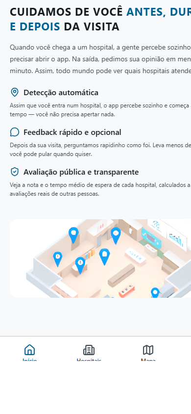

---

## 1. Criando sua conta (é opcional)

Você **não precisa** se cadastrar para usar o app: pode buscar hospitais, ver notas,
consultar o mapa e fazer check-in manual sem nenhuma conta. Criar uma conta só vale a
pena se você quiser guardar seu histórico de visitas e suas avaliações.

Para criar uma conta, abra a aba **Perfil** e toque em **Criar conta**.

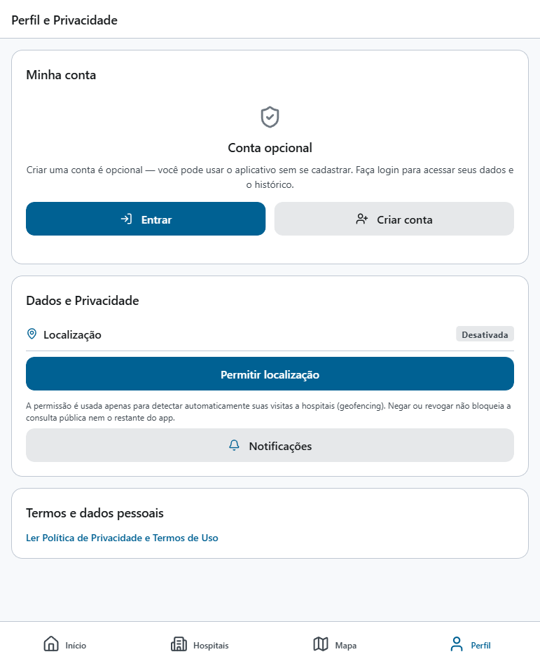

Preencha seu nome, e-mail e uma senha (o telefone é opcional) e aceite os Termos de
Uso e a Política de Privacidade.

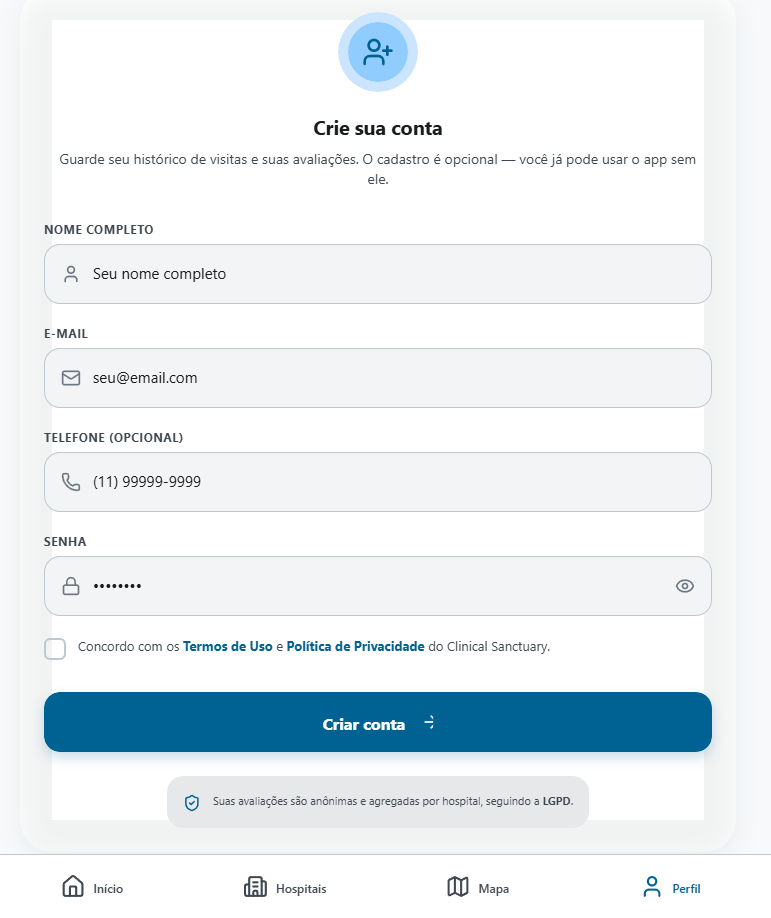

Depois de criar a conta, o app envia um código de confirmação para o seu e-mail.
Você precisa confirmar o e-mail antes de conseguir entrar — isso garante que, se um
dia você precisar redefinir sua senha, o código chegue no endereço certo.

### Entrando com uma conta existente

Se você já tem conta, abra **Perfil** → **Entrar** e informe seu e-mail e senha.

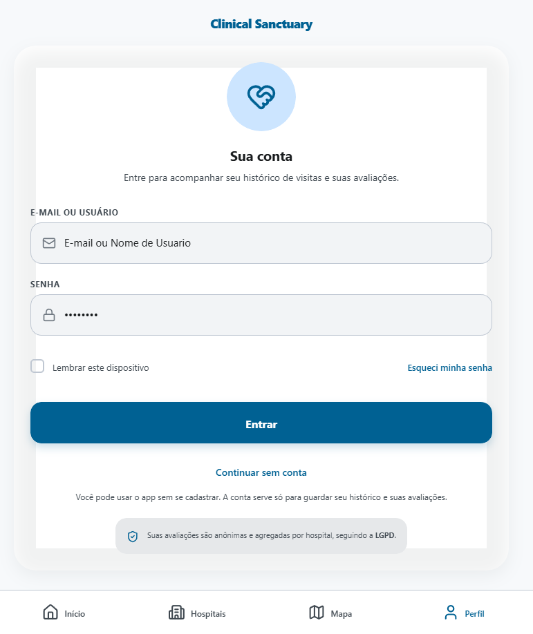

### Esqueci minha senha

Na tela de login, toque em **Esqueci minha senha**. Você recebe um código de 6
dígitos por e-mail para criar uma senha nova.

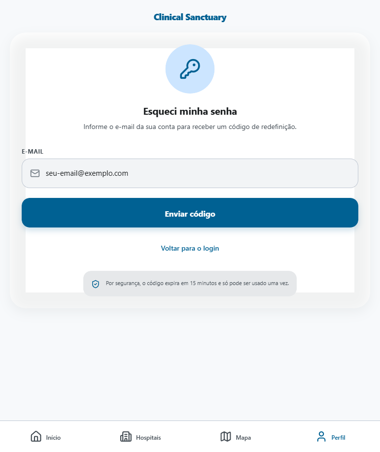

---

## 2. Encontrando um hospital

Abra a aba **Hospitais** para ver a lista completa, com o tipo de cada unidade
(hospital, UBS, UPA, centro especializado etc.) e sua categoria (público, privado ou
filantrópico).

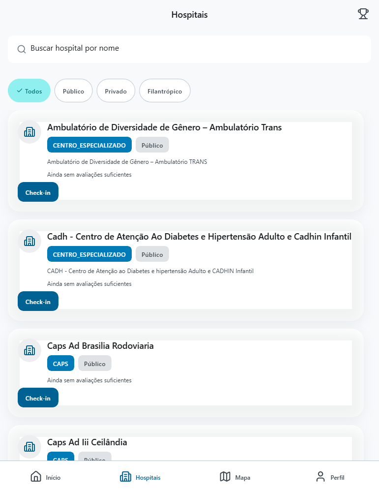

Use o campo de busca para encontrar um hospital pelo nome:

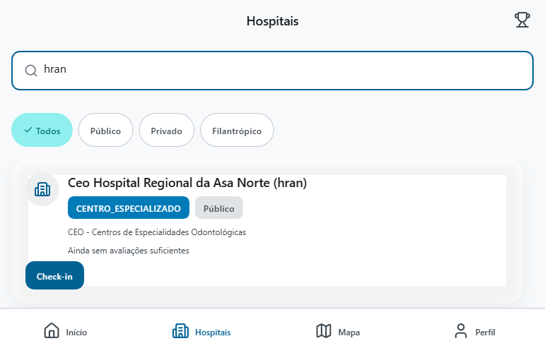

Toque em um hospital da lista para ver o **detalhe**: endereço, contato, horário de
funcionamento, avaliação pública e a localização no mapa.

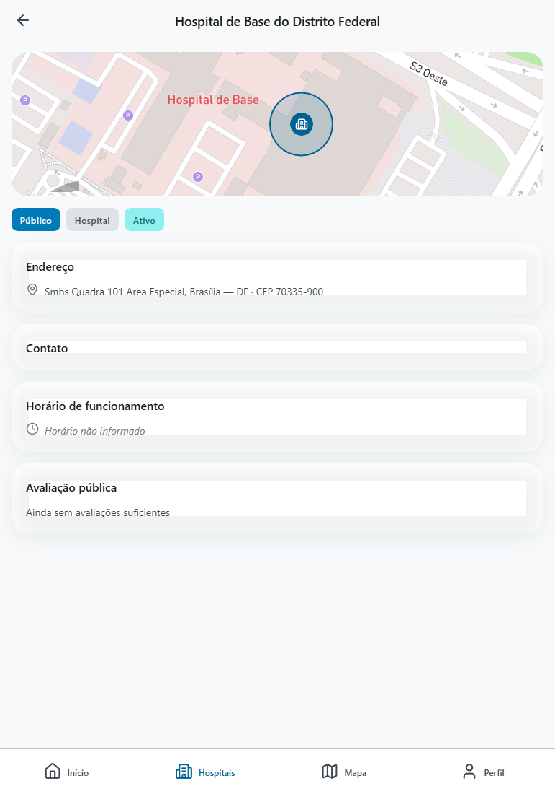

### Ranking de hospitais

No topo da lista de Hospitais, toque no ícone de troféu para ver o **ranking** —
ordenado pela melhor nota ou pelo menor tempo médio de espera, com filtro por tipo.

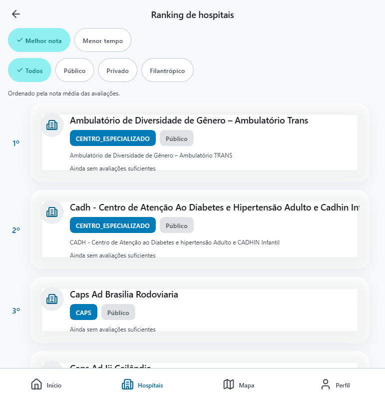

---

## 3. Deixando o app detectar sua visita automaticamente

Abra a aba **Mapa** para ver todos os hospitais próximos num só lugar. Se você
permitir o acesso à localização (em **Perfil** → **Permitir localização**), o app
consegue:

- Mostrar sua posição no mapa junto com os hospitais ao redor;
- Filtrar por um raio de distância (1, 5, 10 ou 25 km);
- **Detectar automaticamente** quando você entra na área de um hospital e começar a
  contar sua visita sozinho — sem precisar abrir o app ou apertar nada.

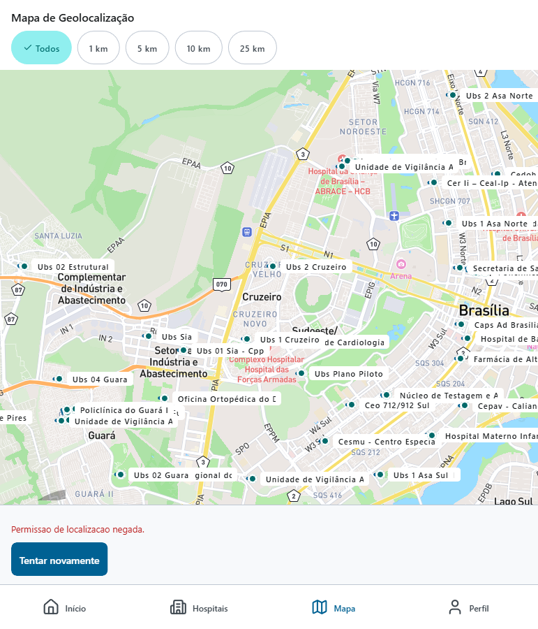

Toque em qualquer marcador do mapa para abrir o detalhe daquele hospital.

**Quando duas unidades de saúde ficam muito próximas uma da outra**, é possível que
seus círculos de detecção se sobreponham. Nesse caso, ao tocar naquele ponto do mapa
o app abre uma lista para você escolher qual das unidades é a que você quer ver —
em vez de adivinhar e abrir sempre a mesma.

---

## 4. Acompanhando seu perfil

Na aba **Perfil**, além de entrar ou criar conta, você pode:

- **Permitir ou revogar a localização** a qualquer momento — negar não bloqueia o
  restante do app, só desliga a detecção automática de visita;
- **Ativar notificações** para receber um convite para avaliar sua visita e, se você
  não responder, um lembrete único depois (opcional: sem elas, você ainda pode
  avaliar pelo próprio app);
- Ler a **Política de Privacidade e Termos de Uso**.

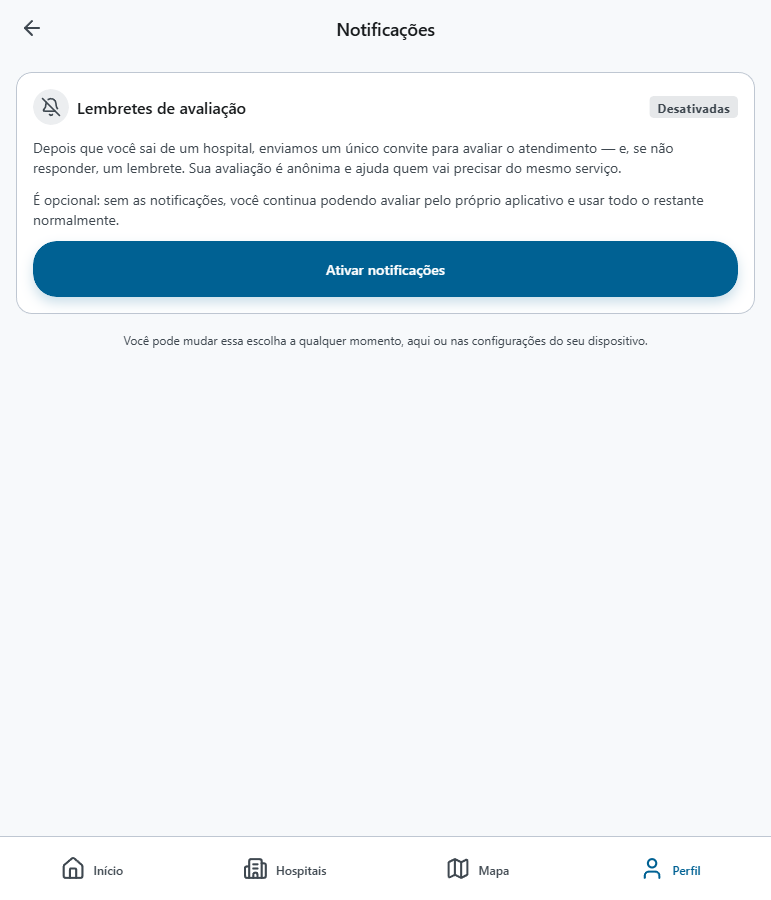

Suas avaliações são sempre anônimas e agregadas por hospital, seguindo a LGPD.

---

## Próximos passos

- Sem conta, você já pode buscar hospitais, consultar o ranking e usar o mapa.
- Com conta, você passa a ter histórico das suas visitas e avaliações guardado.
- Deixe a localização ativada para que o app detecte suas visitas sozinho, sem
  esforço nenhum da sua parte.

Se tiver dúvidas sobre como seus dados são usados, a Política de Privacidade está
sempre acessível em **Perfil** → **Ler Política de Privacidade e Termos de Uso**.
